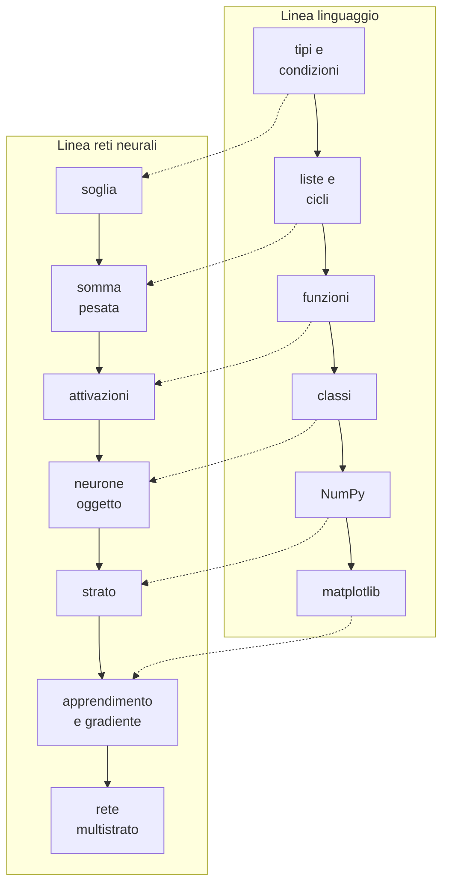

# Logica della progettazione didattica del corso B.8

## Finalità della traccia docenti

La traccia docenti accompagna il syllabus e ne spiega le scelte: perché gli argomenti sono stati selezionati e ordinati in questo modo, come il limite delle 18 ore ha determinato tagli e compressioni, come impostare e condurre i laboratori, come valutare.

Ripartizione indicativa:

- traccia studenti: circa 16 ore
- traccia docenti: circa 2 ore, distribuite in brevi segmenti di 10-15 minuti al termine dei moduli (L2, L8, L12, L17) e nella seconda parte di L18

## Scelta di fondo: il neurone come filo conduttore

Il titolo del corso unisce due obiettivi di natura diversa:  

- imparare un linguaggio di programmazione e  
- capire le basi matematiche e logiche delle reti neurali.  

Se trattati in sequenza (prima "tutto Python", poi "le reti neurali") producono due problemi:  

- la parte di linguaggio resta priva di motivazione, perché gli esercizi sono generici  
- la parte di reti neurali arriva quando rimane poco tempo, e viene ridotta a una dimostrazione  

La soluzione adottata è un filo conduttore unico:  
ogni costrutto del linguaggio viene introdotto nel punto in cui serve a costruire un pezzo del neurone artificiale, e il neurone viene riscritto più volte con strumenti via via più potenti.

| Lezione | Costrutto Python | Versione del neurone |
|---|---|---|
| L4 | `if` | regola a soglia con due ingressi |
| L5 | liste, `for` | somma pesata con un numero qualsiasi di ingressi |
| L6 | funzioni | attivazione come funzione intercambiabile |
| L8 | classi | oggetto `Neurone` con stato (pesi, bias) |
| L10-L11 | array NumPy, `@` | neurone vettoriale; strato come matrice |
| L14 | cicli su array | neurone che aggiorna i propri pesi |
| L16 | composizione di funzioni | rete a due strati |
| L17 | librerie esterne | lo stesso modello in un framework |

Diagramma: le due linee del corso e i punti in cui si incontrano

Vantaggi didattici:

- ogni esercizio di programmazione ha uno scopo riconoscibile
- la matematica del neurone (somma pesata, prodotto scalare, matrice) viene incontrata prima come codice e solo dopo come formula; per studenti di 16-18 anni l'ordine "prima eseguo, poi formalizzo" riduce il carico cognitivo
- la riscrittura ripetuta dello stesso oggetto con strumenti diversi mostra concretamente cosa aggiunge ogni strumento (per esempio NumPy rispetto ai cicli)

## Effetti del limite di 18 ore

Un corso introduttivo completo di Python richiede normalmente 30-40 ore; un'introduzione alle reti neurali con le relative basi matematiche ne richiede altrettante. Con 18 ore complessive sono state fatte le scelte seguenti.

Contenuti ridotti o esclusi:

- Python: esclusi ereditarietà, gestione dei file oltre il minimo, generatori, decoratori, programmazione funzionale avanzata, test strutturati; le classi sono limitate a `__init__`, attributi e metodi, cioè quanto serve per leggere il codice dei framework
- pandas: solo citato; la manipolazione di dataset tabellari è materia del corso B.6
- matematica: derivate e matrici trattate in modo operativo (pendenza calcolata numericamente, matrice come tabella con regole di prodotto), senza dimostrazioni; la retropropagazione è presentata in forma intuitiva e non derivata formalmente
- framework di deep learning: una sola lezione, con funzione di confronto e non di formazione all'uso
- reti convoluzionali, reti ricorrenti, trasformatori: esclusi; eventualmente citati come prosecuzione

Scelte strutturali dovute al monte ore:

- lezioni autonome di un'ora: consentono di comporre sessioni da 2, 3 o 4 ore senza spezzare argomenti a metà; ogni lezione si chiude con un laboratorio che produce un risultato verificabile
- modulo sull'ambiente ridotto a 2 ore: Thonny e i notebook vengono spiegati in modo essenziale e poi ripresi nell'uso quotidiano
- codice fornito nelle lezioni più dense (L16, L17): gli studenti modificano, eseguono e interpretano codice già scritto invece di scriverlo da zero; è una scelta consapevole, che privilegia la comprensione del modello rispetto alla produzione di codice

## Prerequisiti matematici e fascia d'età

In una classe di terzo o quarto anno di istituto tecnico o liceo:

- piano cartesiano, retta, potenze: noti
- funzione esponenziale: nota dal quarto anno in molti indirizzi; per la sigmoide è sufficiente il grafico e il comportamento qualitativo
- derivate: normalmente affrontate al quinto anno; nel corso la derivata viene introdotta come pendenza stimata numericamente con il rapporto incrementale, calcolato in Python, e solo dopo come concetto
- matrici: non presenti nella maggior parte dei programmi; vengono introdotte come tabelle di numeri con una regola di prodotto, verificata prima a mano su un caso 2x2 e poi con NumPy

Il calcolo numerico in Python funziona qui come strumento didattico per la matematica: la pendenza, la minimizzazione e il prodotto tra matrici vengono prima osservati sperimentalmente e poi formalizzati.

## Scelte sugli strumenti

Criteri: PC di fascia bassa, nessun privilegio di amministratore, funzionamento anche senza rete, stesso materiale utilizzabile online e offline.

| Esigenza | Strumento principale | Alternativa | Motivazione |
|---|---|---|---|
| scrivere script, imparare il debug | Thonny | IDLE (incluso in Python) | interfaccia semplice, Python incluso, debugger passo passo che mostra la valutazione delle espressioni |
| notebook senza installazione | JupyterLite | Colab | eseguito interamente nel browser, funziona anche dopo il caricamento iniziale; include NumPy, matplotlib, scikit-learn |
| notebook offline completi | WinPython da chiavetta | installazione utente di Python e `pip install --user` | nessuna installazione, tutte le librerie già incluse |
| framework di deep learning | Colab | nessuna offline equivalente; `MLPClassifier` come sostituto concettuale | PyTorch e TensorFlow sono troppo pesanti per il laboratorio |

Considerazioni sull'inserimento degli strumenti nel corso:

- Thonny prima dei notebook per il codice di base: il notebook, con l'esecuzione a celle in ordine libero, nasconde il flusso di esecuzione di un programma; **nelle prime lezioni conviene che gli studenti vedano un programma eseguito dall'alto in basso**
- notebook dal modulo 3: per il calcolo numerico e i grafici **l'alternanza di codice, risultato e testo è più efficace** dello script
- Colab solo dove indispensabile: dipende dalla rete e da un account Google (aspetto da verificare con le regole della scuola per studenti minorenni); per questo è usato solo in L17 e ogni notebook ha una versione locale
- JupyterLite: il primo caricamento scarica alcune decine di MB;  
in un laboratorio con banda limitata conviene aprirlo su tutte le postazioni prima della lezione.  
I file creati in JupyterLite restano nella memoria del browser: gli studenti devono scaricare il `.ipynb` a fine lezione

## Struttura della lezione di laboratorio

Schema tipico di una lezione di un'ora:

1. richiamo (5 min): un esercizio breve sulla lezione precedente
2. spiegazione con codice dal vivo (20-25 min): il docente scrive il codice davanti alla classe, commettendo e correggendo anche errori tipici
3. laboratorio (25-30 min): esercizi graduati in tre livelli (base, standard, approfondimento)
4. chiusura (5 min): verifica rapida con un esercizio a risposta immediata o con i test `assert` del notebook

(Quando possibile) **la programmazione dal vivo in generale è preferibile alle slide con codice già scritto**: mostra il processo, non solo il risultato, e rende naturale la lettura dei messaggi di errore.

## Esercizi a tre livelli

In ogni laboratorio gli esercizi sono divisi in tre livelli di difficoltà crescente.  
Tutti lavorano sullo stesso tema.

- Base: **si applica direttamente quanto mostrato nella spiegazione**, per esempio completando o modificando codice già fornito. Ogni studente deve completarlo, perché è il minimo richiesto per seguire la lezione successiva.
- Standard: il concetto va usato in **una situazione leggermente diversa** da quella mostrata, e il codice si scrive da zero partendo da una consegna.  
È l'**obiettivo della lezione per la maggior parte della classe**.
- Approfondimento: il concetto va esteso o combinato con argomenti precedenti, con una consegna più aperta.  
*È facoltativo e non è prerequisito delle lezioni successive*.

Esempio (L6, funzioni):

| Livello | Consegna |
|---|---|
| base | completare la funzione `sigmoide(x)` di cui è data l'intestazione e verificarla con i test `assert` forniti |
| standard | scrivere da zero la funzione `neurone(ingressi, pesi, bias, attivazione)` e usarla con due attivazioni diverse |
| approfondimento | scrivere una funzione che confronta le uscite di più attivazioni sugli stessi ingressi e restituisce quella con il valore massimo |

Gli studenti procedono in ordine da un livello al successivo.  
Chi termina prima passa al livello seguente senza aspettare il gruppo, mentre il docente si dedica a chi è ancora al livello base.  
Nella fase di chiusura **si correggono insieme** solo gli esercizi base e standard.

## Gestione della classe in laboratorio

- eterogeneità: gli esercizi a tre livelli permettono agli studenti più veloci di procedere senza fermare il gruppo; gli esercizi di approfondimento non sono prerequisito delle lezioni successive
- programmazione in coppia (pair programming): un "pilota" alla tastiera e un "navigatore" che legge e controlla, con scambio dei ruoli ogni 10 minuti; utile soprattutto nel modulo 2
- errori come materiale didattico: raccogliere i messaggi di errore più frequenti della lezione e commentarli nel richiamo della lezione successiva
- supporto: prima di intervenire, chiedere allo studente di leggere il traceback ad alta voce e di indicare la riga coinvolta

## Valutazione

- formativa: test `assert` inseriti nei notebook; lo studente sa subito se la funzione scritta è corretta
- verifiche di modulo: un esercizio breve al termine dei moduli 2, 3 e 4, svolto singolarmente
- mini progetto finale (L18): valutato con rubrica su quattro dimensioni

| Dimensione | Descrittori |
|---|---|
| correttezza del codice | il codice esegue senza errori e produce i risultati attesi |
| comprensione del modello | lo studente spiega il ruolo di pesi, bias, attivazione, perdita, tasso di apprendimento |
| analisi dei risultati | grafico della perdita interpretato; confronto tra configurazioni diverse |
| comunicazione | cella Markdown chiara, codice commentato, nomi significativi |

## Coordinamento con B.6 e B.4

- B.6 presuppone, o introduce rapidamente, le basi di Python;  
se B.8 precede B.6 nella stessa classe, B.6 può partire da pandas e dagli algoritmi di classificazione.  
Se l'ordine è inverso, B.8 può abbreviare L9 e L12
- temi assegnati a B.6 e solo citati in B.8: raccolta dei dati, pandas, suddivisione addestramento/verifica, metriche (accuratezza, matrice di confusione), sovradattamento
- B.4 non ha sovrapposizioni; esercizi ponte possibili nel modulo 2 (robustezza di una password con stringhe e dizionari)

## Adattamento ad altri monte ore

- 12 ore: unire L1-L2, ridurre il modulo 2 a 4 lezioni (classi solo come lettura di codice), eliminare L17
- 24-30 ore: raddoppiare L16 (retropropagazione con calcolo esplicito su una rete piccolissima), aggiungere una lezione sulla classificazione di immagini piccole (cifre 8x8) e una sui file e sui dati reali

## Materiale open source di riferimento

Non risulta un corso open source che copra l'intero programma con gli stessi vincoli.  
Esistono materiali che coprono parti del programma e possono essere riusati con attribuzione:

- Microsoft, AI for Beginners (licenza MIT): lezioni sul perceptron e sulle reti multistrato con notebook, tra cui una rete implementata a mano; presuppone la conoscenza di Python ed è in inglese. https://github.com/microsoft/AI-For-Beginners
- Microsoft, ML for Beginners (licenza MIT): machine learning classico con scikit-learn; più vicino al corso B.6. https://github.com/microsoft/ML-For-Beginners
- Andrej Karpathy, micrograd (licenza MIT): motore di calcolo automatico del gradiente in circa cento righe; adatto come approfondimento per il docente o per studenti molto motivati. https://github.com/karpathy/micrograd
- Kaggle Learn, Intro to Deep Learning: corso gratuito online con Keras, non open source; utilizzabile come prosecuzione. https://www.kaggle.com/learn/intro-to-deep-learning
- Python ABC, Python Italia: introduzione a Python in italiano. https://pythonitalia.github.io/python-abc/
