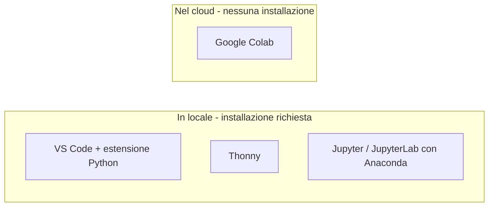

# Lezione 1 - Editor, IDE, notebook Jupyter e Google Colab

Corso B8: Linguaggio Python per il Machine Learning ed il Deep Learning
Incontro 1, lezione 1 di 18. Durata: 1 ora (di cui 20-30 minuti di esercitazione pratica)

## Obiettivi

Al termine di questa lezione si è in grado di:

- distinguere un editor di testo, un IDE e un notebook
- riconoscere le principali opzioni gratuite per scrivere ed eseguire Python: Visual Studio Code con l'estensione Python, Thonny, Jupyter/JupyterLab in locale, Google Colab
- descrivere la struttura di un notebook Jupyter e il funzionamento delle sue celle
- creare, eseguire e salvare un primo notebook su Google Colab

## 1. Editor di testo, IDE e notebook

Per scrivere ed eseguire codice Python esistono tre categorie di strumenti, che si differenziano per quanto supporto offrono oltre alla semplice scrittura del testo.

- **Editor di testo**: un programma che permette di scrivere e modificare file di testo, incluso codice sorgente. Un editor puro non compila né esegue il codice: si limita a offrire funzioni come l'evidenziazione della sintassi (syntax highlighting) e, nelle versioni più avanzate, il completamento automatico.
- **IDE (Integrated Development Environment, ambiente di sviluppo integrato)**: un programma che unisce editor, esecuzione del codice, debug e altri strumenti di sviluppo in un'unica applicazione. Un IDE permette di scrivere un programma, eseguirlo, e osservarne il comportamento passo per passo, senza uscire dall'applicazione.
- **Notebook**: un documento interattivo organizzato in celle, in cui si alternano celle di codice eseguibile e celle di testo descrittivo. A differenza di un IDE, che esegue tipicamente l'intero programma dall'inizio alla fine, un notebook permette di eseguire singole porzioni di codice in un ordine scelto dall'utente, mantenendo lo stato (variabili, funzioni definite) tra un'esecuzione e l'altra.

La distinzione più rilevante ai fini di questo corso è tra IDE e notebook: un IDE è pensato per costruire un programma completo, un notebook per esplorare dati e algoritmi passo per passo, mostrando subito il risultato di ogni singola istruzione. Per questo motivo il notebook è lo strumento di riferimento in ambito di analisi dati, Machine Learning e Deep Learning, mentre l'IDE resta preferibile quando il codice deve diventare un'applicazione strutturata in più file.

## 2. Strumenti per scrivere ed eseguire Python

Le opzioni gratuite più diffuse per iniziare a programmare in Python si dividono in due famiglie: quelle installate in locale, sul proprio computer, e quelle eseguite interamente nel browser, senza installazione.

### 2.1 Visual Studio Code con estensione Python

Visual Studio Code (VS Code) è un editor di testo sviluppato da Microsoft, gratuito e disponibile per Windows, macOS e Linux. Di per sé è un editor generico, adatto a molti linguaggi di programmazione; installando l'estensione ufficiale Python si trasforma in un ambiente completo per lo sviluppo Python, con evidenziazione della sintassi, completamento automatico, debugger integrato e supporto nativo per i notebook Jupyter (file `.ipynb`), tramite l'estensione Jupyter.

VS Code è la scelta più indicata per chi prevede di lavorare anche su progetti composti da più file, oltre che su notebook singoli.

### 2.2 Thonny

Thonny è un IDE gratuito pensato specificamente per chi impara a programmare, sviluppato dall'Università di Tartu. Si distingue per un debugger che permette di visualizzare passo per passo l'esecuzione del programma, incluse le variabili e la pila delle chiamate di funzione (call stack), e per un'interfaccia grafica per l'installazione dei pacchetti esterni.

Thonny è più leggero e immediato di VS Code, quindi indicato per chi preferisce un ambiente semplice, dedicato esclusivamente a Python.

### 2.3 Jupyter e JupyterLab in locale (Anaconda)

Jupyter è il progetto open source che ha dato origine al formato di notebook (`.ipynb`) e alle interfacce Jupyter Notebook e JupyterLab, quest'ultima più recente e con un'interfaccia a più pannelli. Entrambe possono essere installate in locale sul proprio computer.

Il modo più comune per ottenere un ambiente Jupyter funzionante in locale è installare Anaconda, una distribuzione Python che include Python stesso, Jupyter/JupyterLab e le principali librerie scientifiche (tra cui NumPy, Pandas e Matplotlib, che saranno usate nelle lezioni successive di questo corso), evitando così di installare e configurare ciascun componente separatamente.

### 2.4 Google Colab

Google Colaboratory, abbreviato in Colab, è un servizio gratuito di Google che esegue notebook Jupyter direttamente nel browser, senza alcuna installazione sul proprio computer. È lo strumento che verrà usato come riferimento principale in questo corso, perché elimina i problemi di installazione e permette di iniziare a scrivere codice in pochi secondi.

Per usare Colab è necessario un account Google; l'uso di Colab nella modalità gratuita, quella impiegata in questo corso, non comporta alcun pagamento. Le sessioni gratuite hanno però un tempo massimo di utilizzo e si disconnettono automaticamente dopo un periodo di inattività, con la conseguente perdita di tutte le variabili calcolate fino a quel momento (il file del notebook resta invece salvato, se già salvato su Google Drive). Per questo conviene salvare spesso il proprio lavoro su Google Drive, ed essere consapevoli che una sessione interrotta va semplicemente riavviata, rieseguendo le celle necessarie.

## 3. La struttura di un notebook Jupyter

Un notebook Jupyter, sia eseguito in locale sia su Colab, è organizzato in celle. Ogni cella è di uno dei due tipi seguenti:

- **Cella di codice**: contiene istruzioni Python, che vengono eseguite dal kernel quando la cella viene eseguita. Il risultato dell'esecuzione, per esempio l'output di una funzione `print()` o il valore restituito dall'ultima istruzione della cella, viene mostrato subito sotto la cella stessa.
- **Cella di testo (Markdown)**: contiene testo formattato con la sintassi Markdown (titoli, elenchi, grassetto, e così via), utile per documentare il notebook: spiegare cosa fa una sezione di codice, introdurre un argomento, commentare un risultato.

Il kernel è il processo che esegue effettivamente il codice Python di un notebook. Ogni notebook aperto è collegato a un proprio kernel, che mantiene in memoria tutte le variabili e le funzioni definite nelle celle eseguite fino a quel momento: questo è ciò che si intende per stato condiviso tra le celle di uno stesso notebook. Una conseguenza pratica di questo comportamento è che l'ordine in cui le celle vengono effettivamente eseguite conta più dell'ordine in cui compaiono nel notebook: se una cella viene eseguita, poi modificata una cella precedente e questa non viene rieseguita, il kernel continua a usare il valore calcolato in precedenza.

Una cella si esegue con la combinazione di tasti Shift+Invio, che esegue la cella corrente e sposta il cursore sulla cella successiva (creandone una nuova se la cella corrente è l'ultima del notebook).

Diagramma: il ciclo di vita dell'esecuzione di una cella di codice, dalla scrittura al risultato disponibile per le celle successive.

Diagramma: confronto tra gli strumenti presentati, in base al fatto che vengano eseguiti in locale o nel cloud e che richiedano o meno un'installazione.

## 4. Esercizio pratico

Durata indicativa: 25-30 minuti.

1. Aprire Google Colab con il proprio account Google e creare un nuovo notebook.
2. Costruire il notebook con almeno cinque celle:
   - una cella di testo con un titolo
   - una cella di testo con una breve spiegazione di cosa contiene il notebook
   - almeno tre celle di codice, tra cui un piccolo calcolo (per esempio una somma o una conversione tra unità di misura)
3. Eseguire tutte le celle, in ordine, con Shift+Invio.
4. Salvare il notebook su Google Drive.
5. Facoltativo: installare Thonny oppure Jupyter/JupyterLab in locale (per esempio tramite Anaconda) e riprodurre lo stesso semplice calcolo in quell'ambiente, per confrontare l'esperienza con quella di Colab.

## Materiali di riferimento e crediti

La descrizione degli strumenti di installazione locale (Visual Studio Code, Thonny, Jupyter/JupyterLab, Anaconda) è adattata e tradotta, in parte, dalle istruzioni di configurazione del corso Software Carpentry, *Plotting and Programming in Python*, opera di Software Carpentry / The Carpentries, distribuita con licenza Creative Commons Attribution 4.0 (CC BY 4.0). Pagina di riferimento: Plotting and Programming in Python - Summary and Setup, disponibile all'indirizzo https://swcarpentry.github.io/python-novice-gapminder/

Altri riferimenti utili, consultati per la stesura di questa lezione:

- Google Colaboratory (pagina ufficiale): https://colab.research.google.com/
- domande frequenti su Google Colab, incluse le informazioni sui limiti d'uso gratuito: https://research.google.com/colaboratory/faq.html
- Python extension for Visual Studio Code (pagina ufficiale sul marketplace): https://marketplace.visualstudio.com/items?itemName=ms-python.python
- Thonny, Python IDE for beginners (sito ufficiale): https://thonny.org
- Project Jupyter (sito ufficiale): https://jupyter.org
- Anaconda Distribution, pagina di download: https://www.anaconda.com/download

## Materiale accessorio

Un notebook di partenza per l'esercizio di questa lezione, già strutturato con le celle richieste da compilare, è disponibile nel file `B8_L01_notebook_esercizio.ipynb`: può essere caricato direttamente su Google Colab (menu File, Carica notebook) oppure aperto con Jupyter/JupyterLab in locale.
