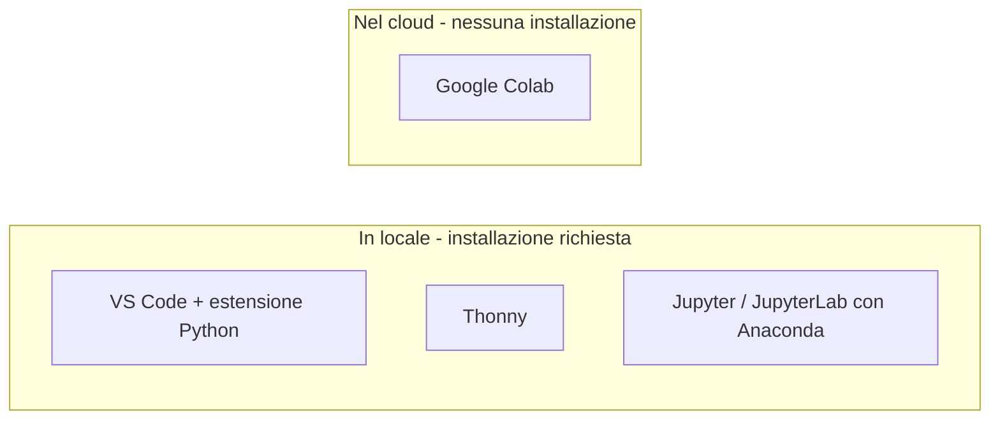

# Lezione 1 - Editor, IDE, notebook Jupyter e Google Colab

Corso B8: Linguaggio Python per il Machine Learning ed il Deep Learning
Incontro 1, lezione 1 di 18. Durata: 1 ora

---

## Obiettivi della lezione

- distinguere editor di testo, IDE e notebook
- conoscere le opzioni gratuite per scrivere Python: VS Code, Thonny, Jupyter/JupyterLab, Google Colab
- capire la struttura di un notebook Jupyter e il funzionamento delle celle
- creare, eseguire e salvare un primo notebook su Google Colab

---

## Editor di testo, IDE, notebook

- **Editor di testo**: scrive e modifica testo, non esegue codice
- **IDE (Integrated Development Environment)**: editor + esecuzione + debug, in un'unica applicazione
- **Notebook**: documento a celle, eseguibili singolarmente, con stato condiviso tra le celle

---

## Editor di testo, IDE, notebook (2)

- IDE: pensato per costruire un programma completo
- notebook: pensato per esplorare dati e algoritmi passo per passo
- il notebook è lo strumento di riferimento per analisi dati, Machine Learning, Deep Learning

---

## Strumenti in locale: VS Code

- editor generico Microsoft, gratuito, multipiattaforma
- con estensione Python: syntax highlighting, completamento, debugger
- estensione Jupyter: supporto nativo ai notebook (`.ipynb`)
- indicato per progetti con più file, oltre ai notebook

Python extension for Visual Studio Code: https://marketplace.visualstudio.com/items?itemName=ms-python.python

---

## Strumenti in locale: Thonny

- IDE gratuito pensato per chi impara a programmare (Università di Tartu)
- debugger che mostra passo per passo variabili e call stack
- interfaccia grafica per installare pacchetti
- più leggero e immediato di VS Code

Thonny, Python IDE for beginners: https://thonny.org

---

## Strumenti in locale: Jupyter/JupyterLab e Anaconda

- Jupyter: progetto open source, formato `.ipynb`
- JupyterLab: interfaccia più recente, a più pannelli
- Anaconda: distribuzione che include Python, Jupyter/JupyterLab e librerie scientifiche (NumPy, Pandas, Matplotlib)

Project Jupyter: https://jupyter.org
Anaconda Distribution, download: https://www.anaconda.com/download

---

## Google Colab

- servizio gratuito di Google, notebook Jupyter nel browser
- nessuna installazione richiesta
- richiede un account Google, l'uso gratuito non comporta pagamento
- sessioni con tempo massimo, disconnessione dopo inattività
- conviene salvare spesso su Google Drive

Google Colaboratory: https://colab.research.google.com/
FAQ su limiti d'uso: https://research.google.com/colaboratory/faq.html

---

## Confronto tra gli strumenti

---

## Le celle di un notebook

- **Cella di codice**: istruzioni Python, eseguite dal kernel, risultato mostrato sotto la cella
- **Cella di testo (Markdown)**: testo formattato, usato per documentare il notebook
- **Kernel**: processo che esegue il codice e mantiene lo stato (variabili, funzioni) tra le celle

Esecuzione di una cella: Shift+Invio

---

## Il ciclo di esecuzione di una cella

Nota: conta l'ordine di esecuzione delle celle, non l'ordine in cui compaiono nel notebook.

---

## Esercizio pratico (25-30 minuti)

1. Aprire Google Colab, creare un nuovo notebook
2. Almeno cinque celle:
   - testo con titolo
   - testo con breve spiegazione
   - almeno tre celle di codice, incluso un piccolo calcolo
3. Eseguire tutte le celle in ordine (Shift+Invio)
4. Salvare il notebook su Google Drive
5. Facoltativo: riprodurre lo stesso calcolo con Thonny o Jupyter/JupyterLab in locale

Notebook di partenza: `B8_L01_notebook_esercizio.ipynb`

---

## Materiali di riferimento

- Software Carpentry, *Plotting and Programming in Python* (CC BY 4.0): https://swcarpentry.github.io/python-novice-gapminder/
- Google Colaboratory: https://colab.research.google.com/
- Python extension for VS Code: https://marketplace.visualstudio.com/items?itemName=ms-python.python
- Thonny: https://thonny.org
- Project Jupyter: https://jupyter.org
- Anaconda Distribution: https://www.anaconda.com/download
