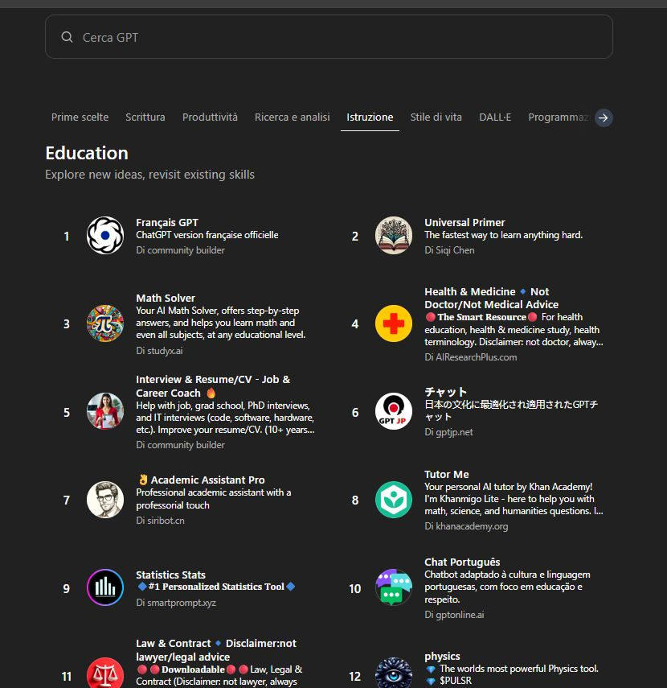
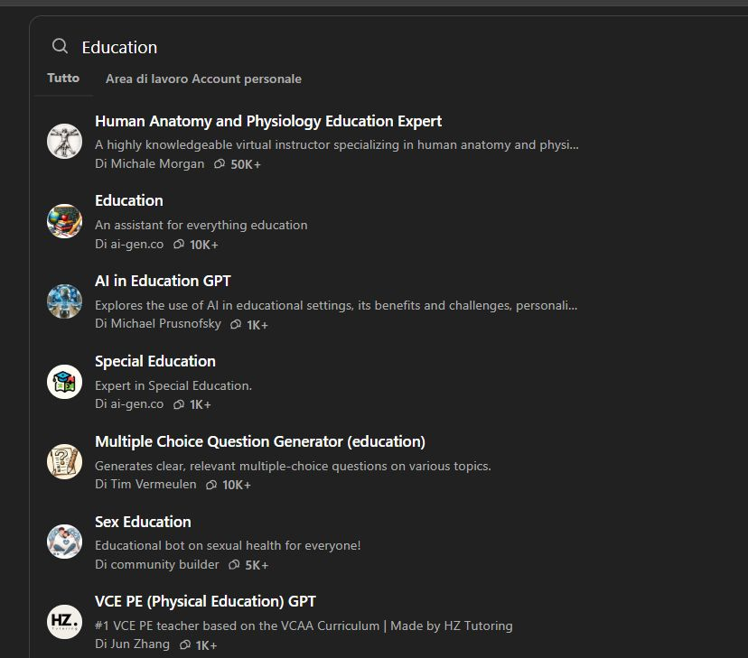

# Funzionalità principali dei Custom GPT

- Personalizzazione di:
  - conoscenze e stili comunicativi
  - comportamenti e regole
  - strumenti (es. upload file, chiamate API)
- Condivisione tramite link diretto

---

# Come crearne uno

- Accedere a https://chat.openai.com/gpts
- Seguire la procedura guidata in italiano
- Inserire:
  - Nome e descrizione
  - Istruzioni personalizzate ("Comportamento")
  - File di conoscenza, se desiderato
  - Tool attivabili

---

# Sicurezza e privacy

- I Custom GPT sono eseguiti nel cloud di OpenAI
- I dati dell'utente non sono usati per addestrare il modello
- Per la scuola: **evitare dati personali di studenti senza autorizzazione**

---

# Differenze con i vecchi plugin

- I plugin erano strumenti separati attivati in ChatGPT
- Ora integrati come strumenti standard (es. browser, codice Python)
- I Custom GPT offrono un'interfaccia semplificata per l'utente

---

# Differenze con gli agenti AI

- Gli agenti AI agiscono in tempo reale, anche in ambienti esterni
- I Custom GPT restano nel perimetro ChatGPT
- Più semplici da creare e gestire, ideali per la scuola

---

# Differenze con i chatbot tradizionali

- I chatbot classici hanno risposte fisse
- I Custom GPT usano modelli linguistici avanzati
- Comportamento adattivo e naturale

---

# Possibile utilizzo nell'istruzione  
(ipotesi già sentito infinte volte, **cosa cambia con gli agents?**)
- Supporto allo studio e al ripasso
- Simulazione di dialoghi disciplinari (es. docente virtuale di storia)
- Generazione di materiali didattici

---

- Correttore automatico di testi
- Supporto a docenti nella preparazione di verifiche e spiegazioni
- Approfondimento delle competenze digitali (PCTO, curriculum digitale)
- Esercizi guidati e tutoring personalizzato

---

# Uso con studenti BES e DSA
(ipotesi già sentito infinte volte, **cosa cambia con gli agents?**)
- Riformulazione semplificata dei testi
- Lettura ad alta voce (tramite strumenti esterni integrabili)
- Interazione multimodale: testo, voce, immagini
- Promozione dell'autonomia nello studio

---

# Alcune aree su cui sperimentare con i Custom GPT 

- Assistente di latino con glossario semplificato
- Allenatore di problem solving per matematica
- Tutor per l’analisi del testo poetico
- GPT che spiega concetti informatici in modo semplificato

---

# Risorse in lingua italiana

- Guida OpenAI: https://openai.com/blog/custom-gpts
- Guida pratica su Schedario.it: https://schedario.it/come-creare-un-custom-gpt-guida/

--- 
# Cerchiamo e proviamo a interagirte con un GPT per la scuola

---  
Non troviamo ciò che cerchiamo fra i principali GPTs per l'istruzione

--- 

Con una ricerca troviamo qualcosa che sembra pertinente
 

--- 
Il GPT trovato è  
https://chatgpt.com/g/g-wQMIiHMJk-ai-in-education-gpt 

---  
Interroghiamolo  

> Tell me about AI in education.
... 
> puoi ripetere in Italiano?

--- 

Certamente. Di seguito trovi una panoramica strutturata sull’**Intelligenza Artificiale (IA) nell’educazione**, tradotta e adattata in italiano, mantenendo un tono professionale e accademico.

---

## **IA nell’Istruzione: Panoramica Generale**

L’**intelligenza artificiale (IA)** sta trasformando profondamente il modo in cui si insegna e si apprende. La sua integrazione nel settore educativo coinvolge vari ambiti, dalla personalizzazione dell’apprendimento alla gestione amministrativa, fino alla creazione di ambienti didattici intelligenti.

---

### 1. **Vantaggi dell’IA nell’Istruzione**

#### a. **Apprendimento Personalizzato**

I sistemi basati su IA adattano i contenuti didattici alle esigenze individuali di ogni studente (ritmo, stile di apprendimento, livello di competenza). Piattaforme come **Khan Academy** o **Squirrel AI** offrono percorsi di apprendimento adattivi.

#### b. **Tutor Intelligenti (Intelligent Tutoring Systems)**

Software come **ALEKS** o **MATHia** forniscono feedback immediati e guida passo-passo, permettendo agli studenti di apprendere anche in autonomia, fuori dalla classe tradizionale.

--- 

#### c. **Efficienza Amministrativa**

L’IA automatizza compiti come la correzione di test, la gestione degli orari o delle iscrizioni, permettendo agli insegnanti di concentrarsi maggiormente sull’insegnamento.

#### d. **Analisi Predittiva**

Gli algoritmi possono identificare studenti a rischio, prevedere risultati accademici e suggerire interventi personalizzati in anticipo.

#### e. **Inclusività e Accessibilità**

Strumenti IA come la sintesi vocale, la traduzione automatica o il riassunto dei testi migliorano l’accesso per studenti con disabilità o che parlano lingue diverse.

---

### 2. **Sfide e Limiti dell’IA nell’Istruzione**

#### a. **Equità nell’Accesso**

Non tutti gli studenti hanno accesso agli strumenti digitali necessari, aggravando le disuguaglianze educative esistenti.

#### b. **Privacy e Sicurezza dei Dati**

L’uso intensivo di dati personali solleva interrogativi su come questi vengano raccolti, conservati e utilizzati. È fondamentale rispettare normative come il **GDPR** o il **FERPA**.

#### c. **Bias Algoritmici**

Se allenati su dati distorti, gli algoritmi possono perpetuare discriminazioni nei confronti di certi gruppi di studenti.

---  

#### d. **Ruolo degli Insegnanti**

Alcuni educatori temono che l’IA possa sostituirli, o non sono sufficientemente formati per utilizzarla efficacemente. Serve un investimento in formazione professionale.

---

### 3. **Applicazioni Principali dell’IA nella Didattica**

| Ambito di Applicazione      | Strumenti e Tecnologie          |
| --------------------------- | ------------------------------- |
| Apprendimento Adattivo      | DreamBox, Century Tech          |
| Valutazione Automatizzata   | Gradescope, Turnitin            |
| Feedback Intelligente       | Grammarly, Ecree                |
| Gestione dell’Apprendimento | Canvas LMS con IA integrata     |
| Assistenti Virtuali         | IBM Watson Tutor, Duolingo Bots |

---

### 4. **Considerazioni Etiche e Pedagogiche**

* **Trasparenza**: Gli studenti e i docenti devono capire come le decisioni dell’IA vengono prese.
* **Supervisione Umana**: L’IA deve supportare, non sostituire, il giudizio umano.
* **Inclusività**: L’IA dovrebbe seguire principi di progettazione universale per l’apprendimento.
* **Autonomia dello Studente**: È importante che gli studenti conservino il controllo del proprio percorso formativo.

---

### 5. **Tendenze Future**

#### a. **IA Emotiva (Affective Computing)**

Sistemi in grado di riconoscere emozioni umane potrebbero personalizzare ulteriormente l’interazione didattica, rendendola più empatica.

#### b. **Apprendimento Continuo e Micro-Credenziali**

L’IA può supportare percorsi di aggiornamento costante attraverso moduli brevi e certificazioni digitali (microlearning).

---  
  
#### c. **IA Generativa nell’Educazione**

Strumenti come **ChatGPT** vengono già utilizzati per tutoraggio, assistenza alla scrittura e creazione di contenuti. Si studiano nuovi modi per integrare queste tecnologie nella progettazione curricolare.

#### d. **Progettazione Curricolare Automatizzata**

Si stanno sviluppando sistemi capaci di analizzare standard educativi e dati degli studenti per costruire curricula ottimizzati e personalizzati.

---

### **Conclusione**

L’intelligenza artificiale può migliorare significativamente la qualità, l’accessibilità e l’efficacia dell’istruzione. Tuttavia, la sua implementazione deve essere **etica**, **trasparente**, e **centrata sull’apprendente**, con una chiara integrazione nel progetto pedagogico. Gli insegnanti devono essere coinvolti come protagonisti nel processo di innovazione.

---

Se desideri approfondire un tema specifico, come l’apprendimento personalizzato, l’etica dell’IA in aula o l’impatto sugli insegnanti, sarò lieto di proseguire.

--- 

## Un'altra domanda al nostro custom GPT

> In che modo sei piu' utile rispetto a chatGPT standard? Hai piu' intelligenza? Cosa fai in piu' o meglio e come fai piu' o meglio?

---  
Domanda molto pertinente. Rispetto a una versione standard di ChatGPT, **questa versione personalizzata – chiamata *AI in Education GPT* – è progettata specificamente per fornire risposte più approfondite, mirate e affidabili nel contesto dell’educazione e dell’uso dell’intelligenza artificiale in ambito educativo**. Di seguito ti spiego nel dettaglio **in cosa consistono le differenze**, **come opero in modo migliorato**, e **quali vantaggi offro**.

---

## 🔍 **1. Specializzazione del Dominio**

### **ChatGPT standard**

* È generalista: risponde a domande su qualsiasi argomento, ma senza una preparazione approfondita o personalizzata per domini specifici.
* Può offrire informazioni corrette, ma non sempre con la profondità o la struttura adatta a un contesto accademico o educativo.

### ✅ **AI in Education GPT**

* È **specializzato in IA nell’istruzione**.
* Integra conoscenze approfondite su:

  * Apprendimento personalizzato basato su IA
  * Sistemi di tutoraggio intelligente
  * Analisi predittiva applicata agli studenti
  * Etica dell’uso dei dati scolastici
  * Tecnologie emergenti in educazione (es. IA generativa)
* Utilizza un **linguaggio formale, strutturato e accademico**, adatto a dirigenti scolastici, docenti universitari, ricercatori e decisori politici.

---

## ⚙️ **2. Migliore Strutturazione delle Risposte**

### **ChatGPT standard**

* Offre risposte generalmente corrette, ma talvolta dispersive o superficiali se il tema richiede rigore accademico o una visione sistemica.

### ✅ **AI in Education GPT**

* Le risposte sono **organizzate in sezioni logiche**, con:

  * Voci numerate o titolate (es. “Vantaggi”, “Sfide”, “Applicazioni”)
  * Tabelle comparative, quando utili
  * Approfondimenti contestuali (es. citazione di piattaforme reali o casi d’uso)
* Le spiegazioni sono **pedagogicamente orientate**, per facilitare l'applicazione pratica nella didattica.

---

## 📈 **3. Focus su Etica, Impatti Sociali e Prospettive Future**

### ✅ **Cosa faccio in più**

* Esploro attivamente temi **interdisciplinari**: IA, pedagogia, diritti digitali, inclusione, ecc.
* Tengo conto di **impatti sistemici**, come il rischio di bias algoritmici, la redistribuzione dei ruoli educativi, e la sostenibilità dei modelli IA nel tempo.
* Offro previsioni basate su trend di ricerca e tecnologie emergenti (es. AI generativa, affective computing, edtech decentralizzato).

---

## 🔐 **4. Attenzione alla Privacy e all’Etica dell’Interazione**

* Non chiedo mai dati sensibili.
* Rispetto pienamente la normativa su protezione dei dati (GDPR, FERPA) nei miei suggerimenti.
* Promuovo l’uso **responsabile e trasparente dell’IA in educazione**, incoraggiando approcci che coinvolgano educatori, famiglie e studenti.

---

## 🧠 **"Più intelligenza"? No, ma più *intelligenza focalizzata*"**

Non sono “più intelligente” in senso assoluto rispetto a ChatGPT standard, ma:

* Ho una **maggiore profondità e precisione nel dominio educativo**.
* Posso fornire **consulenza semi-specialistica**, simile a quella di un ricercatore o consulente accademico.
* Sono progettato per aiutare **scuole, università, formatori e policy maker** a prendere decisioni fondate sull’evidenza.

---

## 📘 **In sintesi: cosa faccio meglio**

| Aspetto                | ChatGPT Standard | AI in Education GPT                        |
| ---------------------- | ---------------- | ------------------------------------------ |
| Profondità tematica    | Generale         | Alta, su IA e istruzione                   |
| Tono e stile           | Conversazionale  | Accademico, formale, strutturato           |
| Applicazioni educative | Superficiali     | Mirate, con esempi reali e tecnologie note |
| Approccio etico        | Generico         | Approfondito, con attenzione normativa     |
| Rilevanza per decisori | Media            | Alta (policy, leadership scolastica)       |

---

Se vuoi, posso anche **aiutarti a progettare un piano d'integrazione dell’IA nella tua scuola o università**, o fornirti **linee guida etiche** e **strumenti didattici concreti**. Fammi sapere cosa ti interessa approfondire.

---  

## Altra domanda

> Funzioni bene solo per la scuola USA o anche per scuole di altre nazioni? Perchè? Spiegami se conosci la scuola Italiana, a che livello di dettaglio la conosci e cosa puoi fare in pratica per la scuola Italiana.

---  

Ottima domanda, e molto importante quando si considera l'adozione dell'intelligenza artificiale in contesti educativi nazionali diversi dagli Stati Uniti.

## 🇮🇹 **Posso essere utile anche per la scuola italiana? Sì, e ti spiego perché.**

---  

### ✅ **1. Non sono limitato alla scuola statunitense**

Sebbene molti studi sull’IA in educazione provengano da contesti anglofoni (come USA, UK, Canada), la mia formazione e i dati su cui mi baso comprendono anche:

* **Documenti e ricerche internazionali** (UNESCO, OECD, European Commission)
* **Normative e riforme educative europee**, inclusi riferimenti alla **scuola italiana**
* **Linee guida nazionali italiane**, quando pubblicamente accessibili (es. PNRR, Linee guida del MIUR/MIM, progetti PON/FESR Scuola)

---  

## 🏛️ **2. Conoscenza del sistema scolastico italiano**

Conosco le strutture fondamentali della scuola italiana e i suoi riferimenti normativi principali. Ad esempio:

### 📘 **Livelli scolastici**

* **Scuola dell'infanzia** (non obbligatoria)
* **Scuola primaria** (5 anni)
* **Scuola secondaria di I grado** (3 anni)
* **Scuola secondaria di II grado** (5 anni, licei, tecnici, professionali)

---  

### 📊 **Valutazione e curricoli**

* Uso del **curricolo per competenze**
* Valutazione formativa e sommativa
* Introduzione di **Educazione Civica Digitale**
* Riforma degli **ITS Academy** (Istituti Tecnici Superiori)

### 🧑‍🏫 **Ruoli e governance**

* **Dirigente scolastico**
* **Collegio docenti**
* **PTOF (Piano Triennale dell’Offerta Formativa)**
* **RAV (Rapporto di Autovalutazione)**
* **INVALSI**, per la valutazione degli apprendimenti

---  

### 📌 **Progetti recenti**

* **Scuola 4.0**: digitalizzazione degli ambienti di apprendimento, PNRR
* **STEAM e coding** introdotti nella scuola primaria e secondaria
* **Competenze digitali per i docenti** tramite S.O.F.I.A., Future Labs, DigCompEdu

---

## ⚙️ **3. Cosa posso fare in pratica per la scuola italiana**

Ecco alcune **applicazioni pratiche** della mia utilità per contesti educativi italiani:

---  

| Ambito                           | Cosa posso offrire                                                                                      |
| -------------------------------- | ------------------------------------------------------------------------------------------------------- |
| **Pianificazione didattica**     | Supporto nella progettazione di lezioni con strumenti IA in linea con il PTOF                           |
| **Formazione docenti**           | Schede sintetiche, webinar simulati o programmi su IA e didattica digitale (anche basati su DigCompEdu) |
| **Consulenza per DS**            | Analisi dei progetti Scuola 4.0, proposte di integrazione IA in chiave PNRR                             |
| **Educazione civica e digitale** | Contenuti aggiornati su uso responsabile dell’IA, bias, privacy, deepfake                               |
---  
| **Accessibilità e inclusione**   | Suggerimenti su strumenti IA utili per BES, DSA, studenti non italofoni                                 |
| **Valutazione personalizzata**   | Proposte di strumenti per il feedback immediato, rubriche automatiche, micro-test adattivi              |

---

## 🧭 **4. Cosa *non* posso (ancora) fare in dettaglio assoluto**

Non posso accedere a:

* **Sistemi chiusi o interni** (es. registro elettronico Argo, Axios, SIDI)
* **Documenti scolastici riservati o personalizzati** (es. PTOF specifico di un istituto)
* **Informazioni aggiornate in tempo reale** se non disponibili pubblicamente online

Tuttavia, posso:

* **Simulare casi di studio realistici**
* **Fornire modelli editabili**
* **Suggerire pratiche ispirate da altre scuole italiane o europee**

---

## 📚 **Esempio pratico: Un dirigente scolastico italiano vuole introdurre l’IA nel PTOF**

**Io posso:**

* Fornire un paragrafo già pronto, conforme alla normativa italiana, da inserire nel PTOF.
* Suggerire strumenti IA concreti (es. Grammarly, ChatGPT, Quizlet, Edpuzzle) con indicazioni didattiche.
* Offrire esempi di uso trasversale dell’IA in Italiano, Matematica, Lingue, Storia.
* Proporre indicatori per monitorare l’impatto (es. engagement, miglioramento voti, feedback studenti).
* Rispettare le indicazioni di **etica digitale** ed educazione civica.

---

## 🔚 **In sintesi**

| Criterio                               | Risposta sintetica                 |
| -------------------------------------- | ---------------------------------- |
| Utilizzabile nella scuola italiana?    | ✅ Sì, pienamente                   |
| Conoscenza delle strutture italiane?   | ✅ Avanzata e aggiornata            |
| Integrazione nei documenti scolastici? | ✅ Possibile, con supporto concreto |
| Riferimento a norme italiane?          | ✅ Quando disponibili pubblicamente |
| Supporto per docenti e DS?             | ✅ Personalizzato e applicabile     |

