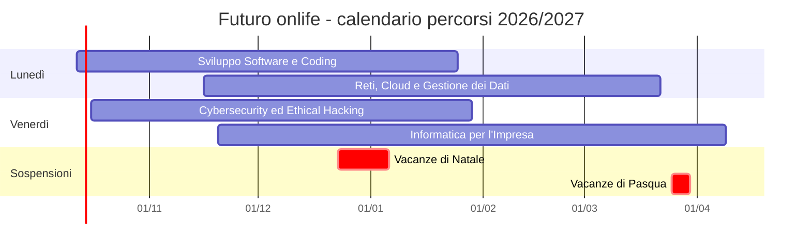

# Futuro onlife: percorsi di orientamento tra scuola, territorio e impresa

**Identificativo di progetto:** 10.1.6A-FDRPOC-LA-2024-68
**CUP:** J84D25001250001

Calendario dei percorsi di orientamento, anno scolastico 2026/2027. Ogni corso ha una durata di 30 ore, articolate in 10 sessioni da 3 ore, sempre nello stesso giorno della settimana, dalle 15:00 alle 18:00.

## Sviluppo Software e Coding Laboratoriale

Percorso in cui gli studenti apprendono:

- la logica di **programmazione**
- la **struttura degli algoritmi**

creando **piccole applicazioni o componenti web**, con illustrazione degli **sbocchi professionali e accademici** legati allo sviluppo informatico.

Giorno: lunedì

| N. | Data | Orario |
|---:|------|--------|
| 1 | lunedì 12 ottobre 2026 | 15:00 - 18:00 |
| 2 | lunedì 19 ottobre 2026 | 15:00 - 18:00 |
| 3 | lunedì 26 ottobre 2026 | 15:00 - 18:00 |
| 4 | lunedì 2 novembre 2026 | 15:00 - 18:00 |
| 5 | lunedì 9 novembre 2026 | 15:00 - 18:00 |
| 6 | lunedì 23 novembre 2026 | 15:00 - 18:00 |
| 7 | lunedì 14 dicembre 2026 | 15:00 - 18:00 |
| 8 | lunedì 11 gennaio 2027 | 15:00 - 18:00 |
| 9 | lunedì 18 gennaio 2027 | 15:00 - 18:00 |
| 10 | lunedì 25 gennaio 2027 | 15:00 - 18:00 |

## Cybersecurity ed Ethical Hacking

Itinerario incentrato sulla sicurezza informatica e sulla difesa delle reti, in cui i ragazzi **simulano attacchi e configurazioni di protezione**, apprendono le sfide della gestione dati e studiano casi reali.

Giorno: venerdì

| N. | Data | Orario |
|---:|------|--------|
| 1 | venerdì 16 ottobre 2026 | 15:00 - 18:00 |
| 2 | venerdì 23 ottobre 2026 | 15:00 - 18:00 |
| 3 | venerdì 30 ottobre 2026 | 15:00 - 18:00 |
| 4 | venerdì 6 novembre 2026 | 15:00 - 18:00 |
| 5 | venerdì 13 novembre 2026 | 15:00 - 18:00 |
| 6 | venerdì 27 novembre 2026 | 15:00 - 18:00 |
| 7 | venerdì 18 dicembre 2026 | 15:00 - 18:00 |
| 8 | venerdì 15 gennaio 2027 | 15:00 - 18:00 |
| 9 | venerdì 22 gennaio 2027 | 15:00 - 18:00 |
| 10 | venerdì 29 gennaio 2027 | 15:00 - 18:00 |

## Reti, Cloud e Gestione dei Dati

Percorso sull'infrastruttura tecnologica, in cui gli studenti si cimentano:

- nella **progettazione di architetture di rete**
- nella gestione di database
- analizzando come "viaggiano" le informazioni

e apprendono i concetti di base dei sistemi cloud e delle infrastrutture ICT del mondo professionale.

Giorno: lunedì

| N. | Data | Orario |
|---:|------|--------|
| 1 | lunedì 16 novembre 2026 | 15:00 - 18:00 |
| 2 | lunedì 30 novembre 2026 | 15:00 - 18:00 |
| 3 | lunedì 1 febbraio 2027 | 15:00 - 18:00 |
| 4 | lunedì 8 febbraio 2027 | 15:00 - 18:00 |
| 5 | lunedì 15 febbraio 2027 | 15:00 - 18:00 |
| 6 | lunedì 22 febbraio 2027 | 15:00 - 18:00 |
| 7 | lunedì 1 marzo 2027 | 15:00 - 18:00 |
| 8 | lunedì 8 marzo 2027 | 15:00 - 18:00 |
| 9 | lunedì 15 marzo 2027 | 15:00 - 18:00 |
| 10 | lunedì 22 marzo 2027 | 15:00 - 18:00 |

## Informatica per l'Impresa e Soft Skills Digitale

Percorso che unisce le competenze tecniche al **lavoro di squadra e al problem solving**, guidando gli studenti nella **simulazione della gestione di un progetto informatico completo**, dal requisito dell'utente al rilascio del software, con l'illustrazione, da parte del docente, di come le aziende ICT gestiscono i progetti, e il supporto nella definizione del proprio piano orientativo post-diploma.

Giorno: venerdì

| N. | Data | Orario |
|---:|------|--------|
| 1 | venerdì 20 novembre 2026 | 15:00 - 18:00 |
| 2 | venerdì 11 dicembre 2026 | 15:00 - 18:00 |
| 3 | venerdì 5 febbraio 2027 | 15:00 - 18:00 |
| 4 | venerdì 12 febbraio 2027 | 15:00 - 18:00 |
| 5 | venerdì 19 febbraio 2027 | 15:00 - 18:00 |
| 6 | venerdì 26 febbraio 2027 | 15:00 - 18:00 |
| 7 | venerdì 5 marzo 2027 | 15:00 - 18:00 |
| 8 | venerdì 12 marzo 2027 | 15:00 - 18:00 |
| 9 | venerdì 19 marzo 2027 | 15:00 - 18:00 |
| 10 | venerdì 9 aprile 2027 | 15:00 - 18:00 |

## Quadro d'insieme

Le barre indicano il periodo tra la prima e l'ultima sessione di ciascun corso; i corsi che condividono lo stesso giorno non si sovrappongono mai nella stessa data.

## Note organizzative

L'orario è flessibile e verrà adattato alle esigenze dei partecipanti, entro i limiti consentiti dalla disponibilità delle infrastrutture.

## Criteri di pianificazione

- **Avvio dei corsi:** con due soli giorni disponibili non è possibile avviare contemporaneamente tutti e quattro i corsi; partono per primi "Sviluppo Software e Coding Laboratoriale" (lunedì) e "Cybersecurity ed Ethical Hacking" (venerdì).
- **Sessioni nel 2026 per tutti i corsi:** per garantire almeno 2 sessioni nel 2026 anche agli altri due corsi, due sessioni di ciascun corso prioritario sono state posticipate al 2027:
  - Coding: le date del 16 e 30 novembre 2026 sono assegnate a Reti, Cloud e Gestione dei Dati
  - Cybersecurity: le date del 20 novembre e 11 dicembre 2026 sono assegnate a Informatica per l'Impresa

  Di conseguenza Coding e Cybersecurity svolgono 7 sessioni nel 2026 e 3 nel gennaio 2027; gli altri due corsi svolgono 2 sessioni nel 2026 e riprendono a febbraio 2027, nello stesso giorno della settimana, al termine del corso che li precede.
- **Festività e sospensioni** (calendario scolastico Regione Lazio 2026/2027: https://regione.lazio.it/notizie/scuola-e-universita/comunicato-calendario-scolastico-2026-2027):
  - martedì 8 dicembre 2026 (Immacolata Concezione)
  - vacanze di Natale dal 23 dicembre 2026 al 6 gennaio 2027
  - vacanze di Pasqua dal 25 al 30 marzo 2027, comprese venerdì 26 marzo e lunedì 29 marzo (Lunedì dell'Angelo)
- **Date escluse perché a ridosso di festività:**
  - venerdì 4 dicembre e lunedì 7 dicembre 2026, ponte con l'Immacolata (il 7 dicembre è sospeso da molte scuole laziali)
  - lunedì 21 dicembre 2026, immediatamente prima delle vacanze di Natale
  - venerdì 8 gennaio 2027, alla ripresa dopo le vacanze di Natale
  - venerdì 2 aprile 2027, alla ripresa dopo le vacanze di Pasqua; l'ultima sessione di Informatica per l'Impresa è spostata a venerdì 9 aprile 2027
- **Date mantenute ma da verificare con il calendario d'istituto:** venerdì 30 ottobre e lunedì 2 novembre 2026, prima e dopo Ognissanti, che nel 2026 cade di domenica; non sono giorni festivi né sospesi nel calendario regionale.

La calendarizzazione è soggetta alla disponibilità delle infrastrutture necessarie (aule laboratorio, PC, software specifico per il laboratorio, la cui lista verrà fornita prima dell'inizio del corso) e può essere variata per consigli di classe o altri importanti eventi scolastici.

---

**Nota fuori dal testo da consegnare:**

> **Se il calendario d'istituto non prevede il ponte del 7 dicembre, oppure se si accettano le date dell'8 gennaio e del 2 aprile, Reti e Impresa possono anticipare la conclusione di una settimana.** Indicami quali date recuperare e aggiorno il calendario.