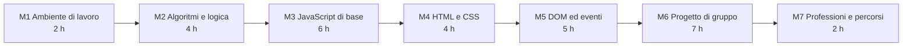

# Sviluppo Software e Coding Laboratoriale

## Dati generali

- Tipo di percorso: percorso di orientamento per le classi terze, quarte e quinte della scuola secondaria di secondo grado, con il coordinamento del docente tutor.
- Durata: 30 ore, suddivise in unità didattiche di circa un'ora, componibili in sessioni da 2 o 3 ore.
- Destinatari: studenti del triennio di istituto tecnico a indirizzo informatico e di liceo scientifico (16-18 anni).
- Prerequisiti: comprensione di programmi brevi (10-20 righe) in un qualsiasi linguaggio; uso di base del PC (file, cartelle, browser).
- Approccio: laboratoriale e basato su progetti; ogni argomento termina con un'attività pratica. Gli aspetti orientativi sono trattati soprattutto a voce, in forma di discussione, a partire da brevi elenchi di punti inseriti nei materiali.

## Obiettivi di apprendimento

Al termine del percorso lo studente:

- descrive che cos'è un algoritmo e lo rappresenta con pseudocodice e diagramma di flusso
- usa le strutture di controllo (sequenza, selezione, iterazione) per risolvere problemi semplici
- scrive, esegue e corregge programmi JavaScript di alcune decine di righe
- costruisce una pagina web con HTML e CSS e la rende interattiva con JavaScript (DOM ed eventi)
- usa gli strumenti professionali di base: editor di codice, strumenti per sviluppatori del browser, terminale, Git
- lavora in piccolo gruppo su un progetto, dalla definizione dei requisiti alla presentazione del risultato
- conosce i principali ruoli professionali dello sviluppo software e i percorsi di studio che vi conducono

## Strumenti software

Tutti gli strumenti sono gratuiti, funzionano su un laptop Windows con 8 GB di RAM e non richiedono account personali.

| Tipologia | Strumento consigliato | Alternative | Note di installazione |
|---|---|---|---|
| Editor di codice | Visual Studio Code, versione ZIP in modalità portatile: https://code.visualstudio.com/docs/setup/portable | VSCodium; Notepad++ | Archivio da scompattare; cartella `data` per la modalità portatile |
| Anteprima delle pagine | Estensione Live Preview (Microsoft): https://marketplace.visualstudio.com/items?itemName=ms-vscode.live-server | Apertura diretta del file HTML nel browser | Si installa dall'editor, nessun account |
| Browser e strumenti per sviluppatori | Firefox o Chrome, con DevTools integrati | Microsoft Edge | Già presenti sui PC di laboratorio |
| Controllo di versione | Git for Windows, edizione portatile: https://git-scm.com/install/windows | Git integrato in VS Code (richiede comunque Git) | Archivio autoestraente; cartella `cmd` da aggiungere al PATH |
| Terminale | PowerShell, integrato in VS Code | Git Bash (incluso in Git for Windows) | Già presente in Windows |

Nota: la guida Microsoft usata come fonte consiglia l'estensione "Live Server" di Ritwick Dey, che al momento della verifica non risulta più disponibile sul Marketplace (la pagina restituisce errore 404). Il corso usa quindi l'estensione "Live Preview" pubblicata da Microsoft.

Servizi esclusi o sostituiti:

- GitHub Copilot e altri assistenti AI integrati nell'editor: esclusi, perché richiedono un account e perché il corso punta alla comprensione del codice scritto dallo studente.
- GitHub e GitHub Codespaces: non necessari; Git si usa in locale. Un eventuale repository remoto condiviso si crea con l'account del docente.

## Struttura del corso

Struttura a tre livelli: modulo, lezione (circa un'ora), sezione.

La struttura delle directory riflette quella del corso: una directory per modulo (`modNN_...`), con un file indice (`modNN_00_indice_modulo.md`) e una sottodirectory per lezione (`lezNN_...`). Ogni directory di lezione contiene tre file con lo stesso prefisso `modNN_lezNN_...`:

- `.md`: la lezione (lezpub), da rendere in PDF A4
- `_marp.md`: presentazione Marp
- `_prezpdoc.md`: presentazione pandoc in formato reveal.js

Il prefisso completo nel nome dei file permette di riconoscere modulo e lezione anche quando un file viene copiato fuori dalla propria directory.

```text
corso01_sviluppo_software/
    corso01_00_syllabus.md
    mod01_ambiente_di_lavoro/
        mod01_00_indice_modulo.md
        lez01_programmi_linguaggi_strumenti/
        lez02_terminale_e_git/
    mod02_algoritmi_e_logica/
        mod02_00_indice_modulo.md
        lez01_problemi_e_algoritmi/
        lez02_strutture_di_controllo/
        lez03_algoritmi_su_elenchi/
        lez04_ordinamento_e_costo/
    mod03_javascript_di_base/
        lez01_variabili_e_tipi/
        lez02_funzioni/
        lez03_decisioni/
        lez04_array_e_cicli/
        lez05_lab_algoritmi_in_javascript/
        lez06_errori_e_debugging/
    mod04_html_e_css/
        lez01_struttura_html/
        lez02_html_semantico_e_accessibilita/
        lez03_css_selettori_box_model/
        lez04_css_layout_responsive/
    mod05_dom_ed_eventi/
        lez01_dom/
        lez02_eventi_mouse_terrario/
        lez03_closure_e_stato/
        lez04_gioco_digitazione_parte1/
        lez05_gioco_digitazione_parte2/
    mod06_progetto_di_gruppo/
        lez01_requisiti_e_piano/
        lez02_sviluppo_interfaccia/
        lez03_sviluppo_logica_e_dati/
        lez04_sviluppo_interazione/
        lez05_integrazione/
        lez06_test_e_revisione/
        lez07_presentazione/
    mod07_professioni_e_percorsi/
        lez01_ruoli_e_processi/
        lez02_percorsi_di_studio_e_lavoro/
```



### Modulo 1: Ambiente di lavoro (2 ore)

Directory: `mod01_ambiente_di_lavoro/`

| Lezione | Contenuti | Attività pratica | Fonte adattata |
|---|---|---|---|
| 1.1 Programmi, linguaggi e strumenti del mestiere | Programma e linguaggio; alto e basso livello; compilazione e interpretazione; editor, browser, DevTools, documentazione | Installazione di VS Code portatile; prima pagina con script; uso della console | Microsoft, lezione 01: https://github.com/microsoft/Web-Dev-For-Beginners/blob/main/1-getting-started-lessons/1-intro-to-programming-languages/README.md |
| 1.2 Terminale e controllo di versione con Git | Comandi di base di PowerShell; PATH; Git: repository, commit, storia | Installazione di Git portatile; primo repository; tre commit | Contenuto originale; riferimento: Pro Git, https://git-scm.com/book/it/v2 |

### Modulo 2: Algoritmi e logica (4 ore)

Directory: `mod02_algoritmi_e_logica/`

| Lezione | Contenuti | Attività pratica | Fonte |
|---|---|---|---|
| 2.1 Problemi e algoritmi | Definizione e proprietà di un algoritmo; input, elaborazione, output; pseudocodice; diagrammi di flusso | Scomposizione di problemi quotidiani e scolastici in passi | Contenuto originale |
| 2.2 Strutture di controllo | Sequenza, selezione, iterazione; teorema di Böhm-Jacopini; tracciamento a mano | Tabelle di traccia; diagrammi Mermaid | Contenuto originale |
| 2.3 Algoritmi su elenchi | Massimo, conteggio, somma, ricerca lineare, ricerca binaria | Esecuzione "a carte" in classe; primi script in console | Contenuto originale |
| 2.4 Ordinamento e costo degli algoritmi | Selection sort; numero di confronti; crescita del costo al crescere dell'input | Misura dei tempi in JavaScript su array di dimensioni crescenti | Contenuto originale |

### Modulo 3: JavaScript di base (6 ore)

Directory: `mod03_javascript_di_base/`

| Lezione | Contenuti | Fonte adattata |
|---|---|---|
| 3.1 Variabili e tipi di dato | `let`, `const`; numeri, stringhe, booleani; operatori; template literal | Microsoft, lezione 04 (Data Types) |
| 3.2 Funzioni | Dichiarazione, parametri, valore di ritorno, funzioni freccia | Microsoft, lezione 05 (Functions and Methods) |
| 3.3 Decisioni | `if`/`else`, operatori logici, `switch`, operatore ternario | Microsoft, lezione 06 (Making Decisions) |
| 3.4 Array e cicli | Array, `for`, `while`, `for...of`, metodi principali degli array | Microsoft, lezione 07 (Arrays and Loops) |
| 3.5 Laboratorio: gli algoritmi del modulo 2 in JavaScript | Ricerca, massimo, ordinamento implementati e verificati | Contenuto originale |
| 3.6 Errori e debugging | Errori di sintassi, di esecuzione, logici; console; breakpoint | MDN, "What are browser developer tools?" (CC-BY-SA 2.5) |

### Modulo 4: HTML e CSS (4 ore)

Directory: `mod04_html_e_css/`

| Lezione | Contenuti | Fonte adattata |
|---|---|---|
| 4.1 Struttura di una pagina HTML | Elementi, attributi, struttura del documento, collegamento di CSS e JS | Microsoft, lezione 08 (Introduction to HTML) |
| 4.2 HTML semantico e accessibilità | Elementi semantici, testo alternativo, contrasto, navigazione da tastiera | Microsoft, lezione 03 (Accessibility) |
| 4.3 CSS: selettori, box model, colori | Regole, selettori, cascata, specificità, box model | Microsoft, lezione 09 (Introduction to CSS) |
| 4.4 CSS: layout e pagine responsive | Posizionamento, Flexbox, media query | Microsoft, lezione 09; MDN, modulo CSS layout |

### Modulo 5: DOM ed eventi (5 ore)

Directory: `mod05_dom_ed_eventi/`

| Lezione | Contenuti | Fonte adattata |
|---|---|---|
| 5.1 Il DOM | Albero del documento; selezione e modifica di elementi | Microsoft, lezione 10 (DOM and Closures) |
| 5.2 Eventi del mouse: il terrario | `addEventListener`, trascinamento di elementi | Microsoft, lezione 10 |
| 5.3 Closure e stato | Funzioni annidate, variabili catturate, stato di un'interfaccia | Microsoft, lezione 10 |
| 5.4 Programmazione a eventi: gioco di digitazione (parte 1) | Eventi da tastiera, confronto di stringhe, misura del tempo | Microsoft, lezione 11 (Typing Game) |
| 5.5 Gioco di digitazione (parte 2) e memorizzazione locale | Completamento del gioco; record salvato con `localStorage` | Microsoft, lezioni 11 e 13 |

### Modulo 6: Progetto di gruppo (7 ore)

Directory: `mod06_progetto_di_gruppo/`

| Lezione | Contenuti |
|---|---|
| 6.1 Dal requisito al piano | Scelta del progetto (quiz, gioco di memoria, lista di attività, convertitore); requisiti, suddivisione dei compiti, pianificazione |
| 6.2 Sviluppo: struttura HTML e stile | Implementazione dell'interfaccia; commit frequenti |
| 6.3 Sviluppo: logica e dati | Algoritmi e strutture dati dell'applicazione |
| 6.4 Sviluppo: interazione | Eventi, aggiornamento del DOM, gestione degli errori |
| 6.5 Sviluppo: integrazione | Unione del lavoro dei membri del gruppo; risoluzione di conflitti |
| 6.6 Test e revisione del codice | Casi di prova, revisione reciproca, correzione |
| 6.7 Presentazione | Dimostrazione del prodotto; retrospettiva |

Fonti di spunto: progetti "memory-game" e "quiz-app" del repository Microsoft (https://github.com/microsoft/Web-Dev-For-Beginners).

### Modulo 7: Professioni e percorsi (2 ore)

Directory: `mod07_professioni_e_percorsi/`

| Lezione | Contenuti |
|---|---|
| 7.1 Ruoli e processi nello sviluppo software | Front-end, back-end, full-stack, tester, DevOps, UX; ciclo di vita del software; lavoro in team |
| 7.2 Percorsi di studio e di ingresso nel lavoro | ITS Academy, lauree triennali, certificazioni, portfolio e contributi open source |

## Composizione delle sessioni

Le lezioni sono unità da circa un'ora. Esempi di composizione:

- sessioni da 2 ore: 15 sessioni, ciascuna con due lezioni consecutive dello stesso modulo, dove possibile
- sessioni da 3 ore: 10 sessioni; la terza ora si usa per il laboratorio più lungo o per la lezione successiva

I moduli 1, 3, 4 e 5 contengono attività che possono essere interrotte al termine di ogni lezione senza perdita di lavoro, perché ogni lezione termina con un commit Git.

## Verifica degli apprendimenti

- Osservazione del lavoro in laboratorio e dei commit prodotti.
- Esercizi di fine lezione, svolti individualmente o a coppie.
- Prodotto del progetto di gruppo e sua presentazione.

## Fonti, licenze e attribuzioni

- Microsoft, "Web Development for Beginners - A Curriculum", https://github.com/microsoft/Web-Dev-For-Beginners . Copyright (c) Microsoft Corporation. Licenza MIT: https://github.com/microsoft/Web-Dev-For-Beginners/blob/main/LICENSE . Le parti adattate sono tradotte, riscritte e indicate nelle singole lezioni con l'URL della lezione di origine.
- MDN Web Docs, Mozilla Contributors, https://developer.mozilla.org/ . Testi con licenza CC-BY-SA 2.5; esempi di codice CC0. Le parti adattate sono indicate nelle singole lezioni.
- Scott Chacon, Ben Straub, "Pro Git", https://git-scm.com/book/it/v2 . Licenza CC BY-NC-SA 3.0: usato solo come riferimento e tramite link, senza riproduzione di testo.
