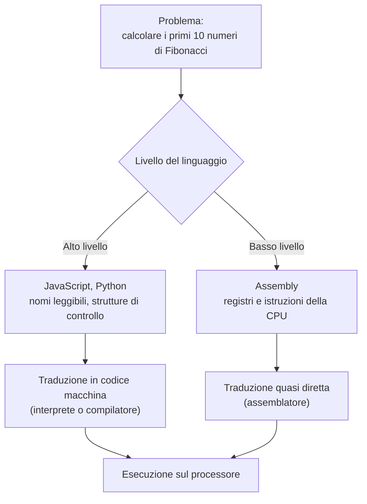
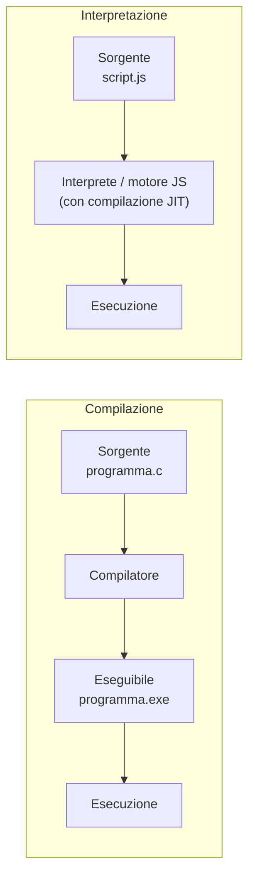
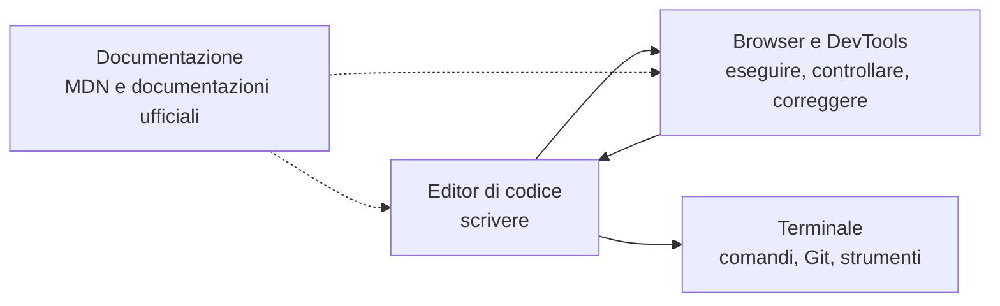

# Lezione 1.1: Programmi, linguaggi e strumenti del mestiere

> Fonte: adattamento, tradotto e riscritto, della lezione "Introduction to Programming Languages and Modern Developer Tools" del corso Microsoft "Web Development for Beginners", https://github.com/microsoft/Web-Dev-For-Beginners/blob/main/1-getting-started-lessons/1-intro-to-programming-languages/README.md . Copyright (c) Microsoft Corporation, licenza MIT: https://github.com/microsoft/Web-Dev-For-Beginners/blob/main/LICENSE .

## 1.1.1 Programma e linguaggio di programmazione

Concetti:

- **Programma**: sequenza di istruzioni che un computer esegue per svolgere un compito.
- **Linguaggio di programmazione**: linguaggio formale, con regole di scrittura (sintassi) e significato (semantica) definiti in modo preciso, usato per scrivere programmi.
- **Codice sorgente**: il testo del programma scritto da una persona in un linguaggio di programmazione.
- **Codice macchina**: sequenza di istruzioni binarie che il processore (CPU) esegue direttamente.

Il processore esegue solo istruzioni molto elementari: copiare un valore in memoria, sommare due numeri, confrontarli, saltare a un'altra istruzione. Un linguaggio di programmazione permette di descrivere un compito con istruzioni più vicine al modo di ragionare umano; uno strumento di traduzione le trasforma poi in codice macchina.

A differenza di una persona, il computer non interpreta le intenzioni: esegue esattamente ciò che è scritto. Un'istruzione ambigua per una persona è, per un linguaggio di programmazione, un errore oppure un'istruzione con un significato preciso, magari diverso da quello voluto.

## 1.1.2 Linguaggi di alto e di basso livello

- **Linguaggio di basso livello**: vicino all'hardware; le istruzioni corrispondono quasi una a una alle operazioni del processore. Esempio: Assembly.
- **Linguaggio di alto livello**: vicino al modo di esprimersi umano; nasconde i dettagli dell'hardware (registri, indirizzi di memoria). Esempi: JavaScript, Python, Java, C#.

Il linguaggio C si colloca in una posizione intermedia: è di alto livello rispetto all'Assembly, ma permette un controllo diretto della memoria e per questo viene spesso usato per sistemi operativi e software embedded.

Diagramma: dallo stesso problema a due livelli di linguaggio.



Esempio: la successione di Fibonacci (ogni numero è la somma dei due precedenti: 0, 1, 1, 2, 3, 5, 8, 13, ...) in JavaScript.

```javascript
// Quanti numeri della successione calcolare
const quantiNumeri = 10;

// I due numeri di partenza della successione
let corrente = 0;
let successivo = 1;

// Ciclo ripetuto quantiNumeri volte; i conta le ripetizioni
for (let i = 0; i < quantiNumeri; i++) {
  // Stampa la posizione (a partire da 1) e il valore corrente
  console.log(`Posizione ${i + 1}: ${corrente}`);

  // Calcola il numero che segue: somma degli ultimi due
  const somma = corrente + successivo;
  // Fa "scorrere" la coppia di numeri di un passo in avanti
  corrente = successivo;
  successivo = somma;
}
```

Elementi del codice:

- `const quantiNumeri = 10;` dichiara una **costante**, cioè un nome associato a un valore che non cambia.
- `let corrente = 0;` dichiara una **variabile**, cioè un nome associato a un valore che può cambiare durante l'esecuzione.
- `for (let i = 0; i < quantiNumeri; i++) { ... }` è un **ciclo**: la variabile `i` parte da 0; finché la condizione `i < quantiNumeri` è vera, il blocco tra parentesi graffe viene eseguito e poi `i++` aumenta `i` di 1.
- `console.log(...)` stampa un valore nella console, un'area di testo degli strumenti per sviluppatori del browser (sezione 1.1.4).
- `` `Posizione ${i + 1}: ${corrente}` `` è un **template literal**: una stringa delimitata da apici inversi, in cui le espressioni racchiuse in `${ }` vengono calcolate e inserite nel testo.

La stessa successione scritta in Assembly ARM occupa circa venti righe di istruzioni come `mov r0,#00` (copia il valore 0 nel registro `r0`) e `add r0,r1` (somma il contenuto del registro `r1` a `r0`). Il testo completo è nella lezione Microsoft citata in apertura. Il confronto mostra il vantaggio dei linguaggi di alto livello: nomi significativi (`corrente`, `successivo` invece di `r0`, `r1`), strutture di controllo esplicite (`for`), commenti. Il programma risulta più facile da leggere, correggere e modificare.

## 1.1.3 Compilazione e interpretazione

Il codice sorgente di un linguaggio di alto livello deve essere tradotto in codice macchina. Le due strategie principali:

- **Compilazione**: un programma chiamato **compilatore** traduce l'intero sorgente in un file eseguibile, prima dell'esecuzione. Esempi: C, C++, Go, Rust.
- **Interpretazione**: un programma chiamato **interprete** legge il sorgente ed esegue le istruzioni man mano. Esempi storici: le prime versioni di JavaScript e Python.

Molti linguaggi moderni usano soluzioni miste. Java e C# vengono compilati in un codice intermedio (bytecode), eseguito da una macchina virtuale. I motori JavaScript dei browser (V8 in Chrome ed Edge, SpiderMonkey in Firefox) interpretano il codice e compilano "al volo" (compilazione **JIT**, Just In Time) le parti eseguite più spesso.



Conseguenza pratica per questo corso: un programma JavaScript non richiede una fase di compilazione separata. È sufficiente un file di testo e un browser.

Linguaggi diffusi e loro ambiti principali:

| Linguaggio | Ambito principale | Caratteristica rilevante |
|---|---|---|
| JavaScript | Pagine e applicazioni web (lato client e, con Node.js, lato server) | È l'unico linguaggio eseguito nativamente da tutti i browser |
| Python | Analisi dei dati, intelligenza artificiale, automazione | Sintassi essenziale, molte librerie scientifiche |
| Java | Applicazioni aziendali, Android | Eseguito da una macchina virtuale, portabile |
| C# | Applicazioni Windows, videogiochi (Unity) | Ecosistema .NET |
| C e C++ | Sistemi operativi, software embedded, motori grafici | Controllo diretto della memoria, alte prestazioni |
| Go | Servizi cloud, back-end | Semplicità, programmazione concorrente |

## 1.1.4 Gli strumenti del mestiere

Il lavoro quotidiano di uno sviluppatore web usa quattro categorie di strumenti.



**Editor di codice.** Editor di testo specializzato per il codice sorgente. Funzioni principali:

- evidenziazione della sintassi: colori diversi per parole chiave, stringhe, commenti
- completamento automatico: suggerimenti di nomi e istruzioni durante la digitazione
- segnalazione degli errori mentre si scrive
- terminale integrato e integrazione con Git
- estensioni che aggiungono funzioni per specifici linguaggi o attività

Strumento consigliato: Visual Studio Code (VS Code), https://code.visualstudio.com/ , gratuito e il più diffuso nello sviluppo web. Alternative: VSCodium (stessa base di VS Code, senza telemetria Microsoft), Notepad++ (editor leggero, senza funzioni avanzate).

Un **IDE** (Integrated Development Environment) è un ambiente più completo, che integra editor, compilatore, debugger e strumenti di progetto; esempi: IntelliJ IDEA, Visual Studio, Eclipse. VS Code, con le estensioni, si avvicina a un IDE pur restando leggero.

**Browser e strumenti per sviluppatori (DevTools).** Il browser esegue le pagine web e contiene un insieme di strumenti per analizzarle. Si aprono con `F12` oppure `Ctrl` + `Shift` + `I`, o con clic destro su un elemento della pagina e voce "Ispeziona". Pannelli principali:

| Pannello | Funzione |
|---|---|
| Ispettore (Firefox) / Elements (Chrome, Edge) | Mostra l'HTML e il CSS della pagina; permette di modificarli in tempo reale |
| Console | Mostra messaggi ed errori; esegue istruzioni JavaScript digitate |
| Debugger (Firefox) / Sources (Chrome, Edge) | Esegue il codice passo passo, con punti di interruzione (breakpoint) |
| Rete (Network) | Elenca le risorse scaricate dalla pagina e i tempi di caricamento |

Guida di riferimento: MDN, "What are browser developer tools?", https://developer.mozilla.org/en-US/docs/Learn_web_development/Howto/Tools_and_setup/What_are_browser_developer_tools

**Terminale.** Interfaccia testuale in cui si digitano comandi. Molti strumenti professionali (Git, gestori di pacchetti, server di sviluppo) si usano principalmente da terminale. È l'argomento della lezione 1.2.

**Documentazione.** Nessuno sviluppatore ricorda a memoria tutte le funzioni di un linguaggio: la consultazione della documentazione fa parte del lavoro quotidiano. Riferimento principale per il web: MDN Web Docs, https://developer.mozilla.org/ , curato da Mozilla e dalla comunità, con guide ed esempi per HTML, CSS e JavaScript.

## 1.1.5 Laboratorio: predisposizione dell'ambiente e primo programma

Tempo indicativo: 30 minuti.

### Installazione di VS Code in modalità portatile

La **modalità portatile** mantiene programma, impostazioni ed estensioni in un'unica cartella: non serve installazione, non servono diritti di amministratore, e la cartella può essere copiata su una chiavetta USB. Documentazione: https://code.visualstudio.com/docs/setup/portable

1. Dalla pagina https://code.visualstudio.com/download scaricare la versione **.zip** per Windows x64 (non gli installer "User" o "System": la modalità portatile funziona solo con l'archivio ZIP).
2. Creare una cartella per gli strumenti del corso, per esempio `C:\strumenti` oppure, su PC condivisi, `Documenti\strumenti`.
3. Scompattare l'archivio in una sottocartella, per esempio `C:\strumenti\vscode`.
4. Dentro `C:\strumenti\vscode` creare una cartella vuota chiamata `data`. Da questo momento VS Code salva impostazioni ed estensioni lì.
5. Avviare `Code.exe`.

Struttura risultante:

```text
C:\strumenti\vscode\
    Code.exe        <- programma da avviare
    bin\            <- contiene il comando "code" per il terminale
    data\           <- impostazioni ed estensioni (modalità portatile)
    ...
```

Nota: la versione ZIP non si aggiorna automaticamente. Per aggiornarla si scompatta la nuova versione e vi si copia la cartella `data`.

### Installazione dell'estensione Live Preview

**Live Preview** è un'estensione Microsoft che avvia un piccolo **server web locale**: un programma che, sul proprio PC, consegna le pagine al browser come farebbe un sito reale, e ricarica la pagina a ogni modifica. Pagina ufficiale: https://marketplace.visualstudio.com/items?itemName=ms-vscode.live-server

1. In VS Code aprire il pannello Estensioni (icona dei quattro quadrati nella barra laterale, oppure `Ctrl` + `Shift` + `X`).
2. Cercare "Live Preview" e verificare che l'autore sia Microsoft.
3. Fare clic su "Install".

### Prima pagina con uno script

1. Creare la cartella di lavoro del corso, per esempio `C:\corso-coding\lab01`.
2. In VS Code: menu File, voce "Open Folder...", selezionare `lab01`. Alla domanda sull'attendibilità della cartella rispondere affermativamente: la cartella contiene solo file propri.
3. Creare il file `index.html` (icona "New File" nel pannello Explorer) con il contenuto seguente.

```html
<!DOCTYPE html>
<!-- Dichiara che il documento usa HTML moderno (HTML5) -->
<html lang="it">
  <head>
    <!-- Codifica dei caratteri: permette lettere accentate -->
    <meta charset="UTF-8">
    <!-- Titolo mostrato nella scheda del browser -->
    <title>Laboratorio 1</title>
  </head>
  <body>
    <h1>Primo laboratorio</h1>
    <p>Aprire la console degli strumenti per sviluppatori (F12).</p>
    <!-- Collega il file JavaScript: il browser lo scarica e lo esegue -->
    <script src="script.js"></script>
  </body>
</html>
```

4. Creare il file `script.js` con il programma di Fibonacci della sezione 1.1.2.
5. Aprire `index.html`, poi fare clic sull'icona di anteprima in alto a destra nell'editor, oppure clic destro sul file e "Show Preview". Per aprire la pagina nel browser esterno: tavolozza dei comandi (`Ctrl` + `Shift` + `P`), comando "Live Preview: Show Preview (External Browser)".
6. Nel browser esterno premere `F12` e aprire la scheda Console: compaiono i dieci numeri della successione.

HTML e CSS sono trattati nel modulo 4; qui la pagina serve solo a far eseguire lo script al browser.

### Esperimenti in console

Nella console si possono digitare istruzioni JavaScript, eseguite alla pressione di Invio:

```javascript
2 + 3 * 4                        // espressione aritmetica: il risultato è 14
"Ciao " + "mondo"                // concatenazione di stringhe
document.title                   // legge il titolo della pagina corrente
document.title = "Titolo nuovo"  // lo modifica: osservare la scheda del browser
```

`document` è l'oggetto che rappresenta la pagina caricata nel browser; `document.title` è la sua proprietà che contiene il titolo. Il modulo 5 approfondisce questo argomento.

Provare poi un'istruzione errata, per esempio `console.log("ciao)` (manca l'apice di chiusura), e leggere il messaggio di errore: indica il tipo di errore e la posizione.

### Esercizi

1. Modificare `script.js` in modo che calcoli i primi 20 numeri della successione.
2. Aggiungere al termine del programma una riga che stampi la somma di tutti i numeri calcolati (suggerimento: una variabile `totale` inizializzata a 0 e aggiornata nel ciclo).
3. Nell'Ispettore del browser modificare il testo del titolo `h1` e osservare che la modifica scompare ricaricando la pagina: gli strumenti per sviluppatori modificano la pagina caricata, non il file sorgente.
