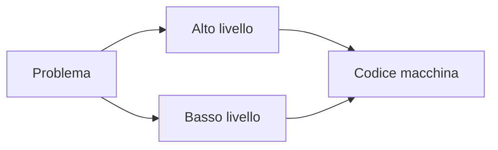
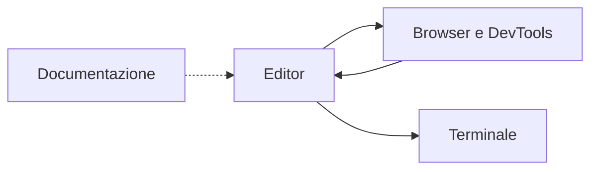

## Lezione 1.1: Programmi, linguaggi e strumenti del mestiere

Modulo 1: Ambiente di lavoro. Sviluppo Software e Coding Laboratoriale

Fonte: adattamento da Microsoft, "Web Development for Beginners", licenza MIT
https://github.com/microsoft/Web-Dev-For-Beginners

---

## Programma e linguaggio

- **Programma**: sequenza di istruzioni eseguite dal computer
- **Linguaggio di programmazione**: sintassi e semantica definite in modo preciso
- **Codice sorgente**: testo scritto dal programmatore
- **Codice macchina**: istruzioni binarie eseguite dalla CPU

Il computer esegue ciò che è scritto, non ciò che si intendeva scrivere.

---

## Alto e basso livello

- **Basso livello** (Assembly): istruzioni corrispondenti alle operazioni della CPU, registri come `r0`, `r1`
- **Alto livello** (JavaScript, Python, Java, C#): nomi significativi, strutture di controllo, dettagli hardware nascosti
- C: posizione intermedia, controllo diretto della memoria



---

## Fibonacci in JavaScript

```javascript
const quantiNumeri = 10;   // costante
let corrente = 0;          // variabili
let successivo = 1;

for (let i = 0; i < quantiNumeri; i++) {
  console.log(`Posizione ${i + 1}: ${corrente}`);
  const somma = corrente + successivo;
  corrente = successivo;
  successivo = somma;
}
```

- `const` / `let`: valore fisso / variabile
- `for`: ciclo con contatore `i`
- `console.log`: stampa nella console del browser
- `` `...${ }...` ``: template literal

---

## Compilazione e interpretazione

- **Compilatore**: traduce tutto il sorgente in un eseguibile, prima dell'esecuzione (C, Go, Rust)
- **Interprete**: esegue il sorgente istruzione per istruzione
- **Soluzioni miste**: bytecode e macchina virtuale (Java, C#); compilazione JIT nei motori JavaScript (V8, SpiderMonkey)

JavaScript: basta un file di testo e un browser.

---

## Linguaggi e ambiti

| Linguaggio | Ambito principale |
|---|---|
| JavaScript | Web, lato client e server |
| Python | Dati, AI, automazione |
| Java | Applicazioni aziendali, Android |
| C# | Windows, videogiochi |
| C, C++ | Sistemi, embedded, grafica |
| Go | Servizi cloud |

---

## Strumenti del mestiere



- Editor: VS Code (alternative: VSCodium, Notepad++)
- DevTools: `F12`; Ispettore, Console, Debugger, Rete
- Documentazione: MDN Web Docs, https://developer.mozilla.org/

---

## Laboratorio 1.1

1. VS Code ZIP scompattato in `C:\strumenti\vscode`
2. Cartella `data` accanto a `Code.exe`: modalità portatile
3. Estensione **Live Preview** (Microsoft)
4. Cartella `lab01` con `index.html` e `script.js`
5. Anteprima nel browser, `F12`, scheda Console

Guida: https://code.visualstudio.com/docs/setup/portable

---

## Esperimenti in console

```javascript
2 + 3 * 4
"Ciao " + "mondo"
document.title
document.title = "Titolo nuovo"
console.log("ciao)      // errore: leggere il messaggio
```

Le modifiche fatte con i DevTools non cambiano i file sorgente.
