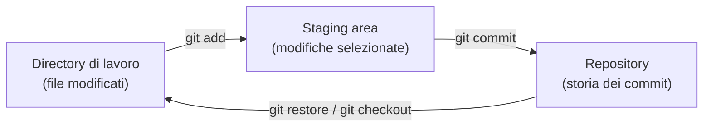
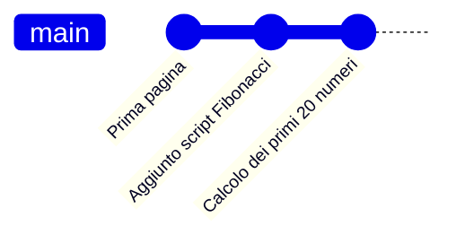

# Lezione 1.2: Terminale e controllo di versione con Git

Contenuto originale.

## 1.2.1 Il terminale

Concetti:

- **Terminale**: finestra in cui si digitano comandi testuali e se ne leggono i risultati.
- **Shell**: programma che interpreta i comandi digitati nel terminale. In Windows la shell moderna è **PowerShell**; esistono anche il Prompt dei comandi (cmd) e, installando Git, Git Bash.
- **Directory corrente** (cartella di lavoro): la cartella in cui la shell si trova in un dato momento; i comandi agiscono su di essa, salvo diversa indicazione.
- **Percorso** (path): indirizzo di un file o di una cartella. Un percorso **assoluto** parte dalla radice del disco (`C:\corso-coding\lab01`); un percorso **relativo** parte dalla directory corrente (`lab01\index.html`).

Motivi per cui gli sviluppatori usano il terminale:

- molti strumenti professionali non hanno interfaccia grafica, o ne hanno una limitata
- i comandi si possono ripetere, combinare e salvare in script, automatizzando operazioni
- i server, spesso senza interfaccia grafica, si gestiscono via terminale

In VS Code il terminale integrato si apre con il menu Terminal, voce "New Terminal". La shell predefinita su Windows è PowerShell e la directory corrente iniziale è la cartella aperta nell'editor.

### Comandi di base di PowerShell

Il **prompt** è il testo che precede il cursore e indica la directory corrente, per esempio `PS C:\corso-coding\lab01>`. Negli esempi seguenti il prompt non è riportato: si digita solo il comando.

```powershell
# Il carattere # introduce un commento: il testo che segue non viene eseguito

pwd                  # "print working directory": mostra la directory corrente
ls                   # elenca file e cartelle della directory corrente
cd ..                # "change directory": sale alla cartella superiore (..)
cd lab01             # entra nella sottocartella lab01 (percorso relativo)
cd C:\corso-coding   # entra in una cartella indicata con percorso assoluto
mkdir lab02          # "make directory": crea la cartella lab02
cls                  # pulisce lo schermo del terminale
```

Dettagli:

- `ls` e `pwd` sono **alias**, cioè nomi alternativi, dei comandi PowerShell `Get-ChildItem` e `Get-Location`. Esistono per compatibilità con le abitudini degli utenti Linux e macOS, dove `ls` e `pwd` sono i comandi originali. Anche `dir`, il comando classico del Prompt dei comandi, funziona come alias di `Get-ChildItem`.
- `..` indica sempre la cartella superiore; `.` indica la cartella corrente.
- Il tasto `Tab` completa automaticamente nomi di file e cartelle: digitando `cd la` e premendo `Tab` si ottiene `cd .\lab01\`.
- I tasti freccia su e giù scorrono i comandi digitati in precedenza.

### La variabile PATH

Quando si digita il nome di un programma (per esempio `git`), la shell lo cerca nelle cartelle elencate nella **variabile d'ambiente PATH**. Una **variabile d'ambiente** è un valore con nome, mantenuto dal sistema operativo e letto dai programmi. Se la cartella del programma non è nel PATH, la shell risponde con un errore del tipo "termine non riconosciuto come nome di cmdlet, funzione, programma eseguibile".

```powershell
$env:Path -split ";"   # mostra le cartelle del PATH, una per riga
```

- `$env:Path` legge la variabile d'ambiente `Path`.
- `-split ";"` è un operatore di PowerShell che divide il testo in parti, usando il punto e virgola come separatore: nel PATH le cartelle sono separate da `;`.

Aggiunta permanente di una cartella al PATH dell'utente (non servono diritti di amministratore):

1. Nel menu Start cercare "variabili d'ambiente" e aprire "Modifica le variabili d'ambiente relative al proprio account".
2. Nella sezione "Variabili dell'utente" selezionare `Path` e fare clic su "Modifica".
3. Fare clic su "Nuovo" e inserire il percorso della cartella, per esempio `C:\strumenti\PortableGit\cmd`.
4. Confermare con OK e **riavviare VS Code**: i terminali leggono il PATH solo all'avvio.

## 1.2.2 Controllo di versione e Git

Concetti:

- **Controllo di versione**: registrazione della storia delle modifiche di un insieme di file, in modo da poter vedere chi ha cambiato cosa e quando, e tornare a versioni precedenti.
- **Git**: il sistema di controllo di versione più diffuso, gratuito e open source, creato nel 2005 da Linus Torvalds per lo sviluppo del kernel Linux. Sito ufficiale: https://git-scm.com/
- **Repository** (repo): cartella di progetto di cui Git registra la storia. Git conserva i propri dati nella sottocartella nascosta `.git`.
- **Commit**: fotografia dello stato dei file in un certo momento, con autore, data e un messaggio che descrive la modifica.
- **Staging area** (area di preparazione): elenco delle modifiche selezionate per il prossimo commit.

Nel lavoro professionale Git è usato praticamente ovunque: permette a più persone di lavorare sullo stesso codice, di sperimentare senza rischiare di perdere la versione funzionante e di ricostruire quando è stato introdotto un errore. Servizi come GitHub e GitLab ospitano repository remoti condivisi; in questo corso si usa Git solo in locale.

Le tre aree di Git:



Ogni commit punta al commit precedente: la storia è una catena.



Riferimento completo in italiano: Scott Chacon, Ben Straub, "Pro Git", capitolo 1, https://git-scm.com/book/it/v2

## 1.2.3 Laboratorio: installazione di Git e primo repository

Tempo indicativo: 35 minuti.

### Installazione di Git portatile

1. Dalla pagina https://git-scm.com/install/windows scaricare "Git for Windows/x64 Portable", nella sezione Portable ("thumbdrive edition"). Il file ha un nome del tipo `PortableGit-<versione>-64-bit.7z.exe`.
2. Eseguire il file: è un **archivio autoestraente**, cioè un archivio compresso che si scompatta da solo. Indicare come destinazione `C:\strumenti\PortableGit`.
3. Aggiungere al PATH dell'utente la cartella `C:\strumenti\PortableGit\cmd` (procedura della sezione 1.2.1) e riavviare VS Code.
4. Verificare nel terminale:

```powershell
git --version   # stampa la versione di Git installata
```

L'opzione `--version`, presente in quasi tutti i programmi da terminale, chiede al programma di stampare la propria versione ed uscire. Se compare un numero di versione, Git è raggiungibile tramite PATH.

### Configurazione dell'identità

Ogni commit registra nome ed email dell'autore. Sui PC personali:

```powershell
git config --global user.name "Nome Cognome"
git config --global user.email "nome.cognome@example.com"
```

- `git config` legge e imposta opzioni di configurazione di Git.
- `--global` salva l'impostazione per tutti i repository dell'utente corrente del PC.
- `user.name` e `user.email` sono i nomi delle due opzioni.

L'email serve solo come identificativo nei commit e non riceve messaggi finché il repository resta locale; `example.com` è un dominio riservato agli esempi. Sui PC di laboratorio condivisi si omette `--global` e si eseguono i due comandi dentro il proprio repository, dopo `git init`: l'impostazione vale solo per quel repository.

### Primo repository

Nel terminale di VS Code, con la cartella `lab01` aperta:

```powershell
git init -b main
```

- `git init` trasforma la directory corrente in un repository, creando la cartella nascosta `.git`.
- `-b main` assegna il nome `main` al **branch** (ramo di sviluppo) iniziale. I branch permettono di sviluppare linee di lavoro parallele; in questo modulo se ne usa uno solo.

```powershell
git status
```

`git status` mostra lo stato dei file: qui `index.html` e `script.js` risultano "untracked", cioè non ancora seguiti da Git.

```powershell
git add index.html script.js
git status
```

`git add` seguito da nomi di file copia le modifiche di quei file nella staging area. Il nuovo `git status` li elenca tra le modifiche pronte per il commit ("Changes to be committed"). Per aggiungere tutti i file modificati della cartella si usa `git add .` (il punto indica la directory corrente).

```powershell
git commit -m "Prima pagina con script Fibonacci"
```

- `git commit` crea un commit con il contenuto della staging area.
- `-m` (message) introduce il messaggio del commit, tra virgolette. Un buon messaggio descrive in poche parole che cosa cambia, per esempio "Calcolo dei primi 20 numeri", non "modifiche".

Se l'opzione `-m` viene omessa, Git apre un editor di testo per scrivere il messaggio.

```powershell
git log --oneline
```

`git log` mostra la storia dei commit, dal più recente; l'opzione `--oneline` riduce ogni commit a una riga, con l'identificativo abbreviato e il messaggio. L'identificativo è un **hash**: una sequenza di caratteri esadecimali calcolata dal contenuto del commit, che lo identifica in modo univoco.

### Modifica, confronto, nuovo commit

1. In `script.js` portare `quantiNumeri` a 20 e salvare.
2. Eseguire:

```powershell
git diff
```

`git diff` mostra le differenze tra i file della directory di lavoro e l'ultima versione registrata: le righe precedute da `-` sono state rimosse, quelle precedute da `+` aggiunte.

3. Registrare la modifica:

```powershell
git add script.js
git commit -m "Calcolo dei primi 20 numeri"
git log --oneline
```

### Git in VS Code

VS Code usa lo stesso Git del terminale. Il pannello Source Control (icona dei rami, oppure `Ctrl` + `Shift` + `G`) mostra i file modificati; il segno `+` accanto a un file corrisponde a `git add`, la casella del messaggio e il pulsante "Commit" corrispondono a `git commit -m`. Conoscere i comandi rende comprensibile ciò che l'interfaccia grafica esegue e permette di lavorare anche dove l'interfaccia non è disponibile.

### Esercizi

1. Registrare con un terzo commit l'esercizio 2 della lezione 1.1 (somma dei numeri calcolati) e verificare la storia con `git log --oneline`.
2. Modificare `index.html` introducendo un errore volontario, verificarlo con `git diff`, poi annullare la modifica con `git restore index.html` (ripristina il file com'era nell'ultimo commit) e controllare con `git status`.
3. Creare la cartella `lab02` con `mkdir`, entrarvi con `cd` e inizializzarvi un nuovo repository: sarà usato nel modulo successivo.

## 1.2.4 Aspetti orientativi (discussione)

- Terminale e Git sono richiesti in quasi tutti gli annunci per sviluppatori, di qualunque linguaggio.
- La storia dei commit di un progetto è anche un documento del proprio lavoro: molti selezionatori esaminano i repository pubblici dei candidati.
- Il controllo di versione si usa anche fuori dallo sviluppo software: documentazione tecnica, configurazioni di server e reti, analisi dei dati.
- Domande per il dibattito: quali strumenti usati oggi sono comuni a tutti i ruoli informatici? Quali cambiano da un ruolo all'altro?
