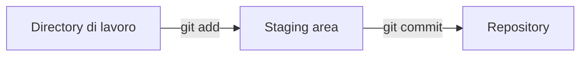
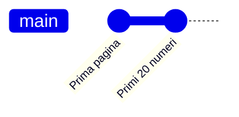

## Contenuti

- Il terminale
- La variabile PATH
- Controllo di versione e Git
- Installazione di Git portatile
- Primo repository
- Aspetti orientativi

## Il terminale

- **Terminale**: finestra per comandi testuali
- **Shell**: interprete dei comandi (PowerShell, cmd, Git Bash)
- **Directory corrente** e **percorsi** assoluti o relativi

```powershell
pwd          # directory corrente
ls           # elenco dei file (alias di Get-ChildItem)
cd ..        # cartella superiore
cd lab01     # entra in lab01
mkdir lab02  # crea una cartella
```

`Tab` completa i nomi; frecce su/giù richiamano i comandi precedenti.

## La variabile PATH

- Elenco di cartelle in cui la shell cerca i programmi
- Programma non nel PATH: "termine non riconosciuto"

```powershell
$env:Path -split ";"
```

Aggiunta permanente: "Modifica le variabili d'ambiente relative al proprio account", voce `Path`, poi riavvio di VS Code.

## Controllo di versione e Git

- **Repository**: progetto di cui Git registra la storia (cartella `.git`)
- **Commit**: fotografia dei file, con autore, data, messaggio
- **Staging area**: modifiche selezionate per il prossimo commit



## Installazione di Git portatile

1. https://git-scm.com/install/windows : "Git for Windows/x64 Portable"
2. Estrazione in `C:\strumenti\PortableGit`
3. `C:\strumenti\PortableGit\cmd` nel PATH
4. Verifica: `git --version`

```powershell
git config --global user.name "Nome Cognome"
git config --global user.email "nome.cognome@example.com"
```

PC condivisi: senza `--global`, dentro il repository.

## Primo repository

```powershell
git init -b main                  # crea il repository, branch main
git status                        # stato dei file
git add index.html script.js      # nella staging area
git commit -m "Prima pagina con script Fibonacci"
git log --oneline                 # storia sintetica
git diff                          # differenze non registrate
git restore index.html            # annulla modifiche non registrate
```



## Aspetti orientativi

- Terminale e Git: richiesti in quasi tutti gli annunci per sviluppatori
- La storia dei commit documenta il proprio lavoro
- Controllo di versione anche per documentazione, configurazioni, dati
- Quali strumenti sono comuni a tutti i ruoli informatici?
