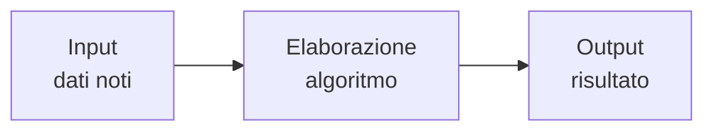
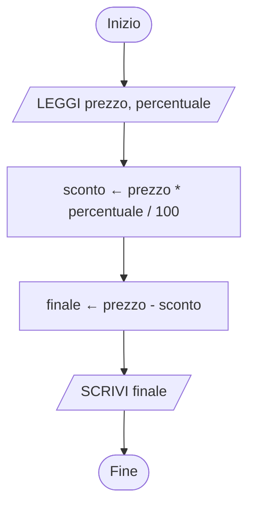

# Lezione 2.1: Problemi e algoritmi

Contenuto originale. Riferimenti esterni indicati nel testo.

Gli esempi JavaScript si eseguono nella console del browser oppure in un file `script.js` collegato a una pagina HTML (modulo 1, lezione 1.1, sezione 1.1.5). La sintassi di JavaScript è trattata in modo sistematico nel modulo 3: qui ogni costrutto è spiegato solo quanto basta per leggere gli esempi.

## 2.1.1 Definizione e proprietà

Concetti:

- **Problema**: situazione in cui, a partire da dati noti (dati di **input**), si deve ottenere un risultato (dati di **output**).
- **Algoritmo**: sequenza finita di istruzioni non ambigue che, eseguite in ordine, risolvono tutti i problemi di una stessa classe. Il termine deriva dal nome del matematico persiano al-Khwarizmi (IX secolo). Voce enciclopedica: https://it.wikipedia.org/wiki/Algoritmo
- **Esecutore**: chi o che cosa esegue le istruzioni: una persona, un robot, un computer. Un'istruzione è valida solo se l'esecutore è in grado di eseguirla.
- **Programma**: algoritmo scritto in un linguaggio di programmazione, quindi eseguibile da un computer.

Proprietà di un algoritmo:

- **Finitezza**: termina dopo un numero finito di passi, per qualunque input valido.
- **Non ambiguità** (determinismo): ogni istruzione ha un solo significato possibile; dopo ogni passo è definito quale passo segue.
- **Eseguibilità**: ogni istruzione è eseguibile dall'esecutore, con le risorse disponibili.
- **Generalità**: risolve una classe di problemi, non un singolo caso. "Calcola la media di 7, 8 e 6" è un caso; "calcola la media di un elenco di voti" è una classe di problemi.

Esempio di istruzione non accettabile in un algoritmo: "cuocere finché la pasta è pronta". La condizione "è pronta" non è definita in modo verificabile; una versione accettabile è "cuocere per il tempo indicato sulla confezione" oppure "assaggiare ogni minuto; terminare quando la pasta non è più dura al centro".

Modello input, elaborazione, output:



## 2.1.2 Variabili e assegnazione

Un algoritmo opera su **variabili**: contenitori con un nome, che conservano un valore. L'**assegnazione** scrive un valore in una variabile, sostituendo quello precedente. In pseudocodice si indica con la freccia `←`:

```text
totale ← 0              // la variabile totale vale 0
totale ← totale + 5     // si calcola totale + 5 (cioè 5) e lo si scrive in totale
```

La seconda riga non è un'equazione matematica (che sarebbe impossibile): si legge "calcola il valore a destra, poi scrivilo nella variabile a sinistra".

## 2.1.3 Pseudocodice

Lo **pseudocodice** è una descrizione dell'algoritmo in linguaggio semi-formale: più preciso del linguaggio naturale, ma indipendente da un linguaggio di programmazione. Non esiste uno standard unico; in questo corso si usano le convenzioni seguenti.

| Pseudocodice | Significato |
|---|---|
| `LEGGI x` | acquisisce un valore dall'esterno (tastiera, file, sensore) e lo memorizza in `x` |
| `SCRIVI x` | comunica all'esterno il valore di `x` |
| `x ← espressione` | assegnazione |
| `SE condizione ALLORA ... ALTRIMENTI ... FINE SE` | selezione (lezione 2.2) |
| `MENTRE condizione ESEGUI ... FINE MENTRE` | iterazione con controllo in testa (lezione 2.2) |
| `PER i DA a A b ESEGUI ... FINE PER` | iterazione con contatore (lezione 2.2) |
| `RIPETI ... FINCHÉ condizione` | iterazione con controllo in coda (lezione 2.2) |
| `//` | commento: spiegazione non eseguita |

Esempio: prezzo di un articolo dopo uno sconto percentuale.

```text
ALGORITMO PrezzoScontato
    LEGGI prezzo                     // per esempio 80
    LEGGI percentuale                // per esempio 25
    sconto ← prezzo * percentuale / 100
    finale ← prezzo - sconto
    SCRIVI finale                    // 60
FINE
```

## 2.1.4 Diagrammi di flusso

Il **diagramma di flusso** (flowchart) rappresenta l'algoritmo con blocchi collegati da frecce, che indicano l'ordine di esecuzione. Blocchi elementari:

| Blocco | Forma | Uso |
|---|---|---|
| Inizio / Fine | ovale | punto di partenza e di arrivo; uno solo per ciascuno |
| Input / Output | parallelogramma | `LEGGI`, `SCRIVI` |
| Elaborazione | rettangolo | assegnazioni e calcoli |
| Decisione | rombo | condizione vera o falsa; due frecce in uscita |

Voce enciclopedica: https://it.wikipedia.org/wiki/Diagramma_di_flusso

Diagramma: algoritmo PrezzoScontato.



I diagrammi di questo corso sono scritti in **Mermaid**, un linguaggio testuale che viene trasformato in figura. Le forme si ottengono con parentesi diverse: `([testo])` ovale, `[/testo/]` parallelogramma, `[testo]` rettangolo, `{testo}` rombo. Documentazione: https://mermaid.js.org/syntax/flowchart.html . Per provare i diagrammi senza installare nulla si può usare l'editor online https://mermaid.live/ , che non richiede account.

## 2.1.5 Lo stesso algoritmo in JavaScript

```javascript
// Dati di input: in un programma reale arriverebbero da un modulo web o da un file
const prezzo = 80;
const percentuale = 25;

// Elaborazione
const sconto = prezzo * percentuale / 100;
const finale = prezzo - sconto;

// Output nella console
console.log("Prezzo finale:", finale);   // Prezzo finale: 60
```

- `const nome = valore;` crea una variabile il cui valore non verrà più cambiato.
- `console.log(a, b)` stampa i valori indicati, separati da uno spazio.
- `*` e `/` sono moltiplicazione e divisione; valgono le precedenze dell'aritmetica.

Per acquisire un valore dall'utente, in questa fase, si può usare `prompt`, che apre una finestra di dialogo e restituisce il testo digitato:

```javascript
// prompt restituisce sempre una stringa (testo): Number la converte in numero
const prezzoLetto = Number(prompt("Prezzo?"));
console.log(prezzoLetto * 2);
```

## 2.1.6 Laboratorio: il robot umano

Tempo indicativo: 25 minuti.

Attività a coppie, senza computer.

1. Sul pavimento o su un foglio a quadretti si disegna una griglia 5 x 5 con una casella di partenza, una di arrivo e alcuni ostacoli.
2. Il "programmatore" scrive un algoritmo usando solo queste istruzioni: `AVANTI` (una casella), `GIRA A DESTRA` (90 gradi sul posto), `GIRA A SINISTRA`.
3. Il "robot" (il compagno) esegue le istruzioni alla lettera, senza interpretarle.
4. Se il robot non arriva, si individua l'istruzione errata e la si corregge. Poi i ruoli si invertono con una nuova griglia.

Punti da osservare e discutere:

- gli errori tipici: istruzioni mancanti, orientamento iniziale non specificato, confusione tra destra e sinistra del robot e del programmatore
- sequenze ripetute di istruzioni (per esempio `AVANTI` quattro volte): nella lezione 2.2 si vedrà come scriverle una sola volta
- la correzione di un algoritmo che non funziona si chiama **debugging**

### Esercizi

1. Scrivere in pseudocodice e disegnare con un diagramma di flusso un algoritmo che legge la base e l'altezza di un rettangolo e scrive area e perimetro.
2. Scrivere un algoritmo che legge una durata espressa in secondi (per esempio 3725) e scrive ore, minuti e secondi (1, 2, 5). Suggerimento: usare la divisione intera e il resto; in JavaScript il resto si calcola con l'operatore `%` e la parte intera con `Math.floor(x)`.
3. Indicare quale proprietà di un algoritmo manca in ciascuna istruzione: "aggiungere sale q.b."; "ripetere all'infinito: stampa 1"; "scrivi il numero più grande di tutti".
