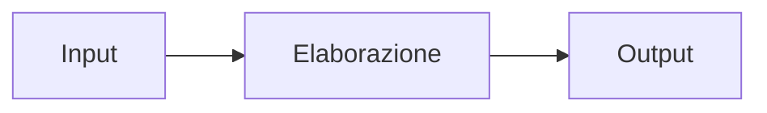
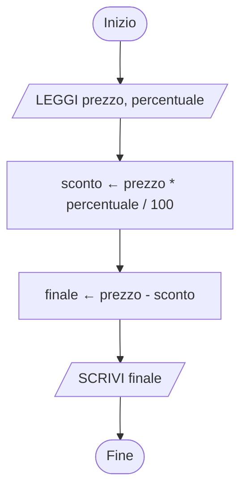

## Contenuti

- Algoritmo: definizione
- Variabili e assegnazione
- Pseudocodice
- Diagramma di flusso
- Laboratorio 2.1: il robot umano

## Algoritmo: definizione

- **Algoritmo**: sequenza finita di istruzioni non ambigue che risolve tutti i problemi di una classe
- **Esecutore**: persona, robot, computer
- **Programma**: algoritmo scritto in un linguaggio di programmazione

Proprietà: **finitezza**, **non ambiguità**, **eseguibilità**, **generalità**



## Variabili e assegnazione

```text
totale ← 0
totale ← totale + 5
```

- **Variabile**: contenitore con un nome
- **Assegnazione** `←`: calcola a destra, scrive a sinistra
- Non è un'equazione matematica

## Pseudocodice

| Pseudocodice | Significato |
|---|---|
| `LEGGI x` / `SCRIVI x` | input / output |
| `x ← espressione` | assegnazione |
| `SE ... ALLORA ... ALTRIMENTI ... FINE SE` | selezione |
| `MENTRE ... ESEGUI ... FINE MENTRE` | ciclo, controllo in testa |
| `PER i DA a A b ESEGUI ... FINE PER` | ciclo con contatore |
| `RIPETI ... FINCHÉ ...` | ciclo, controllo in coda |

## Diagramma di flusso



Ovale: inizio/fine; parallelogramma: I/O; rettangolo: elaborazione; rombo: decisione

## Laboratorio 2.1: il robot umano

- Griglia 5 x 5, partenza, arrivo, ostacoli
- Istruzioni: `AVANTI`, `GIRA A DESTRA`, `GIRA A SINISTRA`
- Il robot esegue alla lettera
- Errori tipici: orientamento iniziale, destra/sinistra, istruzioni mancanti
- Correzione degli errori: **debugging**
