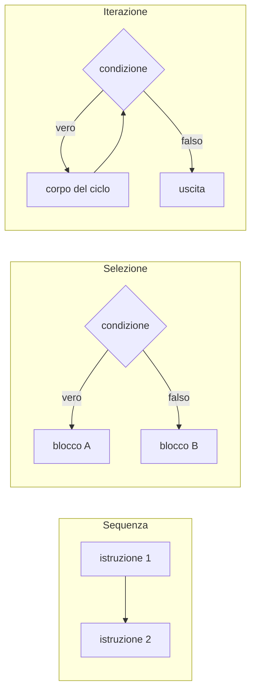
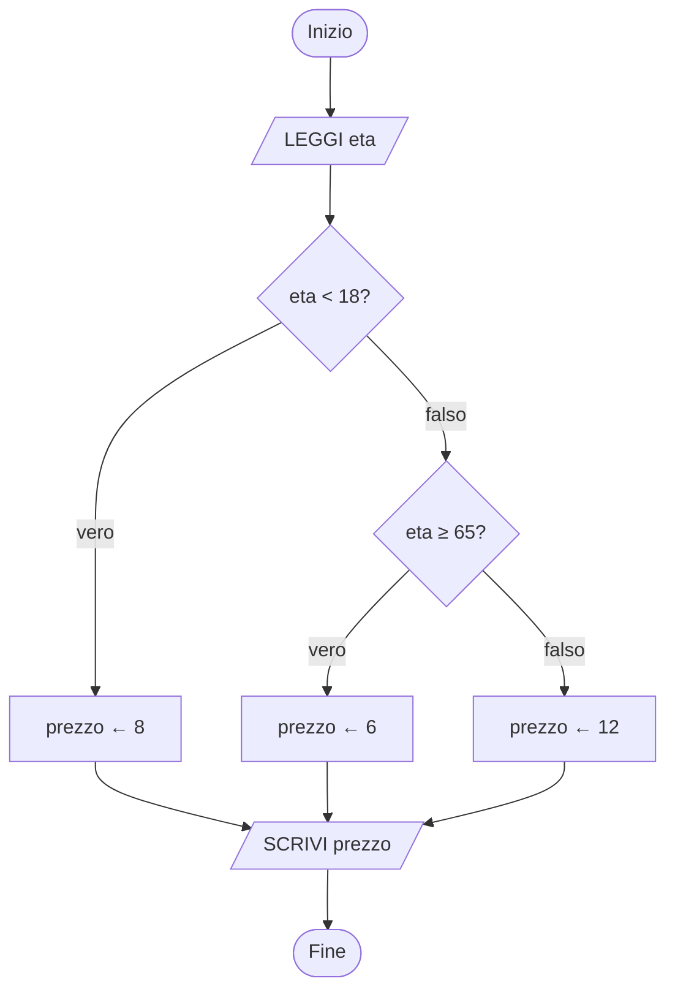

# Lezione 2.2: Strutture di controllo

Contenuto originale. Riferimenti esterni indicati nel testo.

Gli esempi JavaScript si eseguono nella console del browser oppure in un file `script.js` collegato a una pagina HTML (modulo 1, lezione 1.1, sezione 1.1.5). La sintassi di JavaScript è trattata in modo sistematico nel modulo 3: qui ogni costrutto è spiegato solo quanto basta per leggere gli esempi.

## 2.2.1 Le tre strutture e il teorema di Böhm-Jacopini

Le **strutture di controllo** stabiliscono l'ordine in cui vengono eseguite le istruzioni.

- **Sequenza**: le istruzioni vengono eseguite una dopo l'altra, nell'ordine in cui sono scritte.
- **Selezione**: in base a una condizione, viene eseguito un gruppo di istruzioni oppure un altro.
- **Iterazione** (ciclo): un gruppo di istruzioni viene ripetuto finché una condizione resta vera (o fino a quando diventa vera).

**Teorema di Böhm-Jacopini** (1966, Corrado Böhm e Giuseppe Jacopini): qualunque algoritmo può essere espresso usando soltanto sequenza, selezione e iterazione. Il risultato è alla base della **programmazione strutturata**, che evita i salti arbitrari da un punto all'altro del programma (istruzione `goto`) a favore di blocchi con un solo ingresso e una sola uscita. Voce enciclopedica: https://it.wikipedia.org/wiki/Teorema_di_B%C3%B6hm-Jacopini



## 2.2.2 Selezione

Una **condizione** è un'espressione che vale vero o falso. Si costruisce con gli **operatori di confronto** (`=`, `≠`, `<`, `≤`, `>`, `≥`) e si combina con gli **operatori logici**:

- `E` (congiunzione): vera solo se entrambe le condizioni sono vere
- `O` (disgiunzione): vera se almeno una delle due condizioni è vera
- `NON` (negazione): inverte il valore della condizione

Esempio: prezzo del biglietto di un museo; ridotto per minori di 18 anni, ridotto speciale per chi ha almeno 65 anni, intero negli altri casi.

```text
ALGORITMO Biglietto
    LEGGI eta
    SE eta < 18 ALLORA
        prezzo ← 8
    ALTRIMENTI
        SE eta ≥ 65 ALLORA
            prezzo ← 6
        ALTRIMENTI
            prezzo ← 12
        FINE SE
    FINE SE
    SCRIVI prezzo
FINE
```

La seconda `SE` è **annidata** nel ramo `ALTRIMENTI` della prima: viene valutata solo se la prima condizione è falsa.



In JavaScript:

```javascript
const eta = 70;
let prezzo;                 // let: variabile il cui valore potrà cambiare

if (eta < 18) {             // if: SE; la condizione va tra parentesi tonde
  prezzo = 8;
} else if (eta >= 65) {     // else if: ALTRIMENTI SE
  prezzo = 6;
} else {                    // else: ALTRIMENTI
  prezzo = 12;
}
console.log("Prezzo:", prezzo);   // Prezzo: 6
```

In JavaScript gli operatori di confronto si scrivono `===` (uguale), `!==` (diverso), `<`, `<=`, `>`, `>=`; gli operatori logici `&&` (E), `||` (O), `!` (NON).

## 2.2.3 Iterazione

Tre forme di ciclo:

- **Ciclo con controllo in testa** (`MENTRE`): la condizione è verificata prima di ogni ripetizione; se è falsa già all'inizio, il corpo non viene mai eseguito.
- **Ciclo con contatore** (`PER`): il numero di ripetizioni è noto prima di iniziare; una variabile contatore assume in sequenza tutti i valori di un intervallo.
- **Ciclo con controllo in coda** (`RIPETI ... FINCHÉ`): il corpo viene eseguito almeno una volta; la condizione è verificata dopo ogni ripetizione e il ciclo termina quando diventa vera.

Esempio: somma dei numeri interi da 1 a n.

```text
ALGORITMO SommaFinoAN
    LEGGI n
    somma ← 0
    i ← 1
    MENTRE i ≤ n ESEGUI
        somma ← somma + i
        i ← i + 1
    FINE MENTRE
    SCRIVI somma
FINE
```

Stessa logica con il ciclo `PER`, che gestisce automaticamente il contatore:

```text
somma ← 0
PER i DA 1 A n ESEGUI
    somma ← somma + i
FINE PER
```

Esempio di ciclo con controllo in coda: lettura di un voto, ripetuta finché il valore non è compreso tra 1 e 10.

```text
RIPETI
    LEGGI voto
FINCHÉ voto ≥ 1 E voto ≤ 10
```

In JavaScript le tre forme sono `while`, `for` e `do ... while`. Nel `do ... while` la condizione indica quando **continuare**, non quando fermarsi: è quindi la negazione della condizione di `FINCHÉ`.

```javascript
const n = 4;

// Ciclo while: controllo in testa
let somma = 0;
let i = 1;
while (i <= n) {
  somma = somma + i;
  i = i + 1;
}
console.log("while:", somma);   // while: 10

// Ciclo for: inizializzazione; condizione; aggiornamento
let somma2 = 0;
for (let j = 1; j <= n; j++) {  // j++ equivale a j = j + 1
  somma2 += j;                  // += equivale a somma2 = somma2 + j
}
console.log("for:", somma2);    // for: 10

// Ciclo do...while: controllo in coda (si ripete finché il voto NON è valido)
let voto;
do {
  voto = Number(prompt("Voto (1-10)?"));
} while (voto < 1 || voto > 10);
console.log("Voto accettato:", voto);
```

## 2.2.4 Tabella di traccia

La **tabella di traccia** (trace table) verifica un algoritmo eseguendolo a mano: ogni riga registra i valori delle variabili dopo un passo. È la tecnica di base per capire che cosa fa un algoritmo e per trovare errori.

Traccia di SommaFinoAN con n = 4 (una riga per ogni verifica della condizione):

| Passo | i | somma | Condizione i ≤ n |
|---|---|---|---|
| inizio | 1 | 0 | vera |
| 1 | 2 | 1 | vera |
| 2 | 3 | 3 | vera |
| 3 | 4 | 6 | vera |
| 4 | 5 | 10 | falsa: uscita |

Output: 10. Controllo indipendente: la formula di Gauss n(n+1)/2 dà 4 · 5 / 2 = 10.

Esempio più ricco: l'**algoritmo di Euclide** per il massimo comune divisore (MCD) di due interi positivi. Ripete la sostituzione della coppia (a, b) con (b, resto di a diviso b) finché b diventa 0; a quel punto a è il MCD. Voce enciclopedica: https://it.wikipedia.org/wiki/Algoritmo_di_Euclide

```text
ALGORITMO MCD
    LEGGI a, b
    MENTRE b ≠ 0 ESEGUI
        r ← resto di a diviso b
        a ← b
        b ← r
    FINE MENTRE
    SCRIVI a
FINE
```

Traccia con a = 48, b = 18:

| Passo | a | b | r |
|---|---|---|---|
| inizio | 48 | 18 | |
| 1 | 18 | 12 | 12 |
| 2 | 12 | 6 | 6 |
| 3 | 6 | 0 | 0 |

b vale 0: il ciclo termina e l'output è 6.

```javascript
let a = 48;
let b = 18;
while (b !== 0) {
  const r = a % b;    // % : resto della divisione intera
  a = b;
  b = r;
}
console.log("MCD:", a);   // MCD: 6
```

## 2.2.5 Laboratorio

Tempo indicativo: 30 minuti.

1. Compilare la tabella di traccia dell'algoritmo MCD con a = 105, b = 45, poi verificare il risultato eseguendo il codice JavaScript nella console.
2. Nel percorso del robot umano (lezione 2.1) sostituire le sequenze ripetute con un ciclo `PER`, per esempio `PER k DA 1 A 4 ESEGUI AVANTI FINE PER`.
3. Scrivere in pseudocodice, con diagramma di flusso, un algoritmo che legge un numero intero e scrive se è pari o dispari (suggerimento: resto della divisione per 2).
4. Scrivere un algoritmo che legge voti finché l'utente inserisce 0, poi scrive quanti voti sono stati inseriti e la loro media. Verificarlo con una tabella di traccia sulla sequenza 7, 5, 9, 0 e poi tradurlo in JavaScript con `prompt` e `while`.
5. Individuare l'errore: questo ciclo dovrebbe scrivere i numeri da 1 a 5, ma non termina mai.

```text
i ← 1
MENTRE i ≤ 5 ESEGUI
    SCRIVI i
FINE MENTRE
```

Un ciclo che non termina si chiama **ciclo infinito**: viola la proprietà di finitezza. Nel browser un ciclo infinito blocca la scheda: la si chiude e si corregge il codice.
