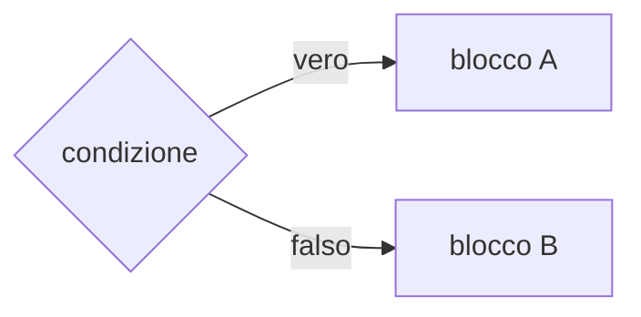

## Lezione 2.2: Strutture di controllo

Modulo 2: Algoritmi e logica. Sviluppo Software e Coding Laboratoriale

---

## Strutture di controllo

- **Sequenza**, **selezione**, **iterazione**
- **Teorema di Böhm-Jacopini** (1966): bastano queste tre per qualunque algoritmo
- Base della **programmazione strutturata**



---

## Selezione: il biglietto del museo

```javascript
const eta = 70;
let prezzo;
if (eta < 18) {
  prezzo = 8;
} else if (eta >= 65) {
  prezzo = 6;
} else {
  prezzo = 12;
}
console.log("Prezzo:", prezzo);
```

Confronto: `===` `!==` `<` `<=` `>` `>=`; logici: `&&` (E), `||` (O), `!` (NON)

---

## Iterazione

- `MENTRE` / `while`: controllo in testa, anche zero ripetizioni
- `PER` / `for`: numero di ripetizioni noto
- `RIPETI ... FINCHÉ` / `do ... while`: almeno una ripetizione

```javascript
let somma = 0;
for (let j = 1; j <= 4; j++) {
  somma += j;
}
console.log(somma);   // 10
```

---

## Tabella di traccia: MCD di Euclide

| Passo | a | b | r |
|---|---|---|---|
| inizio | 48 | 18 | |
| 1 | 18 | 12 | 12 |
| 2 | 12 | 6 | 6 |
| 3 | 6 | 0 | 0 |

```javascript
let a = 48, b = 18;
while (b !== 0) { const r = a % b; a = b; b = r; }
console.log("MCD:", a);   // 6
```
