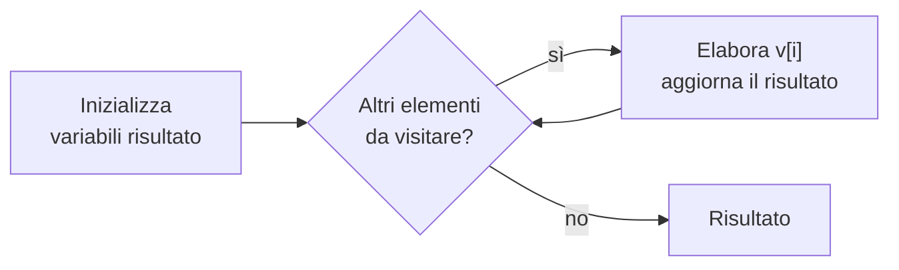

# Lezione 2.3: Algoritmi su elenchi

Contenuto originale. Riferimenti esterni indicati nel testo.

Gli esempi JavaScript si eseguono nella console del browser oppure in un file `script.js` collegato a una pagina HTML (modulo 1, lezione 1.1, sezione 1.1.5). La sintassi di JavaScript è trattata in modo sistematico nel modulo 3: qui ogni costrutto è spiegato solo quanto basta per leggere gli esempi.

## 2.3.1 Array

Un **array** (vettore) è un elenco ordinato di valori, a cui si accede tramite la posizione, detta **indice**. In JavaScript e nella maggior parte dei linguaggi l'indice del primo elemento è 0.

```text
voti = [7, 5, 9, 6, 8]
indice:  0  1  2  3  4
```

- `voti[2]` vale 9
- la **lunghezza** dell'array è 5; l'ultimo indice è lunghezza - 1, cioè 4

In pseudocodice si scrive `v[i]` per l'elemento di indice `i` e `lunghezza(v)` per il numero di elementi. In JavaScript:

```javascript
const voti = [7, 5, 9, 6, 8];   // array: valori tra parentesi quadre, separati da virgole
console.log(voti[2]);          // 9
console.log(voti.length);      // 5: la proprietà length contiene la lunghezza
```

Quasi tutti gli algoritmi su array seguono lo schema della **scansione**: un ciclo visita gli elementi uno alla volta, dall'indice 0 all'ultimo, e aggiorna una o più variabili.



## 2.3.2 Somma, media, conteggio

```text
ALGORITMO SommaMediaSufficienze
    // input: array voti
    somma ← 0
    sufficienti ← 0
    PER i DA 0 A lunghezza(voti) - 1 ESEGUI
        somma ← somma + voti[i]
        SE voti[i] ≥ 6 ALLORA
            sufficienti ← sufficienti + 1
        FINE SE
    FINE PER
    SCRIVI somma / lunghezza(voti), sufficienti
FINE
```

Due schemi fondamentali:

- **accumulatore**: variabile inizializzata a 0 a cui si somma ogni elemento (`somma`)
- **contatore condizionato**: variabile inizializzata a 0 e incrementata di 1 solo per gli elementi che soddisfano una condizione (`sufficienti`)

## 2.3.3 Massimo

Idea: si assume come massimo provvisorio il primo elemento, poi lo si confronta con ciascuno degli altri e lo si sostituisce quando se ne trova uno maggiore.

```text
ALGORITMO Massimo
    max ← v[0]
    PER i DA 1 A lunghezza(v) - 1 ESEGUI
        SE v[i] > max ALLORA
            max ← v[i]
        FINE SE
    FINE PER
    SCRIVI max
FINE
```

Inizializzare `max` a 0 sarebbe un errore: con un array di soli numeri negativi il risultato sarebbe 0, un valore che non compare nell'array.

## 2.3.4 Ricerca lineare

Problema: stabilire se un valore `x` è presente in un array e, se sì, in quale posizione. La **ricerca lineare** (sequenziale) confronta `x` con gli elementi uno alla volta e si ferma al primo uguale. Per convenzione, se il valore non è presente si restituisce -1, che non è un indice valido.

```text
ALGORITMO RicercaLineare
    posizione ← -1
    i ← 0
    MENTRE i < lunghezza(v) E posizione = -1 ESEGUI
        SE v[i] = x ALLORA
            posizione ← i
        FINE SE
        i ← i + 1
    FINE MENTRE
    SCRIVI posizione
FINE
```

Numero di confronti per un array di n elementi: 1 nel caso migliore (valore in prima posizione), n nel caso peggiore (valore in ultima posizione o assente).

## 2.3.5 Ricerca binaria

Se l'array è **ordinato**, si può fare di meglio. La **ricerca binaria** (dicotomica) confronta `x` con l'elemento centrale dell'intervallo ancora da esaminare:

- se sono uguali, la ricerca termina
- se `x` è minore, la ricerca prosegue nella metà sinistra
- se `x` è maggiore, prosegue nella metà destra

A ogni confronto l'intervallo si dimezza. È lo stesso procedimento usato per cercare una parola in un dizionario cartaceo. Voce enciclopedica: https://it.wikipedia.org/wiki/Ricerca_dicotomica

```text
ALGORITMO RicercaBinaria
    // prerequisito: v ordinato in modo crescente
    basso ← 0
    alto ← lunghezza(v) - 1
    posizione ← -1
    MENTRE basso ≤ alto E posizione = -1 ESEGUI
        medio ← parte intera di (basso + alto) / 2
        SE v[medio] = x ALLORA
            posizione ← medio
        ALTRIMENTI
            SE x < v[medio] ALLORA
                alto ← medio - 1
            ALTRIMENTI
                basso ← medio + 1
            FINE SE
        FINE SE
    FINE MENTRE
    SCRIVI posizione
FINE
```

Traccia con v = [3, 8, 12, 17, 23, 31, 40, 52] e x = 31:

| Passo | basso | alto | medio | v[medio] | Esito |
|---|---|---|---|---|---|
| 1 | 0 | 7 | 3 | 17 | 31 > 17: si cerca a destra |
| 2 | 4 | 7 | 5 | 31 | trovato in posizione 5 |

Confronto del numero massimo di confronti:

| n (elementi) | Ricerca lineare | Ricerca binaria |
|---|---|---|
| 8 | 8 | 4 |
| 1 000 | 1 000 | 10 |
| 1 000 000 | 1 000 000 | 20 |

Per la ricerca binaria il numero di confronti cresce come il **logaritmo in base 2** di n: raddoppiando il numero di elementi serve un solo confronto in più.

## 2.3.6 Laboratorio

Tempo indicativo: 30 minuti.

### Attività con le carte (senza computer)

1. A coppie: uno studente dispone 16 carte numerate coperte, in ordine crescente da sinistra a destra, senza mostrarle; l'altro deve trovare la carta con un numero stabilito girando meno carte possibile.
2. Si ripete con le carte mescolate.
3. Si confronta il numero di carte girate nei due casi e lo si mette in relazione con la tabella della sezione 2.3.5.

Un'attività analoga per il confronto tra oggetti e l'ordinamento è proposta da CS Unplugged, progetto dell'Università di Canterbury (Nuova Zelanda): https://classic.csunplugged.org/activities/sorting-algorithms/

### Algoritmi in JavaScript

Le **funzioni** permettono di dare un nome a un algoritmo e di riusarlo con dati diversi: i **parametri** sono i dati di input, `return` restituisce il risultato. Il modulo 3 le tratta in dettaglio.

```javascript
// Restituisce il valore massimo dell'array v (v deve contenere almeno un elemento)
function massimo(v) {
  let max = v[0];
  for (let i = 1; i < v.length; i++) {
    if (v[i] > max) {
      max = v[i];
    }
  }
  return max;
}

// Restituisce l'indice di x in v, oppure -1 se x non è presente
function ricercaLineare(v, x) {
  for (let i = 0; i < v.length; i++) {
    if (v[i] === x) {
      return i;          // return interrompe la funzione: il ciclo non prosegue
    }
  }
  return -1;
}

// Come ricercaLineare, ma richiede v ordinato in modo crescente
function ricercaBinaria(v, x) {
  let basso = 0;
  let alto = v.length - 1;
  while (basso <= alto) {
    const medio = Math.floor((basso + alto) / 2);   // Math.floor: parte intera
    if (v[medio] === x) {
      return medio;
    } else if (x < v[medio]) {
      alto = medio - 1;
    } else {
      basso = medio + 1;
    }
  }
  return -1;
}

const voti = [7, 5, 9, 6, 8];
console.log(massimo(voti));                 // 9
console.log(ricercaLineare(voti, 6));       // 3
console.log(ricercaLineare(voti, 10));      // -1

const ordinati = [3, 8, 12, 17, 23, 31, 40, 52];
console.log(ricercaBinaria(ordinati, 31));  // 5
console.log(ricercaBinaria(ordinati, 4));   // -1
```

Nelle versioni JavaScript di `ricercaLineare` e `ricercaBinaria`, `return` all'interno del ciclo sostituisce la variabile `posizione` dello pseudocodice: appena il valore è trovato, la funzione termina restituendolo.

### Esercizi

1. Scrivere la funzione `minimo(v)` e la funzione `conta(v, x)` che restituisce quante volte `x` compare in `v`.
2. Modificare `ricercaBinaria` in modo che conti e stampi con `console.log` il numero di confronti eseguiti; provarla su `ordinati` con tutti i valori presenti e con alcuni assenti.
3. Applicare `ricercaBinaria` all'array non ordinato `[40, 3, 17, 8]` cercando 3: spiegare con una tabella di traccia perché il risultato è sbagliato.
