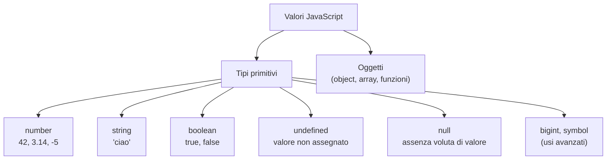

# Lezione 3.1: Variabili e tipi di dato

> Fonte: adattamento, tradotto e riscritto, della lezione "JavaScript Basics: Data Types" del corso Microsoft "Web Development for Beginners", https://github.com/microsoft/Web-Dev-For-Beginners/blob/main/2-js-basics/1-data-types/README.md . Copyright (c) Microsoft Corporation, licenza MIT: https://github.com/microsoft/Web-Dev-For-Beginners/blob/main/LICENSE .

Ambiente di lavoro: gli esempi si eseguono nella console del browser oppure in un file `script.js` collegato a una pagina HTML, come nel laboratorio della lezione 1.1 (sezione 1.1.5). Riferimento generale per tutto il modulo: MDN, "JavaScript Guide", https://developer.mozilla.org/en-US/docs/Web/JavaScript/Guide

## 3.1.1 Dichiarare variabili: let, const, var

Una **variabile** è un nome associato a un valore memorizzato. Prima di usarla va **dichiarata**, cioè creata, con una parola chiave:

- `let`: variabile il cui valore può essere cambiato con nuove assegnazioni.
- `const`: **costante**, cioè variabile che deve ricevere un valore subito e non può essere riassegnata.
- `var`: modo di dichiarazione delle prime versioni di JavaScript; ha regole di visibilità meno intuitive e nel codice moderno non si usa.

```javascript
let punteggio;          // dichiarazione: la variabile esiste ma non ha ancora un valore
punteggio = 10;         // assegnazione
punteggio = 15;         // riassegnazione: il valore 10 viene sostituito da 15

let vite = 3;           // dichiarazione e assegnazione in una sola istruzione

const MAX_VITE = 5;     // costante: valore obbligatorio nella dichiarazione
// MAX_VITE = 6;        // errore: TypeError, assegnazione a una costante
```

Regola pratica: usare `const` per default e `let` solo quando il valore deve cambiare. Il codice risulta più facile da leggere, perché chi lo legge sa quali valori restano fissi.

Regole sui nomi:

- possono contenere lettere, cifre, `_` e `$`, ma non possono iniziare con una cifra
- non possono coincidere con parole chiave del linguaggio (`let`, `if`, `for`, ...)
- JavaScript distingue maiuscole e minuscole: `eta` ed `Eta` sono due variabili diverse
- convenzione **camelCase** per i nomi composti: `numeroStudenti`, `prezzoFinale`
- convenzione per le costanti di configurazione: maiuscole con `_`, per esempio `MAX_VITE`

Nomi significativi (`prezzoFinale` invece di `pf` o `x`) sono una delle caratteristiche principali del codice di qualità professionale.

## 3.1.2 Tipi di dato

Ogni valore ha un **tipo**, che determina quali operazioni si possono eseguire su di esso. JavaScript è un linguaggio a **tipizzazione dinamica**: il tipo appartiene al valore, non alla variabile; una variabile dichiarata con `let` può contenere prima un numero e poi un testo. In linguaggi a tipizzazione statica, come Java o C, il tipo di ogni variabile va dichiarato e non cambia.



L'operatore `typeof` restituisce il nome del tipo di un valore:

```javascript
typeof 42          // "number"
typeof "ciao"      // "string"
typeof true        // "boolean"
let x;
typeof x           // "undefined": x è dichiarata ma non ha un valore
typeof [1, 2]      // "object": gli array sono oggetti
```

- **undefined**: valore automatico di una variabile dichiarata e non assegnata.
- **null**: valore assegnato esplicitamente per indicare "nessun valore" (per esempio "nessun vincitore ancora").

## 3.1.3 Numeri e operatori aritmetici

In JavaScript interi e decimali appartengono allo stesso tipo `number`. Il separatore decimale è il punto: `3.14`.

| Operatore | Operazione | Esempio | Risultato |
|---|---|---|---|
| `+` | addizione | `7 + 2` | `9` |
| `-` | sottrazione | `7 - 2` | `5` |
| `*` | moltiplicazione | `7 * 2` | `14` |
| `/` | divisione | `7 / 2` | `3.5` |
| `%` | resto della divisione intera | `7 % 2` | `1` |
| `**` | elevamento a potenza | `7 ** 2` | `49` |

Valgono le precedenze dell'aritmetica (prima `**`, poi `*`, `/`, `%`, infine `+`, `-`); le parentesi tonde modificano l'ordine: `(2 + 3) * 4` vale 20.

Operatori di assegnazione abbreviati:

```javascript
let n = 10;
n += 5;    // n = n + 5  -> 15
n -= 3;    // n = n - 3  -> 12
n *= 2;    // n = n * 2  -> 24
n++;       // n = n + 1  -> 25
n--;       // n = n - 1  -> 24
```

Particolarità dei numeri in virgola mobile:

```javascript
0.1 + 0.2;              // 0.30000000000000004
(0.1 + 0.2).toFixed(2); // "0.30": stringa con 2 decimali
```

I numeri decimali sono memorizzati in binario con un numero finito di cifre (standard IEEE 754, comune a quasi tutti i linguaggi): alcuni valori, come 0.1, non sono rappresentabili esattamente. Per importi in euro, nei programmi professionali si lavora spesso in centesimi interi.

L'oggetto `Math` contiene funzioni matematiche:

```javascript
Math.round(2.6)    // 3: arrotondamento all'intero più vicino
Math.floor(2.6)    // 2: parte intera per difetto
Math.max(4, 9, 1)  // 9
Math.sqrt(16)      // 4: radice quadrata
```

## 3.1.4 Stringhe

Una **stringa** è una sequenza di caratteri racchiusa tra apici singoli `'...'`, doppi `"..."` o inversi `` `...` ``.

```javascript
const nome = "Ada";
const cognome = 'Lovelace';

// Concatenazione con +
const completo = nome + " " + cognome;         // "Ada Lovelace"

// Template literal: apici inversi, espressioni in ${ }
const saluto = `Buongiorno, ${nome}! Oggi hai ${10 + 5} punti.`;
// "Buongiorno, Ada! Oggi hai 15 punti."
```

Il template literal è preferibile quando si inseriscono più valori nel testo: il risultato si legge come la frase finale. Sulla tastiera italiana l'apice inverso non ha un tasto dedicato: in Windows si ottiene tenendo premuto `Alt` e digitando `96` sul tastierino numerico.

Proprietà e **metodi** delle stringhe (un metodo è una funzione associata a un valore, invocata con il punto):

```javascript
const s = "JavaScript";
s.length              // 10: numero di caratteri
s[0]                  // "J": carattere in posizione 0
s.toUpperCase()       // "JAVASCRIPT"
s.includes("Script")  // true: contiene la sottostringa?
s.slice(0, 4)         // "Java": caratteri dalla posizione 0 alla 3
```

Le stringhe sono **immutabili**: i metodi non modificano la stringa originale, ne restituiscono una nuova.

## 3.1.5 Booleani

Il tipo **boolean** ha due soli valori: `true` e `false`. Deriva il nome da George Boole (1815-1864), matematico inglese che formalizzò la logica con operazioni algebriche. I booleani sono il risultato dei confronti e controllano le decisioni del programma (lezione 3.3).

```javascript
const maggiorenne = 17 >= 18;   // false
const iscritto = true;
```

## 3.1.6 Conversioni di tipo

Quando un operatore riceve valori di tipo diverso, JavaScript li converte automaticamente (**conversione implicita**, o coercizione). Le regole sono fonte frequente di errori:

```javascript
"1" + "1"     // "11": + con stringhe concatena
"5" + 2       // "52": il numero viene convertito in stringa
"5" * 2       // 10: * funziona solo sui numeri, la stringa viene convertita
"ciao" * 2    // NaN: "Not a Number", risultato numerico non valido
```

Conversione esplicita, da preferire:

```javascript
Number("42")        // 42
Number("4,5")       // NaN: la virgola non è un separatore decimale valido
Number("4.5")       // 4.5
String(42)          // "42"
Number.isNaN(Number("abc"))   // true: verifica se il risultato non è un numero
```

Caso tipico: `prompt` e i campi di testo delle pagine web restituiscono sempre stringhe. Prima di fare calcoli va applicato `Number()`.

### Uguaglianza: == e ===

- `===` (**uguaglianza stretta**): vero solo se i valori sono uguali **e** dello stesso tipo.
- `==` (uguaglianza con conversione): converte i valori prima di confrontarli, con regole poco intuitive.

```javascript
5 === 5      // true
5 === "5"    // false: tipi diversi
5 == "5"     // true: la stringa viene convertita
0 == ""      // true (!)
```

Regola del corso, comune nelle linee guida professionali: usare sempre `===` e `!==`.

## 3.1.7 Oggetti: primo contatto

Un **oggetto** raggruppa più valori, detti **proprietà**, ciascuno con un nome:

```javascript
const studente = {
  nome: "Luca",       // proprietà nome, di tipo stringa
  classe: 4,          // proprietà classe, di tipo numero
  iscritto: true      // proprietà iscritto, di tipo booleano
};

console.log(studente.nome);   // "Luca": accesso con il punto
studente.classe = 5;          // modifica di una proprietà
```

Un oggetto dichiarato con `const` non può essere sostituito da un altro oggetto, ma le sue proprietà possono essere modificate. Gli oggetti sono fondamentali nel modulo 5: ogni elemento di una pagina web è rappresentato da un oggetto.

## 3.1.8 Laboratorio

Tempo indicativo: 25 minuti. Cartella di lavoro: `lab03` con `index.html` e `script.js` (struttura del laboratorio 1.1); repository Git con un commit al termine.

1. In console, prevedere il risultato e poi verificarlo: `10 % 3`, `2 ** 10`, `"3" + 4 + 5`, `3 + 4 + "5"`, `typeof NaN`, `let eta = 1; let Eta = 2; eta === Eta`. Spiegare i casi inattesi (suggerimento per `"3" + 4 + 5`: le operazioni si eseguono da sinistra a destra).
2. In `script.js` scrivere un programma che:
   - legge con `prompt` nome e anno di nascita
   - converte l'anno in numero e controlla con `Number.isNaN` che la conversione sia riuscita
   - calcola l'età approssimativa, usando l'anno corrente ottenuto con `new Date().getFullYear()` (crea un oggetto data con l'istante attuale e ne legge l'anno)
   - stampa con un template literal una frase del tipo "Mario, nel 2026 compi 17 anni"
3. Creare un oggetto `libro` con titolo, autore, anno e disponibile (booleano); stampare una frase che usa tutte le proprietà.
4. Registrare il lavoro con `git add` e `git commit`.

### Esercizi

1. Scrivere un programma che converte una temperatura da gradi Celsius a Fahrenheit (F = C · 9/5 + 32) e stampa il risultato con un decimale.
2. Dato un numero intero di centesimi (per esempio 1234), stampare l'importo nel formato "12 euro e 34 centesimi" usando `Math.floor` e `%`.
3. Spiegare perché `0.1 + 0.2 === 0.3` vale `false` e come si potrebbe confrontare correttamente il risultato con 0.3.
