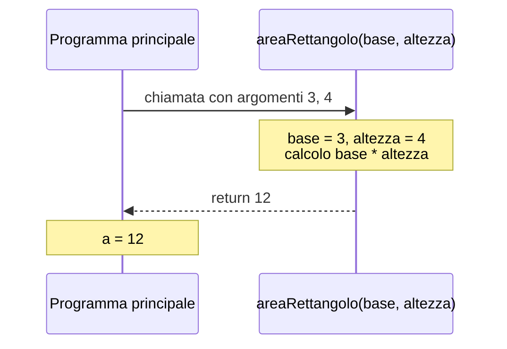

# Lezione 3.2: Funzioni

> Fonte: adattamento, tradotto e riscritto, della lezione "JavaScript Basics: Methods and Functions" del corso Microsoft "Web Development for Beginners", https://github.com/microsoft/Web-Dev-For-Beginners/blob/main/2-js-basics/2-functions-methods/README.md . Copyright (c) Microsoft Corporation, licenza MIT: https://github.com/microsoft/Web-Dev-For-Beginners/blob/main/LICENSE .

Ambiente di lavoro: console del browser oppure `script.js` collegato a una pagina HTML (lezione 1.1, sezione 1.1.5).

## 3.2.1 Perché le funzioni

Una **funzione** è un blocco di codice con un nome, che svolge un compito preciso e può essere eseguito (**chiamato**) più volte, da punti diversi del programma.

Vantaggi:

- **riuso**: il codice si scrive una volta sola; una correzione vale per tutte le chiamate
- **leggibilità**: un nome come `calcolaMedia(voti)` spiega che cosa accade senza dover leggere i dettagli
- **scomposizione**: un problema complesso si divide in sottoproblemi, ciascuno risolto da una funzione (la stessa idea degli algoritmi del modulo 2)
- **verificabilità**: ogni funzione si può provare separatamente (lezione 3.5)

## 3.2.2 Definizione e chiamata

```javascript
// Definizione: parola chiave function, nome, parentesi tonde, corpo tra graffe
function salutaTutti() {
  console.log("Buongiorno a tutti!");
}

// Chiamata: nome seguito da parentesi tonde
salutaTutti();
salutaTutti();   // ogni chiamata esegue di nuovo il corpo
```

Convenzioni: nomi in camelCase che iniziano con un verbo (`calcolaTotale`, `mostraRisultato`, `verificaInput`); una funzione dovrebbe svolgere un solo compito.

## 3.2.3 Parametri e argomenti

- **Parametri**: nomi elencati tra le parentesi nella definizione; all'interno della funzione si comportano come variabili.
- **Argomenti**: valori concreti passati nella chiamata; vengono assegnati ai parametri nell'ordine in cui compaiono.

```javascript
function saluta(nome, saluto) {          // nome e saluto sono parametri
  console.log(`${saluto}, ${nome}!`);
}

saluta("Giulia", "Ciao");                // "Ciao, Giulia!"   argomenti: "Giulia", "Ciao"
saluta("prof. Rossi", "Buongiorno");     // "Buongiorno, prof. Rossi!"
```

**Valori predefiniti** dei parametri: se l'argomento manca, il parametro assume il valore indicato con `=`.

```javascript
function saluta2(nome, saluto = "Ciao") {
  console.log(`${saluto}, ${nome}!`);
}
saluta2("Giulia");                 // "Ciao, Giulia!"
saluta2("Giulia", "Buonasera");    // "Buonasera, Giulia!"
```

Un parametro senza valore predefinito e senza argomento vale `undefined`.

## 3.2.4 Valore di ritorno

L'istruzione `return` termina la funzione e restituisce un valore al punto in cui è stata chiamata. Il valore può essere memorizzato in una variabile, usato in un'espressione o passato a un'altra funzione.

```javascript
function areaRettangolo(base, altezza) {
  return base * altezza;
}

const a = areaRettangolo(3, 4);                         // 12
const totale = areaRettangolo(3, 4) + areaRettangolo(2, 5);   // 12 + 10 = 22
console.log(`Area complessiva: ${totale}`);
```

Differenza importante tra **stampare** e **restituire**: una funzione che esegue solo `console.log` mostra un valore ma non lo rende disponibile al resto del programma; una funzione che esegue `return` lascia al chiamante la decisione su che cosa farne. Le funzioni che calcolano valori dovrebbero restituirli, non stamparli.

Una funzione senza `return` restituisce `undefined`.

Diagramma: flusso di una chiamata.



## 3.2.5 Visibilità delle variabili (scope)

Lo **scope** (ambito di visibilità) di una variabile è la parte di programma in cui la variabile esiste.

- Variabili e parametri dichiarati dentro una funzione sono **locali**: esistono solo durante l'esecuzione della funzione e non sono visibili fuori.
- Variabili dichiarate con `let` o `const` dentro un blocco `{ }` (per esempio il corpo di un `if` o di un `for`) sono visibili solo in quel blocco.
- Variabili dichiarate fuori da ogni funzione e blocco sono **globali**: visibili ovunque.

```javascript
const IVA = 0.22;                     // globale

function prezzoConIva(prezzo) {
  const iva = prezzo * IVA;           // locale: usa la globale IVA
  return prezzo + iva;
}

console.log(prezzoConIva(100));       // 122
// console.log(iva);                  // ReferenceError: iva is not defined
```

Limitare le variabili globali riduce gli errori: una funzione che usa solo i propri parametri e variabili locali si comporta sempre allo stesso modo e si può verificare in isolamento.

## 3.2.6 Funzioni come valori: funzioni anonime e freccia

In JavaScript una funzione è un valore: si può assegnare a una variabile o passare come argomento a un'altra funzione.

```javascript
// Funzione anonima (senza nome) assegnata a una costante
const quadrato = function (x) {
  return x * x;
};

// Funzione freccia: sintassi compatta, molto usata nel codice moderno
const cubo = (x) => {
  return x * x * x;
};

// Se il corpo è una sola espressione, graffe e return si possono omettere
const doppio = (x) => x * 2;

console.log(quadrato(3), cubo(2), doppio(7));   // 9 8 14
```

Una funzione passata come argomento a un'altra funzione si chiama **callback**: viene "richiamata" dalla funzione che la riceve, al momento opportuno. Esempio con `setTimeout`, funzione predefinita del browser che esegue una callback dopo un certo numero di millisecondi:

```javascript
function avvisa() {
  console.log("Sono passati 2 secondi");
}

setTimeout(avvisa, 2000);   // senza parentesi: si passa la funzione, non la si chiama

setTimeout(() => {
  console.log("Messaggio da una funzione freccia, dopo 3 secondi");
}, 3000);

console.log("Questo messaggio compare per primo");
```

L'ultima riga viene stampata per prima: `setTimeout` non blocca il programma, ma registra la callback da eseguire più tardi. Questo meccanismo è alla base della programmazione a eventi (modulo 5). Scrivendo `setTimeout(avvisa(), 2000)`, invece, la funzione verrebbe eseguita subito e a `setTimeout` arriverebbe il suo valore di ritorno, `undefined`.

## 3.2.7 Funzioni e metodi

Un **metodo** è una funzione che appartiene a un oggetto e si invoca con il punto: `console.log(...)` è il metodo `log` dell'oggetto `console`; `"ciao".toUpperCase()` è un metodo delle stringhe; `Math.round(...)` è un metodo dell'oggetto `Math`.

## 3.2.8 Laboratorio: una piccola libreria di funzioni

Tempo indicativo: 25 minuti. Cartella `lab03`, nuovo file `funzioni.js` collegato da `index.html` con `<script src="funzioni.js"></script>`.

1. Scrivere e provare in console le funzioni seguenti; ognuna deve **restituire** il risultato, non stamparlo:
   - `celsiusInFahrenheit(c)`
   - `prezzoScontato(prezzo, percentuale = 10)`
   - `mediaDiTre(a, b, c)`
   - `iniziali(nome, cognome)`, che restituisce per esempio `"A.L."` per `"Ada"`, `"Lovelace"` (usare `nome[0]`)
2. Riscrivere `celsiusInFahrenheit` come funzione freccia di una riga.
3. Definire `doppio` come nella sezione 3.2.6, poi scrivere una funzione `applica(f, x)` che restituisce `f(x)`; provarla con `applica(doppio, 5)` e con `applica((x) => x + 1, 5)`.
4. Commit Git.

### Esercizi

1. Spiegare in una frase la differenza tra funzione e metodo.
2. Individuare l'errore: la funzione dovrebbe restituire il perimetro di un quadrato, ma `const p = perimetro(5)` vale `undefined`.

```javascript
function perimetro(lato) {
  console.log(lato * 4);
}
```

3. Prevedere l'ordine dei messaggi stampati da questo codice, poi verificarlo:

```javascript
setTimeout(() => console.log("A"), 1000);
console.log("B");
setTimeout(() => console.log("C"), 0);
console.log("D");
```
