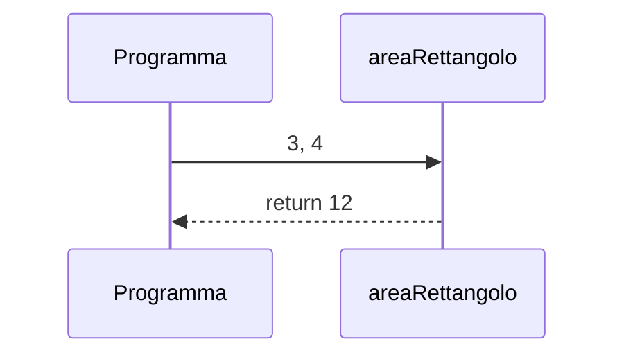

## Contenuti

- Perché le funzioni
- Parametri e argomenti
- Valore di ritorno
- Scope
- Funzioni come valori
- Laboratorio 3.2

Fonte: adattamento da Microsoft, "Web Development for Beginners", lezione "Functions and Methods", licenza MIT, https://github.com/microsoft/Web-Dev-For-Beginners

## Perché le funzioni

- **Riuso**: scritto una volta, chiamato più volte
- **Leggibilità**: il nome spiega che cosa accade
- **Scomposizione** del problema in sottoproblemi
- **Verificabilità**: ogni funzione si prova separatamente

```javascript
function salutaTutti() {
  console.log("Buongiorno a tutti!");
}
salutaTutti();
```

## Parametri e argomenti

```javascript
function saluta(nome, saluto = "Ciao") {   // parametri, valore predefinito
  console.log(`${saluto}, ${nome}!`);
}
saluta("Giulia");                // argomento: "Giulia"
saluta("Giulia", "Buonasera");
```

- **Parametri**: nomi nella definizione
- **Argomenti**: valori nella chiamata

## Valore di ritorno

```javascript
function areaRettangolo(base, altezza) {
  return base * altezza;
}
const a = areaRettangolo(3, 4);   // 12
```



Restituire, non stampare: decide il chiamante

## Scope

- Variabili e parametri di una funzione: **locali**
- `let` / `const` in un blocco `{ }`: visibili solo nel blocco
- Variabili esterne: **globali**, da limitare

```javascript
function prezzoConIva(prezzo) {
  const iva = prezzo * IVA;   // locale
  return prezzo + iva;
}
```

## Funzioni come valori

```javascript
const quadrato = function (x) { return x * x; };   // anonima
const doppio = (x) => x * 2;                       // freccia

setTimeout(() => {
  console.log("dopo 3 secondi");
}, 3000);
console.log("stampato per primo");
```

- **Callback**: funzione passata a un'altra funzione
- `setTimeout(avvisa, 2000)`, non `setTimeout(avvisa(), 2000)`
- **Metodo**: funzione di un oggetto (`console.log`, `Math.round`)

## Laboratorio 3.2

- `celsiusInFahrenheit(c)`
- `prezzoScontato(prezzo, percentuale = 10)`
- `mediaDiTre(a, b, c)`
- `iniziali(nome, cognome)`
- Versione freccia di una funzione
- `applica(f, x)`
- Commit Git
