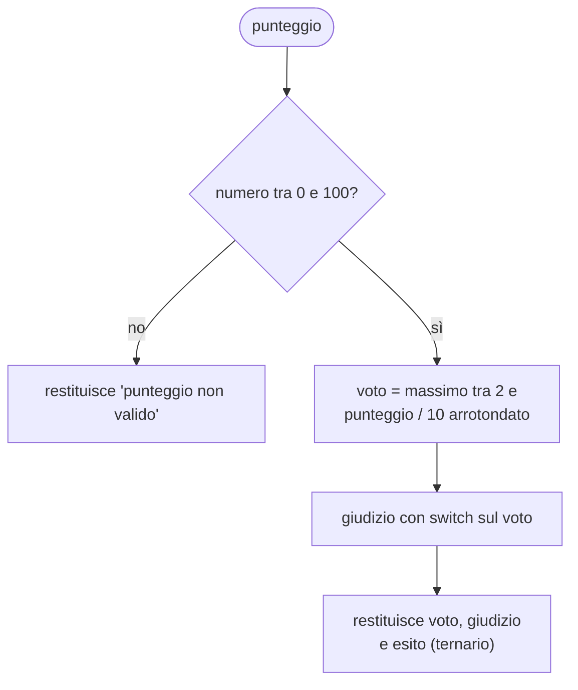

# Lezione 3.3: Decisioni

> Fonte: adattamento, tradotto e riscritto, della lezione "JavaScript Basics: Making Decisions" del corso Microsoft "Web Development for Beginners", https://github.com/microsoft/Web-Dev-For-Beginners/blob/main/2-js-basics/3-making-decisions/README.md . Copyright (c) Microsoft Corporation, licenza MIT: https://github.com/microsoft/Web-Dev-For-Beginners/blob/main/LICENSE .

Ambiente di lavoro: console del browser oppure `script.js` collegato a una pagina HTML (lezione 1.1, sezione 1.1.5). La struttura di selezione in pseudocodice è trattata nella lezione 2.2.

## 3.3.1 Operatori di confronto

Un confronto produce un valore booleano (`true` o `false`).

| Operatore | Significato | Esempio | Risultato |
|---|---|---|---|
| `<` | minore | `5 < 6` | `true` |
| `<=` | minore o uguale | `5 <= 5` | `true` |
| `>` | maggiore | `5 > 6` | `false` |
| `>=` | maggiore o uguale | `5 >= 6` | `false` |
| `===` | uguale (valore e tipo) | `5 === "5"` | `false` |
| `!==` | diverso (valore o tipo) | `5 !== 6` | `true` |

Il confronto tra stringhe avviene in ordine alfabetico basato sui codici dei caratteri: `"apple" < "banana"` è `true`, ma anche `"Zebra" < "apple"` è `true`, perché le maiuscole hanno codici minori delle minuscole.

## 3.3.2 if, else, else if

```javascript
const credito = 500;
const prezzoTelefono = 800;

// if: il blocco viene eseguito solo se la condizione è vera
if (credito >= prezzoTelefono) {
  console.log("Acquisto possibile");
}

// if ... else: due percorsi alternativi
if (credito >= prezzoTelefono) {
  console.log("Acquisto possibile");
} else {
  console.log(`Mancano ${prezzoTelefono - credito} euro`);
}
```

Con più alternative si usa `else if`. Le condizioni vengono valutate dall'alto verso il basso e si esegue **solo il primo** blocco la cui condizione è vera: l'ordine delle condizioni è quindi rilevante.

```javascript
const temperatura = 23;

if (temperatura < 10) {
  console.log("Freddo");
} else if (temperatura < 20) {        // qui si arriva solo se temperatura >= 10
  console.log("Fresco");
} else if (temperatura < 28) {        // qui solo se temperatura >= 20
  console.log("Gradevole");
} else {
  console.log("Caldo");
}
```

## 3.3.3 Operatori logici

| Operatore | Nome | Vero quando | Esempio |
|---|---|---|---|
| `&&` | E (AND) | entrambe le condizioni sono vere | `eta >= 14 && eta <= 18` |
| `\|\|` | O (OR) | almeno una condizione è vera | `giorno === "sabato" \|\| giorno === "domenica"` |
| `!` | NON (NOT) | la condizione è falsa | `!iscritto` |

```javascript
const credito = 600;
const prezzo = 800;
const prezzoScontato = prezzo * 0.8;   // sconto del 20%: 640
const haCoupon = true;

if (credito >= prezzo || (haCoupon && credito >= prezzoScontato)) {
  console.log("Acquisto possibile");
} else {
  console.log("Credito insufficiente");
}
```

**Valutazione a corto circuito**: in `A && B`, se `A` è falso `B` non viene valutato, perché il risultato è comunque falso; in `A || B`, se `A` è vero `B` non viene valutato. La regola permette controlli come `utente !== null && utente.nome === "Ada"`: se `utente` è `null`, la seconda parte, che causerebbe un errore, non viene eseguita.

## 3.3.4 Valori truthy e falsy

In una condizione JavaScript accetta anche valori non booleani, convertendoli:

- **falsy** (trattati come falso): `false`, `0`, `""` (stringa vuota), `null`, `undefined`, `NaN`
- **truthy** (trattati come vero): tutti gli altri valori, compresi `"0"`, `"false"`, `[]` (array vuoto)

```javascript
const nomeInserito = "";
if (!nomeInserito) {
  console.log("Nome obbligatorio");   // stampato: la stringa vuota è falsy
}
```

La forma è comoda ma può nascondere errori: `if (quantita)` è falso anche quando la quantità è legittimamente 0. In caso di dubbio conviene scrivere la condizione esplicita, per esempio `if (quantita !== undefined)`.

## 3.3.5 switch

`switch` confronta un valore con una serie di casi, usando l'uguaglianza stretta. È più leggibile di una catena di `else if` quando si confronta la stessa variabile con valori precisi.

```javascript
const giorno = 3;
let nomeGiorno;

switch (giorno) {
  case 1:
    nomeGiorno = "lunedì";
    break;              // esce dallo switch
  case 2:
    nomeGiorno = "martedì";
    break;
  case 3:
    nomeGiorno = "mercoledì";
    break;
  case 6:
  case 7:               // più casi con lo stesso blocco
    nomeGiorno = "fine settimana";
    break;
  default:              // nessun caso corrispondente
    nomeGiorno = "giorno non valido";
}
console.log(nomeGiorno);   // "mercoledì"
```

Senza `break` l'esecuzione prosegue nei casi successivi (comportamento detto **fall-through**): è voluto solo quando più casi condividono lo stesso codice, come per 6 e 7.

## 3.3.6 Operatore ternario

L'**operatore ternario** sceglie tra due valori in una sola espressione: `condizione ? valoreSeVero : valoreSeFalso`.

```javascript
const voto = 7;
const esito = voto >= 6 ? "sufficiente" : "insufficiente";

// equivalente a:
let esito2;
if (voto >= 6) {
  esito2 = "sufficiente";
} else {
  esito2 = "insufficiente";
}
```

Adatto ad assegnazioni semplici; per logiche con più rami `if` e `switch` restano più leggibili.

## 3.3.7 Laboratorio: dal punteggio al giudizio

Tempo indicativo: 25 minuti. File `decisioni.js` nella cartella `lab03`.

Scrivere una funzione `valuta(punteggio)` che riceve il punteggio di una verifica, da 0 a 100, e restituisce una stringa con voto e giudizio. Algoritmo:



Requisiti:

1. Validazione dell'input con operatori logici: il punteggio deve essere un numero (`typeof punteggio === "number"` e `!Number.isNaN(punteggio)`) compreso tra 0 e 100.
2. Voto: `Math.max(2, Math.round(punteggio / 10))`.
3. Giudizio con `switch` sul voto: 2, 3, 4 "gravemente insufficiente"; 5 "insufficiente"; 6 "sufficiente"; 7 "discreto"; 8 "buono"; 9 "ottimo"; 10 "eccellente".
4. Esito con l'operatore ternario: "promosso" se il voto è almeno 6, altrimenti "da recuperare".
5. Verifica con i casi di prova: 59, 60, 64, 65, 100, 0, -5, 120, `"abc"`. Per ciascuno annotare prima il risultato atteso, poi confrontarlo con quello ottenuto.
6. Commit Git.

### Esercizi

1. Riscrivere l'esempio delle temperature con le condizioni in ordine inverso (prima `temperatura >= 28`) e verificare che il risultato non cambi.
2. Scrivere una funzione `bisestile(anno)` che restituisce `true` se l'anno è bisestile: divisibile per 4, ma non per 100, salvo che sia divisibile per 400. Verificarla con 2024, 1900, 2000, 2026.
3. Indicare quali di questi valori sono falsy: `0`, `"0"`, `[]`, `""`, `"false"`, `null`.
