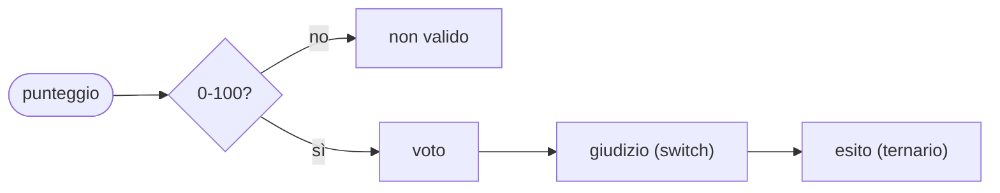

## Lezione 3.3: Decisioni

Modulo 3: JavaScript di base. Sviluppo Software e Coding Laboratoriale

Fonte: adattamento da Microsoft, "Web Development for Beginners", lezione "Making Decisions", licenza MIT
https://github.com/microsoft/Web-Dev-For-Beginners

---

## Operatori di confronto

| Operatore | Significato |
|---|---|
| `<` `<=` `>` `>=` | ordine |
| `===` | uguale, stesso tipo |
| `!==` | diverso |

Stringhe: ordine dei codici dei caratteri; maiuscole prima delle minuscole

---

## if, else if, else

```javascript
if (temperatura < 10) {
  console.log("Freddo");
} else if (temperatura < 20) {
  console.log("Fresco");
} else {
  console.log("Caldo");
}
```

Si esegue solo il **primo** blocco con condizione vera: l'ordine conta

---

## Operatori logici

- `&&` E: entrambe vere
- `||` O: almeno una vera
- `!` NON: inverte

```javascript
if (credito >= prezzo || (haCoupon && credito >= prezzoScontato)) { ... }
```

**Corto circuito**: `utente !== null && utente.nome === "Ada"`

---

## Truthy e falsy

- **Falsy**: `false`, `0`, `""`, `null`, `undefined`, `NaN`
- **Truthy**: tutto il resto, compresi `"0"`, `"false"`, `[]`

`if (quantita)` è falso anche per quantità 0: preferire condizioni esplicite

---

## switch e operatore ternario

```javascript
switch (giorno) {
  case 1: nomeGiorno = "lunedì"; break;
  case 6:
  case 7: nomeGiorno = "fine settimana"; break;
  default: nomeGiorno = "giorno non valido";
}

const esito = voto >= 6 ? "sufficiente" : "insufficiente";
```

Senza `break`: **fall-through** nei casi successivi

---

## Laboratorio 3.3: dal punteggio al giudizio



Casi di prova: 59, 60, 64, 65, 100, 0, -5, 120, `"abc"`
Prima il risultato atteso, poi quello ottenuto
