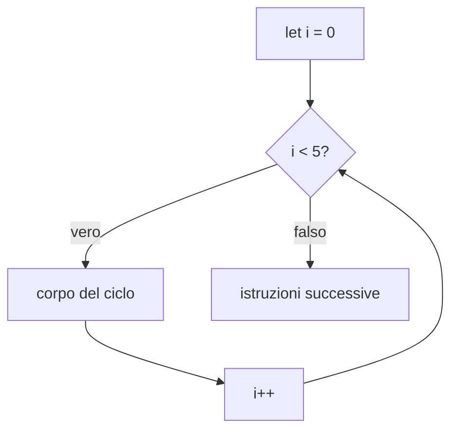

# Lezione 3.4: Array e cicli

> Fonte: adattamento, tradotto e riscritto, della lezione "JavaScript Basics: Arrays and Loops" del corso Microsoft "Web Development for Beginners", https://github.com/microsoft/Web-Dev-For-Beginners/blob/main/2-js-basics/4-arrays-loops/README.md . Copyright (c) Microsoft Corporation, licenza MIT: https://github.com/microsoft/Web-Dev-For-Beginners/blob/main/LICENSE .

Ambiente di lavoro: console del browser oppure `script.js` collegato a una pagina HTML (lezione 1.1, sezione 1.1.5). Array e iterazione in pseudocodice sono trattati nelle lezioni 2.2 e 2.3.

## 3.4.1 Creare e usare un array

Un **array** è un elenco ordinato di valori, detti **elementi**, accessibili tramite un **indice** numerico che parte da 0.

```javascript
const gusti = ["cioccolato", "fragola", "vaniglia", "pistacchio"];
const punteggi = [85, 92, 78, 96];
const misto = ["Luca", 17, true];   // ammesso, ma di solito un array contiene valori dello stesso tipo
const vuoto = [];

console.log(gusti[0]);        // "cioccolato"
console.log(gusti.length);    // 4
console.log(gusti[gusti.length - 1]);   // "pistacchio": ultimo elemento
console.log(gusti[10]);       // undefined: indice inesistente, nessun errore
```

Modifica di elementi:

```javascript
gusti[1] = "limone";          // sostituisce "fragola"
gusti[4] = "nocciola";        // aggiunge un quinto elemento
```

Un array dichiarato con `const` non può essere sostituito con un altro array, ma il suo contenuto può cambiare: `const` protegge il riferimento all'array, non gli elementi.

Accedere a un indice inesistente restituisce `undefined` senza segnalare errori: è una causa frequente di errori logici, per esempio nei cicli che vanno un passo oltre la fine dell'array.

## 3.4.2 Metodi principali

| Metodo | Effetto | Esempio con `v = ["a", "b", "c"]` |
|---|---|---|
| `push(x)` | aggiunge `x` in fondo | `v.push("d")` : `["a","b","c","d"]` |
| `pop()` | rimuove e restituisce l'ultimo elemento | `v.pop()` restituisce `"c"` |
| `unshift(x)` | aggiunge `x` all'inizio | `v.unshift("z")` : `["z","a","b","c"]` |
| `shift()` | rimuove e restituisce il primo elemento | `v.shift()` restituisce `"a"` |
| `indexOf(x)` | indice della prima occorrenza di `x`, oppure -1 | `v.indexOf("b")` restituisce 1 |
| `includes(x)` | `true` se `x` è presente | `v.includes("z")` restituisce `false` |
| `slice(i, j)` | nuovo array con gli elementi da `i` a `j - 1` | `v.slice(0, 2)` restituisce `["a","b"]` |
| `join(sep)` | stringa con gli elementi separati da `sep` | `v.join(", ")` restituisce `"a, b, c"` |

`indexOf` e `includes` eseguono internamente una ricerca lineare (lezione 2.3): costo proporzionale alla lunghezza dell'array. Documentazione completa: MDN, "Indexed collections", https://developer.mozilla.org/en-US/docs/Web/JavaScript/Guide/Indexed_collections

## 3.4.3 Il ciclo for

```javascript
for (let i = 0; i < 5; i++) {
  console.log(`Giro numero ${i}`);
}
```

Le tre parti tra parentesi, separate da punto e virgola:

- **inizializzazione** (`let i = 0`): eseguita una volta, prima del primo giro
- **condizione** (`i < 5`): verificata prima di ogni giro; se è falsa il ciclo termina
- **aggiornamento** (`i++`): eseguito alla fine di ogni giro



Scansione di un array con l'indice:

```javascript
const punteggi = [85, 92, 78, 96];
for (let i = 0; i < punteggi.length; i++) {
  console.log(`Studente ${i + 1}: ${punteggi[i]} punti`);
}
```

La condizione `i < punteggi.length` (non `<=`) fa fermare il ciclo all'ultimo indice valido, `length - 1`. Usare `<=` è l'errore detto **off-by-one** (fuori di uno): l'ultimo giro legge `punteggi[4]`, cioè `undefined`.

Scansione all'indietro: `for (let i = punteggi.length - 1; i >= 0; i--)`.

## 3.4.4 Il ciclo while

`while` ripete il corpo finché la condizione è vera; è adatto quando il numero di ripetizioni non è noto in anticipo.

```javascript
// Chiede una password al massimo 3 volte
const PASSWORD = "mela";
let tentativi = 0;
let risposta = "";

while (risposta !== PASSWORD && tentativi < 3) {
  risposta = prompt(`Password (tentativo ${tentativi + 1} di 3)?`);
  tentativi++;
}

if (risposta === PASSWORD) {
  console.log("Accesso consentito");
} else {
  console.log("Troppi tentativi");
}
```

Nel `while` l'aggiornamento delle variabili della condizione è responsabilità del programmatore: se manca, il ciclo non termina (ciclo infinito, lezione 2.2).

## 3.4.5 for...of e forEach

Quando serve solo il valore degli elementi, non l'indice, esistono forme più compatte e meno soggette a errori di indice:

```javascript
const colori = ["rosso", "verde", "blu"];

// for...of: la variabile colore assume a ogni giro il valore di un elemento
for (const colore of colori) {
  console.log(colore);
}

// forEach: metodo degli array che chiama una callback per ogni elemento,
// passandole il valore e l'indice
colori.forEach((colore, indice) => {
  console.log(`${indice}: ${colore}`);
});
```

Scelta del ciclo:

- `for` con indice: serve la posizione, si scorre all'indietro o a passi diversi da 1, si confrontano elementi vicini
- `for...of`: si leggono tutti i valori in ordine
- `forEach`: come `for...of`, in stile a callback; non si può interrompere prima della fine
- `while`: il numero di ripetizioni dipende da un evento (input, tentativi, convergenza di un calcolo)

## 3.4.6 break e continue

- `break` interrompe subito il ciclo.
- `continue` salta il resto del giro corrente e passa al successivo.

```javascript
const numeri = [4, -2, 7, 0, 9, -5];

for (const n of numeri) {
  if (n === 0) {
    break;              // interrompe al primo zero
  }
  if (n < 0) {
    continue;           // ignora i negativi
  }
  console.log(n);       // stampa 4 e 7
}
```

## 3.4.7 Esempio completo: statistiche sui voti

```javascript
const voti = [7, 5, 9, 6, 8, 4, 7];

let somma = 0;
let massimo = voti[0];
let minimo = voti[0];
let sufficienti = 0;

for (const v of voti) {
  somma += v;
  if (v > massimo) massimo = v;       // if con una sola istruzione: graffe omesse
  if (v < minimo) minimo = v;
  if (v >= 6) sufficienti++;
}

const media = somma / voti.length;
console.log(`Media: ${media.toFixed(2)}`);        // 6.57
console.log(`Massimo: ${massimo}, minimo: ${minimo}`);
console.log(`Sufficienze: ${sufficienti} su ${voti.length}`);
```

Il programma applica in un solo ciclo gli schemi della lezione 2.3: accumulatore, massimo, minimo, contatore condizionato. Omettere le graffe con una sola istruzione è ammesso, ma molte guide di stile professionali lo sconsigliano: aggiungendo in seguito una seconda riga, questa resterebbe fuori dal blocco.

## 3.4.8 Laboratorio

Tempo indicativo: 25 minuti. File `array.js` nella cartella `lab03`.

1. Creare un array `spesa` con cinque prodotti. Con i metodi della sezione 3.4.2: aggiungere un prodotto in fondo, rimuovere il primo, verificare la presenza di "pane", stampare l'elenco separato da virgole.
2. Dato l'array `temperature = [12.5, 15.1, 18.3, 21.0, 19.4, 16.8, 14.2]` (una settimana), stampare con un `for` giorno per giorno ("Giorno 1: 12.5 gradi"), poi la media, la massima e il numero di giorni sopra i 17 gradi.
3. Riscrivere il punto 2 con `for...of` dove possibile: quale informazione si perde?
4. Scrivere con `while` un programma che raddoppia un numero partendo da 1 finché supera 1000 e stampa quanti raddoppi sono serviti.
5. Commit Git.

### Esercizi

1. Scrivere una funzione `inverti(v)` che restituisce un nuovo array con gli elementi di `v` in ordine inverso, senza usare il metodo `reverse`.
2. Scrivere una funzione `contaParole(frase)` che restituisce il numero di parole di una frase. Suggerimento: `frase.split(" ")` restituisce l'array delle parti separate da spazi.
3. Individuare e correggere l'errore:

```javascript
const v = [3, 1, 4];
for (let i = 0; i <= v.length; i++) {
  console.log(v[i] * 2);   // l'ultima riga stampata è NaN
}
```
