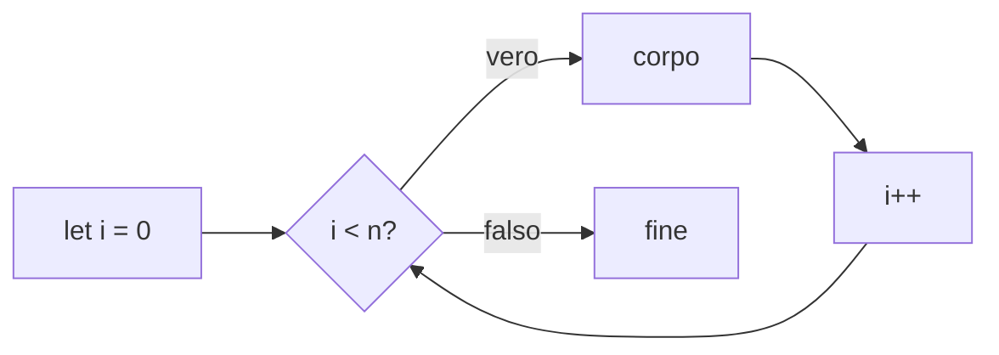

## Contenuti

- Array
- Metodi principali
- Il ciclo for
- while, for...of, forEach
- break e continue
- Statistiche sui voti
- Laboratorio 3.4

Fonte: adattamento da Microsoft, "Web Development for Beginners", lezione "Arrays and Loops", licenza MIT, https://github.com/microsoft/Web-Dev-For-Beginners

## Array

```javascript
const gusti = ["cioccolato", "fragola", "vaniglia"];
gusti[0];                  // "cioccolato"
gusti.length;              // 3
gusti[gusti.length - 1];   // ultimo
gusti[10];                 // undefined, nessun errore
```

`const`: l'array non si sostituisce, il contenuto sì

## Metodi principali

| Metodo | Effetto |
|---|---|
| `push` / `pop` | aggiunge / rimuove in fondo |
| `unshift` / `shift` | aggiunge / rimuove all'inizio |
| `indexOf` / `includes` | ricerca lineare |
| `slice(i, j)` | copia da `i` a `j - 1` |
| `join(sep)` | stringa con separatore |

## Il ciclo for



```javascript
for (let i = 0; i < punteggi.length; i++) {
  console.log(`Studente ${i + 1}: ${punteggi[i]}`);
}
```

`<=` al posto di `<`: errore **off-by-one**

## while, for...of, forEach

```javascript
while (risposta !== PASSWORD && tentativi < 3) { ... }

for (const colore of colori) { console.log(colore); }

colori.forEach((colore, indice) => console.log(indice, colore));
```

- `for`: serve l'indice
- `for...of`, `forEach`: solo i valori
- `while`: numero di ripetizioni non noto

## break e continue

```javascript
for (const n of numeri) {
  if (n === 0) break;       // interrompe il ciclo
  if (n < 0) continue;      // salta al giro successivo
  console.log(n);
}
```

## Statistiche sui voti

```javascript
for (const v of voti) {
  somma += v;
  if (v > massimo) massimo = v;
  if (v < minimo) minimo = v;
  if (v >= 6) sufficienti++;
}
const media = somma / voti.length;
```

Accumulatore, massimo, minimo, contatore condizionato in un solo ciclo

## Laboratorio 3.4

- Lista della spesa con i metodi degli array
- Temperature di una settimana: media, massima, giorni sopra 17 gradi
- Stesso programma con `for...of`
- Raddoppi con `while` fino a superare 1000
- Commit Git
