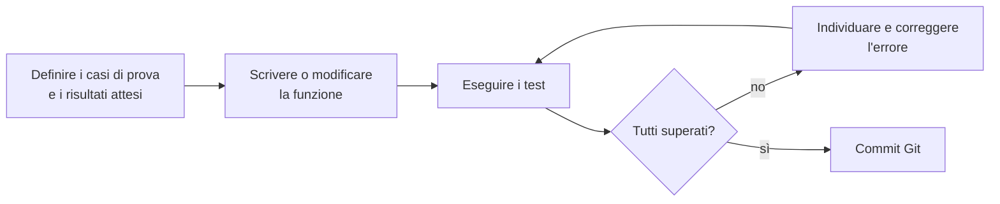

# Lezione 3.5: Laboratorio: gli algoritmi del modulo 2 in JavaScript

Contenuto originale. Riferimenti esterni indicati nel testo.

Obiettivo: realizzare una piccola libreria di funzioni con gli algoritmi del modulo 2 e verificarla con test automatici, come si fa nei progetti professionali. Si usano le nozioni delle lezioni 3.1-3.4.

## 3.5.1 Test del software

Concetti:

- **Caso di prova** (test case): un input con il relativo **risultato atteso**, stabilito prima di eseguire il codice.
- **Test automatico**: codice che esegue la funzione da verificare con un caso di prova e confronta il risultato ottenuto con quello atteso, segnalando le differenze.
- **Test unitario** (unit test): test di una singola unità di codice, di solito una funzione, isolata dal resto del programma.
- **Casi limite** (edge case): input ai confini dell'insieme dei valori ammessi, dove gli errori sono più frequenti: array vuoto, array di un solo elemento, valore cercato in prima o in ultima posizione, valori tutti uguali, numeri negativi.

Un test che fallisce non è un problema: segnala un errore prima che arrivi agli utenti. I test si rieseguono dopo ogni modifica, per verificare che le correzioni non abbiano introdotto nuovi errori (test di **regressione**).



Nei progetti reali si usano **framework di test** (per JavaScript: Jest, Vitest, Mocha) che automatizzano esecuzione e resoconto. In questo laboratorio si costruisce una versione minima con poche righe, per capire il meccanismo.

## 3.5.2 Struttura del progetto

Cartella `lab-algoritmi`, repository Git separato:

```text
lab-algoritmi/
    index.html      <- pagina che carica i due script
    algoritmi.js    <- la libreria: solo definizioni di funzioni
    test.js         <- i test: chiamate alle funzioni e confronto con i risultati attesi
```

Separare il codice dai test è una convenzione professionale: la libreria si può riusare in altri progetti senza portarsi dietro i test.

`index.html`:

```html
<!DOCTYPE html>
<html lang="it">
  <head>
    <meta charset="UTF-8">
    <title>Algoritmi: test</title>
  </head>
  <body>
    <h1>Test della libreria di algoritmi</h1>
    <p>Risultati nella console (F12).</p>
    <!-- L'ordine conta: test.js usa le funzioni definite in algoritmi.js -->
    <script src="algoritmi.js"></script>
    <script src="test.js"></script>
  </body>
</html>
```

## 3.5.3 La funzione di verifica

`test.js` inizia con una funzione che confronta risultato ottenuto e atteso e tiene il conto dei test superati.

```javascript
// Contatori globali dei test
let superati = 0;
let falliti = 0;

// Confronta ottenuto e atteso; stampa l'esito del test
function verifica(descrizione, ottenuto, atteso) {
  // JSON.stringify trasforma un valore in testo: [1, 2] diventa "[1,2]".
  // Serve per confrontare gli array, perché === tra due array distinti
  // restituisce false anche se il contenuto è uguale.
  const ok = JSON.stringify(ottenuto) === JSON.stringify(atteso);
  if (ok) {
    superati++;
    console.log(`OK      ${descrizione}`);
  } else {
    falliti++;
    console.error(`FALLITO ${descrizione}: atteso ${JSON.stringify(atteso)}, ottenuto ${JSON.stringify(ottenuto)}`);
  }
}
```

- `console.error` stampa il messaggio evidenziato in rosso come errore, così i test falliti si notano subito.
- Perché `===` non basta per gli array: gli array sono oggetti e `===` tra oggetti verifica se si tratta dello **stesso** oggetto in memoria, non se hanno lo stesso contenuto. `[1, 2] === [1, 2]` vale `false`.

## 3.5.4 La libreria

`algoritmi.js`: ogni funzione corrisponde a un algoritmo della lezione 2.3 o 2.4. Prima di scrivere i test, stabilire il comportamento nei casi limite; per l'array vuoto si sceglie di restituire `null`, il valore che indica "nessun risultato".

```javascript
// Somma degli elementi; 0 per l'array vuoto
function somma(v) {
  let s = 0;
  for (const x of v) {
    s += x;
  }
  return s;
}

// Media aritmetica; null per l'array vuoto (la divisione per 0 darebbe NaN)
function media(v) {
  if (v.length === 0) {
    return null;
  }
  return somma(v) / v.length;    // riuso della funzione somma
}

// Quanti elementi sono maggiori o uguali a soglia
function contaAlmeno(v, soglia) {
  let c = 0;
  for (const x of v) {
    if (x >= soglia) {
      c++;
    }
  }
  return c;
}

// Massimo; null per l'array vuoto
function massimo(v) {
  if (v.length === 0) {
    return null;
  }
  let max = v[0];
  for (let i = 1; i < v.length; i++) {
    if (v[i] > max) {
      max = v[i];
    }
  }
  return max;
}

// Indice di x in v, oppure -1
function ricercaLineare(v, x) {
  for (let i = 0; i < v.length; i++) {
    if (v[i] === x) {
      return i;
    }
  }
  return -1;
}

// Indice di x in v ordinato in modo crescente, oppure -1
function ricercaBinaria(v, x) {
  let basso = 0;
  let alto = v.length - 1;
  while (basso <= alto) {
    const medio = Math.floor((basso + alto) / 2);
    if (v[medio] === x) {
      return medio;
    } else if (x < v[medio]) {
      alto = medio - 1;
    } else {
      basso = medio + 1;
    }
  }
  return -1;
}

// Restituisce una copia ordinata di v; v non viene modificato
function selectionSort(v) {
  const a = v.slice();              // copia: il chiamante conserva l'array originale
  for (let i = 0; i < a.length - 1; i++) {
    let posMin = i;
    for (let j = i + 1; j < a.length; j++) {
      if (a[j] < a[posMin]) {
        posMin = j;
      }
    }
    const temp = a[i];
    a[i] = a[posMin];
    a[posMin] = temp;
  }
  return a;
}
```

Scelta progettuale: `selectionSort` restituisce una copia invece di modificare l'array ricevuto. Una funzione che non modifica i propri argomenti è più facile da usare e da verificare; il metodo predefinito `sort`, al contrario, modifica l'array (lezione 2.4).

## 3.5.5 I test

Seguito di `test.js`:

```javascript
// somma e media
verifica("somma di [7, 5, 9]", somma([7, 5, 9]), 21);
verifica("somma dell'array vuoto", somma([]), 0);
verifica("media di [7, 5, 9]", media([7, 5, 9]), 7);
verifica("media dell'array vuoto", media([]), null);

// conteggio
verifica("voti almeno 6 in [7, 5, 9, 6]", contaAlmeno([7, 5, 9, 6], 6), 3);
verifica("nessun valore sopra soglia", contaAlmeno([1, 2], 5), 0);

// massimo
verifica("massimo in [3, 9, 2]", massimo([3, 9, 2]), 9);
verifica("massimo con soli negativi", massimo([-4, -1, -7]), -1);
verifica("massimo di un solo elemento", massimo([5]), 5);
verifica("massimo dell'array vuoto", massimo([]), null);

// ricerca lineare
verifica("ricerca lineare: primo elemento", ricercaLineare([4, 8, 1], 4), 0);
verifica("ricerca lineare: ultimo elemento", ricercaLineare([4, 8, 1], 1), 2);
verifica("ricerca lineare: assente", ricercaLineare([4, 8, 1], 5), -1);

// ricerca binaria: tutti i valori presenti e alcuni assenti
const ordinati = [3, 8, 12, 17, 23, 31, 40, 52];
for (let i = 0; i < ordinati.length; i++) {
  verifica(`ricerca binaria di ${ordinati[i]}`, ricercaBinaria(ordinati, ordinati[i]), i);
}
verifica("ricerca binaria: minore di tutti", ricercaBinaria(ordinati, 1), -1);
verifica("ricerca binaria: maggiore di tutti", ricercaBinaria(ordinati, 99), -1);
verifica("ricerca binaria: array vuoto", ricercaBinaria([], 5), -1);

// ordinamento
verifica("ordinamento", selectionSort([29, 10, 14, 37, 13]), [10, 13, 14, 29, 37]);
verifica("ordinamento con duplicati", selectionSort([3, 1, 3, 2]), [1, 2, 3, 3]);
verifica("ordinamento di array già ordinato", selectionSort([1, 2, 3]), [1, 2, 3]);
const originale = [2, 1];
selectionSort(originale);
verifica("l'array originale non viene modificato", originale, [2, 1]);

// Resoconto finale
console.log(`Test superati: ${superati}, falliti: ${falliti}`);
```

La ricerca binaria è verificata su **tutti** gli elementi con un ciclo: i test stessi sono codice e possono usare cicli e funzioni.

## 3.5.6 Attività

Tempo indicativo: 50 minuti.

1. Creare la struttura della sezione 3.5.2 e un repository Git (`git init -b main`).
2. Copiare le funzioni e i test; aprire la pagina con Live Preview e verificare in console che tutti i test siano superati.
3. **Introdurre un errore volontario** in `massimo`: inizializzare `max` a 0 invece che a `v[0]`. Quali test falliscono? Perché il test su `[3, 9, 2]` continua a essere superato? Che cosa sarebbe successo se i test avessero usato solo array di numeri positivi? Ripristinare il codice.
4. Introdurre un secondo errore in `ricercaBinaria`: sostituire `basso <= alto` con `basso < alto`. Individuare i test che falliscono e spiegare con una tabella di traccia (lezione 2.2) il caso della ricerca di 52.
5. Aggiungere alla libreria, **scrivendo prima i test** e poi il codice, le funzioni:
   - `minimo(v)`
   - `conta(v, x)`: quante volte `x` compare in `v`
   - `eOrdinato(v)`: `true` se `v` è in ordine crescente (anche vuoto o con un solo elemento)
6. Fare un commit dopo ogni funzione aggiunta con tutti i test superati.

Il punto 5 applica in forma semplificata il **Test-Driven Development** (TDD): i test si scrivono prima del codice e descrivono il comportamento voluto; il codice si considera completo quando li supera.

## 3.5.7 Le stesse operazioni con i metodi degli array

JavaScript offre metodi predefiniti che realizzano gli schemi scritti a mano:

```javascript
const voti = [7, 5, 9, 6];

// filter: nuovo array con gli elementi per cui la callback restituisce true
const sufficienti = voti.filter((v) => v >= 6);           // [7, 9, 6]

// map: nuovo array con il risultato della callback applicata a ogni elemento
const centesimi = voti.map((v) => v * 10);                // [70, 50, 90, 60]

// reduce: combina gli elementi in un solo valore, partendo dal valore iniziale 0
const totale = voti.reduce((acc, v) => acc + v, 0);       // 27

// Math.max con l'operatore spread (...), che "espande" l'array in argomenti separati
const max = Math.max(...voti);                            // 9
```

Nel lavoro quotidiano si usano questi metodi; conoscere gli algoritmi sottostanti serve a valutarne il costo e a scrivere la soluzione quando nessun metodo predefinito è adatto. Documentazione: MDN, riferimento di `Array`, https://developer.mozilla.org/en-US/docs/Web/JavaScript/Reference/Global_Objects/Array

Esercizio: aggiungere a `test.js` test che confrontano `somma(v)` con `v.reduce((acc, x) => acc + x, 0)` e `contaAlmeno(v, 6)` con `v.filter((x) => x >= 6).length` su alcuni array.

## 3.5.8 Aspetti orientativi (discussione)

- Il test del software è una professione specifica: tester, QA engineer (Quality Assurance), test automation engineer.
- In molte aziende nessuna modifica viene accettata se non è accompagnata da test e se i test esistenti non sono tutti superati; i test vengono eseguiti automaticamente a ogni commit (integrazione continua, CI).
- Scrivere test obbliga a definire con precisione che cosa deve fare il codice: è la stessa attività di analisi dei requisiti, su piccola scala.
- Domande per il dibattito: quali conseguenze può avere un errore non individuato dai test in un'app bancaria, in un dispositivo medico, nel software di un'auto?
