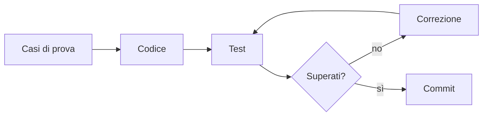

## Lezione 3.5: Laboratorio: gli algoritmi del modulo 2 in JavaScript

Modulo 3: JavaScript di base. Sviluppo Software e Coding Laboratoriale

---

## Test del software

- **Caso di prova**: input e risultato atteso, stabilito prima
- **Test automatico**: codice che confronta ottenuto e atteso
- **Test unitario**: una funzione alla volta
- **Casi limite**: array vuoto, un elemento, primo/ultimo, negativi, duplicati
- **Regressione**: rieseguire i test dopo ogni modifica

Framework professionali: Jest, Vitest, Mocha

---

## Ciclo di lavoro



---

## Struttura del progetto

```text
lab-algoritmi/
    index.html      carica i due script, nell'ordine
    algoritmi.js    solo definizioni di funzioni
    test.js         chiamate e confronti
```

Libreria separata dai test: riusabile in altri progetti

---

## La funzione di verifica

```javascript
function verifica(descrizione, ottenuto, atteso) {
  const ok = JSON.stringify(ottenuto) === JSON.stringify(atteso);
  if (ok) { superati++; console.log(`OK      ${descrizione}`); }
  else { falliti++; console.error(`FALLITO ${descrizione}`); }
}
```

`[1, 2] === [1, 2]` è `false`: `===` tra oggetti confronta l'identità, non il contenuto

---

## Libreria e test

- `somma`, `media`, `contaAlmeno`, `massimo`
- `ricercaLineare`, `ricercaBinaria`
- `selectionSort`: restituisce una copia ordinata
- Array vuoto: `null` = nessun risultato

```javascript
verifica("massimo con soli negativi", massimo([-4, -1, -7]), -1);
verifica("media dell'array vuoto", media([]), null);
```

---

## Attività

- Tutti i test superati
- Errori volontari: `max = 0`, `basso < alto`; quali test falliscono?
- **Prima i test, poi il codice**: `minimo`, `conta`, `eOrdinato` (TDD)
- Un commit per ogni funzione

---

## Metodi predefiniti degli array

```javascript
voti.filter((v) => v >= 6);            // [7, 9, 6]
voti.map((v) => v * 10);               // [70, 50, 90, 60]
voti.reduce((acc, v) => acc + v, 0);   // 27
Math.max(...voti);                     // 9
```

---

## Aspetti orientativi

- Professioni: tester, QA engineer, test automation engineer
- Nessuna modifica senza test; test automatici a ogni commit (CI)
- Test = definizione precisa dei requisiti
- Conseguenze di un errore non individuato: banche, medicina, automobili
