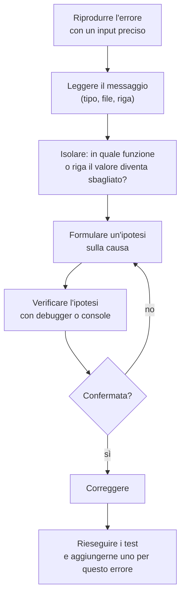

# Lezione 3.6: Errori e debugging

Contenuto originale. Riferimenti esterni indicati nel testo.

Il **debugging** è l'attività di individuare e correggere gli errori (bug) di un programma. Nel lavoro di uno sviluppatore occupa una parte rilevante del tempo: saperlo fare con metodo conta quanto saper scrivere codice.

## 3.6.1 Tre tipi di errore

| Tipo | Quando si manifesta | Come si nota | Esempio |
|---|---|---|---|
| **Errore di sintassi** | prima dell'esecuzione, quando il motore legge il codice | messaggio `SyntaxError`; lo script non viene eseguito affatto | parentesi non chiusa |
| **Errore di esecuzione** (runtime) | durante l'esecuzione, all'istruzione che lo causa | messaggio di errore (`ReferenceError`, `TypeError`, ...); le istruzioni successive non vengono eseguite | uso di una variabile inesistente |
| **Errore logico** | durante l'esecuzione, senza messaggi | il programma termina, ma il risultato è sbagliato | ciclo che parte dall'indice sbagliato |

Gli errori logici sono i più difficili: il computer non li segnala. Si scoprono solo confrontando i risultati con quelli attesi, per esempio con i test automatici (lezione 3.5).

Errori di esecuzione più frequenti in JavaScript:

- `ReferenceError: x is not defined`: si usa un nome mai dichiarato, spesso per un errore di battitura (`puntegi` invece di `punteggi`), per una differenza tra maiuscole e minuscole o perché la variabile è locale a un'altra funzione.
- `TypeError: Cannot read properties of undefined (reading 'x')`: si cerca di leggere la proprietà o il metodo `x` di un valore `undefined`, per esempio il risultato di una funzione che non esegue `return`.
- `TypeError: x is not a function`: si chiama come funzione qualcosa che non lo è, per esempio per un nome di metodo sbagliato (`toUppercase` invece di `toUpperCase`).

Elenco completo, con spiegazioni ed esempi per ciascun errore: MDN, "JavaScript error reference", https://developer.mozilla.org/en-US/docs/Web/JavaScript/Reference/Errors

## 3.6.2 Leggere un messaggio di errore

Esempio di messaggio nella console di Chrome o Edge:

```text
Uncaught ReferenceError: puntegi is not defined
    at script.js:27:32
```

- `Uncaught`: l'errore non è stato gestito dal programma (sezione 3.6.6).
- `ReferenceError`: tipo di errore.
- `puntegi is not defined`: descrizione.
- `script.js:27:32`: file, riga 27, colonna 32. Facendo clic su questo riferimento, gli strumenti per sviluppatori aprono il file nel punto dell'errore.

Firefox mostra le stesse informazioni con parole leggermente diverse. Regola: leggere sempre il messaggio per intero prima di modificare il codice; il tipo e la posizione restringono molto la ricerca. Attenzione: la riga indicata è quella in cui l'errore **si manifesta**, non sempre quella in cui è stato **commesso**.

## 3.6.3 Tecniche con la console

Stampe di controllo mirate, con etichette che rendono leggibile l'output:

```javascript
const v = [72, 85, 90];
let somma = 0;
for (let i = 0; i < v.length; i++) {
  somma += v[i];
  console.log("giro", i, "elemento", v[i], "somma parziale", somma);
}
```

Altri metodi dell'oggetto `console`:

```javascript
console.table([{ nome: "Ada", voto: 8 }, { nome: "Luca", voto: 6 }]);  // tabella leggibile
console.warn("Valore insolito");       // avviso, evidenziato in giallo
console.error("Valore non valido");    // errore, evidenziato in rosso
```

Le stampe di controllo vanno rimosse al termine del debugging: nel codice consegnato disturbano la lettura della console.

## 3.6.4 Il debugger del browser

Il **debugger** permette di sospendere l'esecuzione in un punto scelto e di osservare lo stato del programma, istruzione per istruzione, senza modificare il codice.

- **Breakpoint** (punto di interruzione): riga in cui l'esecuzione si ferma. Si imposta facendo clic sul numero di riga nel pannello Sources (Chrome, Edge) o Debugger (Firefox), oppure scrivendo nel codice l'istruzione `debugger;`, che ha effetto solo se gli strumenti per sviluppatori sono aperti.
- **Resume** (riprendi): continua fino al breakpoint successivo.
- **Step over** (passa oltre): esegue la riga corrente; se contiene una chiamata di funzione, la esegue per intero senza entrarvi.
- **Step into** (entra): se la riga corrente contiene una chiamata di funzione, entra nel corpo della funzione.
- **Step out** (esci): completa la funzione corrente e torna al punto da cui era stata chiamata.
- **Scope** (ambito): pannello con i valori attuali delle variabili locali e globali.
- **Watch** (espressioni osservate): espressioni scelte dal programmatore, ricalcolate a ogni passo, per esempio `somma / v.length`.
- **Call stack** (pila delle chiamate): elenco delle funzioni in corso di esecuzione, dalla più recente; mostra il percorso che ha portato al punto attuale.

Documentazione: Chrome, "Debug JavaScript", https://developer.chrome.com/docs/devtools/javascript/ ; Firefox, "The Firefox JavaScript Debugger", https://firefox-source-docs.mozilla.org/devtools-user/debugger/index.html ; panoramica generale: MDN, https://developer.mozilla.org/en-US/docs/Learn_web_development/Howto/Tools_and_setup/What_are_browser_developer_tools

## 3.6.5 Un metodo per il debugging



Principi:

- **una modifica alla volta**: cambiando più cose insieme non si capisce quale ha risolto il problema, o quale ne ha creato un altro
- **confrontare atteso e ottenuto**: prima di eseguire, stabilire che cosa ci si aspetta in ogni punto
- **ridurre il caso**: se l'errore compare con un array di 1000 elementi, cercare l'array più piccolo che lo riproduce
- **spiegare il codice riga per riga**, ad alta voce o per iscritto: la tecnica, detta "rubber duck debugging" (debugging con la paperella di gomma), fa emergere spesso l'errore
- dopo la correzione, aggiungere un test che avrebbe individuato l'errore, così non si ripresenterà

## 3.6.6 Gestire gli errori previsti: try e catch

Alcuni errori non dipendono dal programmatore ma da dati esterni: input dell'utente, file mancanti, rete assente. In questi casi il programma può **gestire** l'errore invece di interrompersi.

- `throw` segnala un errore, creando un oggetto `Error` con un messaggio.
- `try { ... } catch (e) { ... }` esegue il blocco `try`; se al suo interno si verifica un errore, l'esecuzione passa al blocco `catch`, che riceve l'errore nel parametro `e`.

```javascript
function leggiEta(testo) {
  const eta = Number(testo);
  if (Number.isNaN(eta) || eta < 0 || eta > 120) {
    throw new Error(`Età non valida: "${testo}"`);   // interrompe la funzione
  }
  return eta;
}

try {
  const eta = leggiEta("diciassette");
  console.log("Età:", eta);                // non eseguito: l'errore avviene prima
} catch (e) {
  console.error(e.message);                // Età non valida: "diciassette"
}
console.log("Il programma prosegue");
```

`try` e `catch` non servono a nascondere gli errori di programmazione: un `ReferenceError` va corretto nel codice, non intercettato.

## 3.6.7 Laboratorio: caccia agli errori

Tempo indicativo: 35 minuti. Cartella `lab-debug` con `index.html` (come nel laboratorio 1.1) e il seguente `script.js`.

Il programma dovrebbe stampare, per i punteggi dati, media 73.8, promossi 4 (soglia 60) e percentuale 80%. Contiene **quattro errori**: uno di sintassi, due di esecuzione e uno logico.

```javascript
// Statistiche su una lista di punteggi (contiene 4 errori)
const punteggi = [72, 85, 90, 64, 58];

function calcolaMedia(v) {
  let somma = 0;
  for (let i = 1; i < v.length; i++) {
    somma += v[i];
  }
  return somma / v.length;
}

function contaPromossi(v, soglia) {
  let promossi = 0;
  for (const p of v) {
    if (p >= soglia {
      promossi++;
    }
  }
  return promossi;
}

function percentualePromossi(v, soglia) {
  const perc = contaPromossi(v, soglia) / v.length * 100;
}

console.log("Media:", calcolaMedia(punteggi).toFixed(1));
console.log("Promossi:", contaPromossi(puntegi, 60));
console.log("Percentuale:", percentualePromossi(punteggi, 60).toFixed(0) + "%");
```

Procedura:

1. Aprire la pagina con Live Preview nel browser esterno e la console. Per ogni errore annotare in una tabella: messaggio (se presente), tipo di errore, riga, causa, correzione.
2. Correggere **un errore alla volta**, salvare e ricaricare: osservare come a ogni correzione l'esecuzione arrivi un po' più avanti.
3. Per l'errore logico usare il debugger: breakpoint sulla riga `somma += v[i];` di `calcolaMedia`, osservare nel pannello Scope i valori di `i` e `somma` a ogni passo con step over e individuare l'elemento che non viene sommato.
4. Dopo le correzioni, verificare i tre risultati attesi e fare un commit.
5. Scrivere per `calcolaMedia` e `contaPromossi` alcuni test con la funzione `verifica` della lezione 3.5.

### Esercizi

1. Per ciascun frammento indicare il tipo di errore e il messaggio previsto, poi verificarlo in console: `let x = 5; x();`, `console.log(y);`, `const z = 1; z = 2;`, `if (3 > 2 { }`.
2. Una funzione `massimo` restituisce 0 su `[-3, -8, -1]`. Formulare un'ipotesi sulla causa senza vedere il codice (suggerimento: lezione 2.3).
3. Scrivere una funzione `dividi(a, b)` che segnala con `throw` la divisione per zero, e un programma che la usa con `try` e `catch`.

## 3.6.8 Aspetti orientativi (discussione)

- Nei colloqui tecnici capita di dover trovare l'errore in un frammento di codice: si valuta il metodo, non solo il risultato.
- Nelle aziende gli errori segnalati dagli utenti diventano "ticket" in sistemi di gestione (issue tracker): ogni ticket descrive come riprodurre l'errore, il comportamento atteso e quello osservato. Scrivere segnalazioni chiare è una competenza richiesta anche a chi non programma.
- Alcuni errori software famosi hanno avuto conseguenze gravi o costose (per esempio l'esplosione del razzo Ariane 5 nel 1996, causata da un errore di conversione numerica): per questo in molti settori il test e la verifica del software sono regolati da norme specifiche.
- Domande per il dibattito: quali qualità personali aiutano nel debugging? Pazienza, metodo, capacità di chiedere aiuto descrivendo con precisione il problema?
