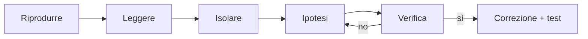

## Lezione 3.6: Errori e debugging

Modulo 3: JavaScript di base. Sviluppo Software e Coding Laboratoriale

---

## Tre tipi di errore

| Tipo | Quando | Segnale |
|---|---|---|
| Sintassi | lettura del codice | `SyntaxError`, script non eseguito |
| Esecuzione | all'istruzione | `ReferenceError`, `TypeError`, stop |
| Logico | esecuzione | nessuno: risultato sbagliato |

Riferimento: https://developer.mozilla.org/en-US/docs/Web/JavaScript/Reference/Errors

---

## Leggere un messaggio di errore

```text
Uncaught ReferenceError: puntegi is not defined
    at script.js:27:32
```

- Tipo, descrizione, file, riga, colonna
- Clic sul riferimento: apre il punto dell'errore
- Riga in cui l'errore **si manifesta**, non sempre dove è stato **commesso**

---

## Console

```javascript
console.log("giro", i, "somma parziale", somma);
console.table([{ nome: "Ada", voto: 8 }]);
console.warn("Valore insolito");
console.error("Valore non valido");
```

Rimuovere le stampe di controllo al termine

---

## Il debugger

- **Breakpoint** (clic sul numero di riga, oppure `debugger;`)
- **Resume**, **step over**, **step into**, **step out**
- **Scope**: valori delle variabili
- **Watch**: espressioni osservate
- **Call stack**: percorso delle chiamate

Sources (Chrome, Edge), Debugger (Firefox)

---

## Metodo



- Una modifica alla volta
- Ridurre il caso
- Spiegare il codice riga per riga (rubber duck debugging)

---

## try, catch, throw

```javascript
try {
  const eta = leggiEta("diciassette");   // throw new Error(...)
} catch (e) {
  console.error(e.message);
}
```

Per errori dovuti a dati esterni, non per nascondere errori di programmazione

---

## Laboratorio: caccia agli errori

- Programma con 4 errori: sintassi, 2 di esecuzione, logico
- Risultati attesi: media 73.8, promossi 4, percentuale 80%
- Un errore alla volta; tabella con messaggio, tipo, riga, causa, correzione
- Errore logico: breakpoint e pannello Scope
- Test con `verifica`, commit Git

---

## Aspetti orientativi

- Esercizi di debugging nei colloqui tecnici: conta il metodo
- Issue tracker e ticket: come riprodurre, atteso, osservato
- Ariane 5 (1996): errore di conversione numerica
- Qualità utili: pazienza, metodo, descrizione precisa dei problemi
