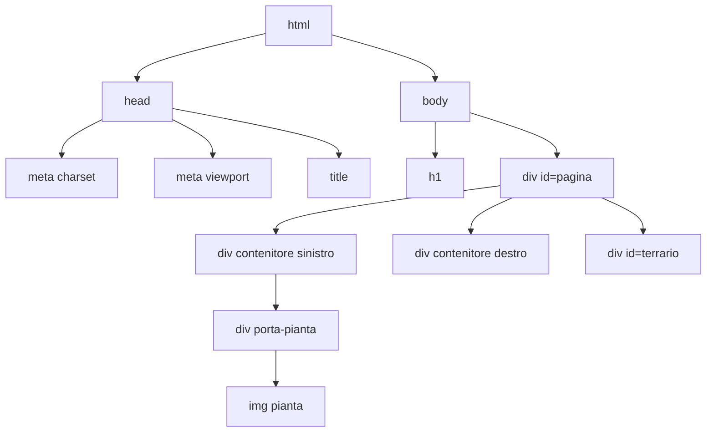

# Lezione 4.1: Struttura di una pagina HTML

> Fonte: adattamento, tradotto e riscritto, della lezione "Terrarium Project Part 1: Introduction to HTML" del corso Microsoft "Web Development for Beginners", https://github.com/microsoft/Web-Dev-For-Beginners/blob/main/3-terrarium/1-intro-to-html/README.md . Copyright (c) Microsoft Corporation, licenza MIT: https://github.com/microsoft/Web-Dev-For-Beginners/blob/main/LICENSE . Le immagini delle piante del laboratorio provengono dallo stesso repository.

Progetto del modulo: un **terrario virtuale**, pagina con un barattolo di vetro e alcune piante disposte ai lati. In questo modulo si costruiscono struttura (HTML) e aspetto (CSS); nel modulo 5 le piante diventano trascinabili con JavaScript.

## 4.1.1 HTML, CSS, JavaScript

Una pagina web è composta da tre linguaggi con ruoli distinti:

- **HTML** (HyperText Markup Language): **struttura e significato** dei contenuti: titoli, paragrafi, immagini, collegamenti.
- **CSS** (Cascading Style Sheets): **aspetto**: colori, caratteri, dimensioni, disposizione (lezioni 4.3 e 4.4).
- **JavaScript**: **comportamento**: reazioni alle azioni dell'utente, calcoli, modifiche della pagina (moduli 3 e 5).

HTML è un **linguaggio di markup**, non un linguaggio di programmazione: non contiene istruzioni da eseguire, ma "marca" il testo per indicarne il ruolo. Riferimento completo degli elementi: MDN, "HTML elements reference", https://developer.mozilla.org/en-US/docs/Web/HTML/Reference/Elements

## 4.1.2 Elementi, tag, attributi

Concetti:

- **Elemento**: unità della pagina, per esempio un paragrafo. Si scrive con un **tag di apertura** e un **tag di chiusura** che racchiudono il contenuto: `<p>Testo del paragrafo</p>`.
- **Elemento vuoto**: elemento senza contenuto e senza tag di chiusura, per esempio `` (immagine) o `<meta>`.
- **Attributo**: informazione aggiuntiva scritta nel tag di apertura nella forma `nome="valore"`.

```html
<a href="https://developer.mozilla.org/">Documentazione MDN</a>
<!-- elemento a (collegamento), attributo href (destinazione), contenuto: testo cliccabile -->


<!-- elemento vuoto img, attributi src (file) e alt (testo alternativo) -->
```

- `<!-- ... -->` è un **commento**: ignorato dal browser, serve a chi legge il codice.
- I nomi di tag e attributi si scrivono in minuscolo per convenzione; i valori degli attributi vanno tra virgolette.

Gli elementi si **annidano**: un elemento può contenerne altri, e deve essere chiuso dopo quelli che contiene. `<p>Testo <strong>importante</strong></p>` è corretto; `<p>Testo <strong>importante</p></strong>` non lo è.

## 4.1.3 Struttura del documento

```html
<!DOCTYPE html>
<html lang="it">
  <head>
    <meta charset="UTF-8">
    <meta name="viewport" content="width=device-width, initial-scale=1">
    <title>Titolo nella scheda del browser</title>
  </head>
  <body>
    <h1>Contenuto visibile</h1>
  </body>
</html>
```

- `<!DOCTYPE html>`: dichiara che il documento segue lo standard HTML attuale (HTML5).
- `<html lang="it">`: **elemento radice**, contiene tutto il documento; `lang` indica la lingua, usata per esempio dai lettori di schermo per la pronuncia e dai motori di ricerca.
- `<head>`: **metadati**, cioè informazioni sulla pagina che non compaiono nel contenuto.
  - `<meta charset="UTF-8">`: codifica dei caratteri; UTF-8 rappresenta lettere accentate e simboli di tutte le lingue.
  - `<meta name="viewport" ...>`: istruisce i browser dei dispositivi mobili a usare la larghezza reale dello schermo, invece di simulare uno schermo da computer (lezione 4.4).
  - `<title>`: titolo mostrato nella scheda del browser e nei risultati dei motori di ricerca.
- `<body>`: **contenuto** visibile della pagina.

Il browser trasforma il codice HTML in una struttura ad albero, in cui ogni elemento è figlio dell'elemento che lo contiene. È la base del DOM, trattato nel modulo 5.



## 4.1.4 Elementi di uso comune

| Elemento | Uso |
|---|---|
| `<h1>` ... `<h6>` | titoli, dal livello più importante al meno importante |
| `<p>` | paragrafo |
| `<a href="...">` | collegamento ipertestuale |
| `` | immagine |
| `<ul>`, `<ol>`, `<li>` | elenco puntato, elenco numerato, voce di elenco |
| `<strong>`, `<em>` | testo importante, testo enfatizzato |
| `<div>` | contenitore generico di blocco, senza significato proprio |
| `<span>` | contenitore generico in linea, per una parte di testo |
| `<button>` | pulsante |

Percorsi nei valori di `href` e `src`:

- **URL assoluto**: indirizzo completo, `https://developer.mozilla.org/`.
- **Percorso relativo**: riferito alla posizione del file HTML: `images/plant1.png` indica il file `plant1.png` nella sottocartella `images`; `../style.css` indica un file nella cartella superiore. Nei percorsi web il separatore è sempre `/`, anche su Windows.

## 4.1.5 Attributi id e class

- `id`: identificativo **univoco** nella pagina; un solo elemento può avere un dato `id`. Serve per individuare quell'elemento dal CSS e da JavaScript.
- `class`: etichetta **condivisa** da più elementi dello stesso tipo; un elemento può avere più classi, separate da spazi (`class="pianta grande"`).

```html
<div id="terrario">...</div>                 <!-- uno solo nella pagina -->
         <!-- classe comune, id specifico -->

```

Convenzione del corso: nomi in minuscolo, parole separate da trattini (`contenitore-sinistro`), senza spazi né lettere accentate.

## 4.1.6 Laboratorio: la struttura del terrario

Tempo indicativo: 30 minuti.

### Preparazione della cartella e delle immagini

1. Creare la cartella `terrario` e aprirla in VS Code; inizializzare un repository Git (`git init -b main`).
2. Scaricare le 14 immagini delle piante nella sottocartella `images`. Dal terminale di VS Code (PowerShell):

```powershell
mkdir images
1..14 | ForEach-Object {
  Invoke-WebRequest "https://raw.githubusercontent.com/microsoft/Web-Dev-For-Beginners/main/3-terrarium/solution/images/plant$_.png" -OutFile "images/plant$_.png"
}
ls images
```

- `1..14` è l'**operatore di intervallo** di PowerShell: produce i numeri da 1 a 14.
- `|` (**pipe**) passa il risultato del comando a sinistra al comando a destra.
- `ForEach-Object { ... }` esegue il blocco tra graffe una volta per ogni valore ricevuto; `$_` è il valore corrente (1, 2, ..., 14).
- `Invoke-WebRequest URL -OutFile FILE` scarica la risorsa indicata dall'URL e la salva nel file indicato.
- Nella stringa tra virgolette doppie `$_` viene sostituito dal numero: `plant$_.png` diventa `plant1.png`, `plant2.png`, ...

In alternativa il docente distribuisce la cartella `images` già pronta. Le immagini sono nel repository Microsoft, cartella `3-terrarium/solution/images`, con licenza MIT.

### Il file index.html

Creare `index.html` con il contenuto seguente. Il collegamento a `style.css` viene inserito subito, anche se il file verrà creato nella lezione 4.3.

```html
<!DOCTYPE html>
<html lang="it">
  <head>
    <meta charset="UTF-8">
    <meta name="viewport" content="width=device-width, initial-scale=1">
    <title>Il mio terrario virtuale</title>
    <!-- Foglio di stile esterno (lezione 4.3) -->
    <link rel="stylesheet" href="style.css">
  </head>
  <body>
    <h1>Il mio terrario</h1>

    <div id="pagina">
      <!-- Colonna sinistra: piante da 1 a 7 -->
      <div id="contenitore-sinistro" class="contenitore">
        <div class="porta-pianta"></div>
        <div class="porta-pianta"></div>
        <div class="porta-pianta"></div>
        <div class="porta-pianta"></div>
        <div class="porta-pianta"></div>
        <div class="porta-pianta"></div>
        <div class="porta-pianta"></div>
      </div>

      <!-- Colonna destra: piante da 8 a 14 -->
      <div id="contenitore-destro" class="contenitore">
        <div class="porta-pianta"></div>
        <div class="porta-pianta"></div>
        <div class="porta-pianta"></div>
        <div class="porta-pianta"></div>
        <div class="porta-pianta"></div>
        <div class="porta-pianta"></div>
        <div class="porta-pianta"></div>
      </div>

      <!-- Il barattolo: forme disegnate interamente con il CSS (lezione 4.4) -->
      <div id="terrario">
        <div class="barattolo-collo"></div>
        <div class="barattolo-pareti">
          <div class="riflesso-lungo"></div>
          <div class="riflesso-corto"></div>
        </div>
        <div class="terra"></div>
        <div class="barattolo-fondo"></div>
      </div>
    </div>
  </body>
</html>
```

Struttura della pagina:

- ogni pianta è un'immagine con classe `pianta` e `id` univoco, racchiusa in un `div` con classe `porta-pianta`, che ne definisce lo spazio
- le piante sono divise in due contenitori, uno per lato, con classe comune `contenitore` e `id` diversi
- il barattolo è formato da `div` vuoti: senza CSS non si vede nulla; forma e colore arriveranno dal foglio di stile

Il testo `alt="pianta"`, uguale per tutte le immagini, è volutamente povero: nella lezione 4.2 viene migliorato.

### Verifica

1. Aprire la pagina con Live Preview: compaiono il titolo e le 14 immagini una sotto l'altra, a grandezza naturale. È il comportamento normale di una pagina senza CSS.
2. Con gli strumenti per sviluppatori (`F12`, scheda Ispettore o Elements) esplorare l'albero degli elementi e confrontarlo con il diagramma della sezione 4.1.3.
3. Validare il codice con il validatore ufficiale del W3C, https://validator.w3.org/nu/ , opzione "text input" (incolla il codice): non devono comparire errori. Il messaggio sul file `style.css` mancante non riguarda il validatore, ma la console del browser.
4. Commit: `git add .` e `git commit -m "Struttura HTML del terrario"`.

### Esercizi

1. Aggiungere sotto il titolo un paragrafo che spieghi in una frase che cosa si può fare nella pagina, con un collegamento alla pagina di Wikipedia sui terrari.
2. Introdurre un errore volontario (tag `div` non chiuso) e osservare come lo segnala il validatore; poi correggerlo.
3. Scrivere a parte una pagina `ricetta.html` con titolo, elenco puntato degli ingredienti, elenco numerato dei passi e una frase con testo in `<strong>`.
