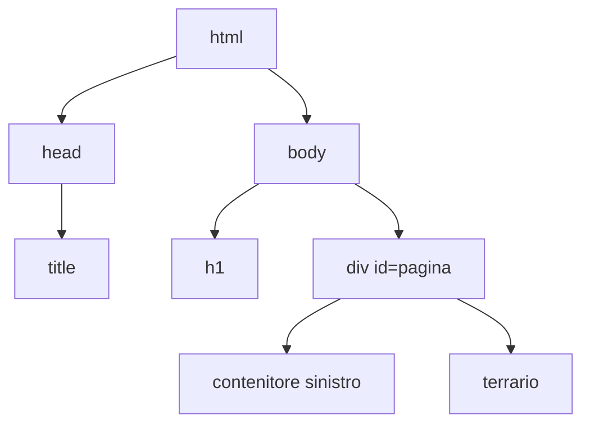

## Lezione 4.1: Struttura di una pagina HTML

Modulo 4: HTML e CSS. Sviluppo Software e Coding Laboratoriale

Fonte: adattamento da Microsoft, "Web Development for Beginners", lezione "Introduction to HTML", licenza MIT
https://github.com/microsoft/Web-Dev-For-Beginners

---

## HTML, CSS, JavaScript

- **HTML**: struttura e significato
- **CSS**: aspetto e disposizione
- **JavaScript**: comportamento

HTML è un linguaggio di **markup**, non di programmazione

Progetto del modulo: il **terrario virtuale**

---

## Elementi, tag, attributi

```html
<a href="https://developer.mozilla.org/">Documentazione MDN</a>

<!-- commento -->
```

- Tag di apertura e di chiusura; elementi vuoti (`img`, `meta`)
- Attributi `nome="valore"`
- Annidamento corretto: si chiude prima l'elemento interno

---

## Struttura del documento

```html
<!DOCTYPE html>
<html lang="it">
  <head>
    <meta charset="UTF-8">
    <meta name="viewport" content="width=device-width, initial-scale=1">
    <title>Titolo nella scheda</title>
  </head>
  <body> ... </body>
</html>
```

---

## Il documento come albero



---

## Elementi comuni, id e class

| Elemento | Uso |
|---|---|
| `h1`...`h6`, `p` | titoli, paragrafi |
| `a`, `img` | collegamenti, immagini |
| `ul`, `ol`, `li` | elenchi |
| `div`, `span` | contenitori generici |

- `id`: univoco nella pagina
- `class`: condivisa, anche più classi per elemento
- Percorsi assoluti e relativi; separatore `/`

---

## Laboratorio 4.1: la struttura del terrario

```powershell
mkdir images
1..14 | ForEach-Object {
  Invoke-WebRequest "https://raw.githubusercontent.com/.../plant$_.png" -OutFile "images/plant$_.png"
}
```

- `index.html`: titolo, due contenitori con 7 piante ciascuno, barattolo di `div` vuoti
- Esplorazione con l'Ispettore
- Validatore W3C: https://validator.w3.org/nu/
- Commit Git
