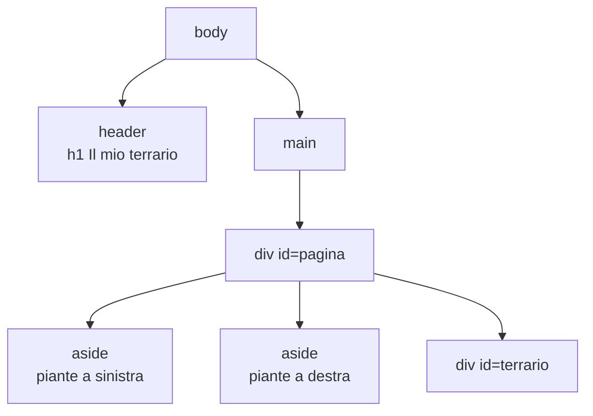

# Lezione 4.2: HTML semantico e accessibilità

> Fonte: adattamento, tradotto e riscritto, della lezione "Accessibility" del corso Microsoft "Web Development for Beginners", https://github.com/microsoft/Web-Dev-For-Beginners/blob/main/1-getting-started-lessons/3-accessibility/README.md . Copyright (c) Microsoft Corporation, licenza MIT: https://github.com/microsoft/Web-Dev-For-Beginners/blob/main/LICENSE .

## 4.2.1 Accessibilità: che cos'è e perché conta

L'**accessibilità** di un sito o di un'applicazione è la possibilità di usarlo da parte di tutte le persone, comprese quelle con disabilità visive, uditive, motorie o cognitive, anche tramite **tecnologie assistive**:

- **lettori di schermo** (screen reader): leggono ad alta voce, o su display braille, il contenuto e la struttura della pagina. Esempi: NVDA (Windows, gratuito), Assistente vocale (Narrator, incluso in Windows), VoiceOver (Apple), TalkBack (Android).
- **ingranditori** e zoom del browser, per chi ha una vista ridotta
- **navigazione da tastiera** o con dispositivi alternativi al mouse, per chi ha difficoltà motorie

Motivi per cui l'accessibilità è un requisito professionale:

- una parte significativa della popolazione ha una disabilità, permanente o temporanea (un braccio ingessato, uno schermo al sole)
- in Italia e nell'Unione Europea è un **obbligo di legge**: per la Pubblica Amministrazione dalla Legge 4/2004 ("Legge Stanca"); dal 28 giugno 2025, con il recepimento dello European Accessibility Act (D.Lgs. 82/2022), anche per molti servizi digitali privati, come commercio elettronico e servizi bancari
- le soluzioni accessibili migliorano l'uso per tutti: struttura chiara, testi leggibili, comandi da tastiera (come le rampe sui marciapiedi, usate anche da passeggini e valigie)

Le **WCAG** (Web Content Accessibility Guidelines), pubblicate dal W3C, sono lo standard internazionale di riferimento, richiamato dalle leggi. Riferimento rapido ufficiale: https://www.w3.org/WAI/WCAG22/quickref/

Le WCAG si basano su quattro principi (**POUR**):

- **Percepibile**: le informazioni sono presentate in forme che l'utente può percepire (testo alternativo per le immagini, sottotitoli, contrasto sufficiente).
- **Utilizzabile** (Operable): tutte le funzioni sono utilizzabili, anche solo da tastiera.
- **Comprensibile** (Understandable): testi chiari, comportamento prevedibile, messaggi di errore utili.
- **Robusto**: il codice è corretto e interpretabile dalle tecnologie assistive, attuali e future.

## 4.2.2 HTML semantico

Un elemento **semantico** comunica il ruolo del contenuto, non solo il suo aspetto. I lettori di schermo usano questi ruoli per presentare la pagina e permettere di saltare direttamente a una sezione.

| Elemento | Ruolo |
|---|---|
| `<header>` | intestazione della pagina o di una sezione |
| `<nav>` | blocco di collegamenti di navigazione |
| `<main>` | contenuto principale; uno solo per pagina |
| `<section>` | sezione tematica, di solito con un titolo |
| `<article>` | contenuto autonomo (notizia, post, scheda prodotto) |
| `<aside>` | contenuto correlato ma secondario |
| `<footer>` | piè di pagina |
| `<button>` | pulsante attivabile con mouse e tastiera |

Confronto:

```html
<!-- Non semantico: solo div, i ruoli si capiscono unicamente dai nomi delle classi -->
<div class="testata">...</div>
<div class="menu">...</div>
<div class="contenuto">...</div>

<!-- Semantico: i ruoli sono espliciti per browser, motori di ricerca e tecnologie assistive -->
<header>...</header>
<nav>...</nav>
<main>...</main>
```

`<div>` e `<span>` restano utili per raggruppare elementi a scopo di impaginazione, quando nessun elemento semantico è adatto.

**Gerarchia dei titoli**: un solo `<h1>` per pagina e livelli in sequenza (`h2` dentro `h1`, `h3` dentro `h2`), senza salti di livello. Gli utenti di lettori di schermo navigano spesso di titolo in titolo: i titoli funzionano come indice della pagina. Il livello di un titolo va scelto in base alla struttura, non alla dimensione del carattere, che si regola con il CSS.

Diagramma: struttura semantica del terrario al termine del laboratorio di questa lezione.



## 4.2.3 Testi alternativi, collegamenti, moduli

**Testo alternativo** (attributo `alt` delle immagini): sostituisce l'immagine per chi non la vede e quando il file non viene caricato.

- immagine **informativa**: `alt` descrive l'informazione che l'immagine trasmette, in modo conciso: `alt="Grafico: iscritti in crescita dal 2020 al 2025"`
- immagine **decorativa**: `alt=""` (vuoto), così i lettori di schermo la ignorano
- non iniziare con "immagine di": il lettore di schermo annuncia già che si tratta di un'immagine

**Testo dei collegamenti**: deve indicare la destinazione anche letto fuori contesto. Molti utenti di lettori di schermo scorrono l'elenco dei collegamenti della pagina: un elenco di "clicca qui" è inutilizzabile.

```html
<!-- Da evitare -->
<p>Per il regolamento <a href="regolamento.pdf">clicca qui</a>.</p>

<!-- Corretto -->
<p>Consultare il <a href="regolamento.pdf">regolamento del concorso (PDF)</a>.</p>
```

**Etichette dei moduli**: ogni campo di input ha un elemento `<label>` associato tramite `for` e `id`. Il lettore di schermo legge l'etichetta quando il campo riceve il focus; inoltre il clic sull'etichetta attiva il campo, un'area più ampia da colpire.

```html
<label for="email">Indirizzo email</label>
<input type="email" id="email" name="email">
```

## 4.2.4 Colore, contrasto, tastiera

- **Contrasto**: il rapporto di contrasto tra testo e sfondo deve essere almeno **4.5:1** per il testo normale e 3:1 per il testo grande (livello AA delle WCAG). Verifica: WebAIM Contrast Checker, https://webaim.org/resources/contrastchecker/ , gratuito e senza account.
- **Non affidare un'informazione solo al colore**: un campo errato evidenziato solo in rosso non è percepito da chi non distingue i colori; va aggiunto un testo o un simbolo.
- **Tastiera**: tutti i comandi devono essere raggiungibili con `Tab` (avanti) e `Shift` + `Tab` (indietro) e attivabili con `Invio` o `Spazio`. Gli elementi nativi (`<a>`, `<button>`, `<input>`) lo sono automaticamente; un `<div>` con un gestore di clic, invece, non riceve il focus e non è attivabile da tastiera. Per questo i pulsanti si realizzano con `<button>`.
- **Focus visibile**: l'elemento che riceve il focus da tastiera deve essere evidenziato; il bordo predefinito del browser non va rimosso con il CSS senza sostituirlo.

**ARIA** (Accessible Rich Internet Applications) è un insieme di attributi (`role`, `aria-label`, ...) che aggiungono informazioni per le tecnologie assistive quando l'HTML non basta, per esempio in componenti complessi come schede o menu a comparsa. Regola generale: usare prima l'elemento HTML semantico adatto; ARIA solo quando non esiste. Esempio d'uso corretto: `<aside aria-label="Piante disponibili">` dà un nome a una zona che non ha un titolo visibile.

## 4.2.5 Strumenti di verifica

| Strumento | Tipo | Dove |
|---|---|---|
| Lighthouse | verifica automatica: accessibilità, prestazioni, buone pratiche | integrato in Chrome ed Edge, scheda Lighthouse degli strumenti per sviluppatori: https://developer.chrome.com/docs/lighthouse/overview |
| Accessibility Inspector | albero di accessibilità; controlli su contrasto, tastiera, etichette; ordine di tabulazione | integrato in Firefox, scheda Accessibilità: https://firefox-source-docs.mozilla.org/devtools-user/accessibility_inspector/index.html |
| Assistente vocale (Narrator) | lettore di schermo | incluso in Windows; si attiva e disattiva con `Ctrl` + `Win` + `Invio` |
| WebAIM Contrast Checker | rapporto di contrasto tra due colori | https://webaim.org/resources/contrastchecker/ |
| Validatore W3C | correttezza del codice HTML | https://validator.w3.org/nu/ |

Gli strumenti automatici individuano solo una parte dei problemi (per esempio verificano che `alt` esista, non che sia significativo): servono anche prove manuali, come l'uso della pagina con la sola tastiera.

## 4.2.6 Laboratorio

Tempo indicativo: 35 minuti.

### Parte 1: correggere una pagina

Creare nella cartella `terrario` il file `pagina-da-correggere.html`:

```html
<!DOCTYPE html>
<html>
  <head>
    <meta charset="UTF-8">
    <title>Serra comunale</title>
    <style>
      /* stile interno: CSS scritto nella pagina (lezione 4.3) */
      body { font-family: sans-serif; }
      .nota { color: #aaaaaa; background: #ffffff; }
      .pulsante { background: #2e7d32; color: white; padding: 0.5rem; display: inline-block; cursor: pointer; }
    </style>
  </head>
  <body>
    <div class="titolo"><b>Serra comunale</b></div>
    <h3>Orari</h3>
    <p class="nota">Aperta dal martedì alla domenica, dalle 9 alle 18.</p>
    
    <p>Per il programma delle visite <a href="programma.html">clicca qui</a>.</p>
    <div class="pulsante" onclick="alert('Iscrizione inviata')">Iscriviti</div>
  </body>
</html>
```

`onclick` è un attributo che esegue codice JavaScript al clic; qui serve solo a simulare un pulsante (gli eventi sono l'argomento del modulo 5).

1. Eseguire un'analisi con Lighthouse (categoria Accessibility) oppure con l'Accessibility Inspector di Firefox, e annotare i problemi segnalati.
2. Provare la pagina con la sola tastiera: il "pulsante" Iscriviti è raggiungibile con `Tab`? Questo problema, come il collegamento "clicca qui", in genere non viene segnalato dagli strumenti automatici: si individua solo con prove manuali e con la lettura del codice.
3. Verificare con WebAIM Contrast Checker il contrasto tra `#aaaaaa` e `#ffffff`.
4. Correggere tutti i problemi. Elenco di controllo: lingua del documento, titolo principale come `<h1>` e gerarchia dei titoli, testo alternativo, testo del collegamento, contrasto, pulsante realizzato con `<button>`, struttura con `<header>` e `<main>`.
5. Ripetere l'analisi e confrontare il punteggio.

### Parte 2: il terrario

Migliorare `index.html` del terrario:

1. Racchiudere il titolo in `<header>` e il `div` con `id="pagina"` in `<main>`.
2. Trasformare i due contenitori delle piante da `<div>` in `<aside>`, mantenendo `id` e `class`, con etichette distinte: `aria-label="Piante disponibili, colonna sinistra"` e `aria-label="Piante disponibili, colonna destra"`. Due zone dello stesso tipo con lo stesso nome sarebbero indistinguibili per chi usa un lettore di schermo.
3. Aprire ciascuna immagine e sostituire `alt="pianta"` con una breve descrizione, per esempio `alt="Pianta grassa con foglie a rosetta"`.
4. Verificare con il validatore W3C e con Lighthouse; commit con messaggio "Terrario: struttura semantica e testi alternativi".

### Esercizi

1. Attivare l'Assistente vocale di Windows e ascoltare la lettura di `pagina-da-correggere.html` prima e dopo le correzioni.
2. Cercare nel sito della propria scuola un collegamento del tipo "clicca qui" o un'immagine senza testo alternativo e proporre una correzione.
3. Con WebAIM Contrast Checker trovare il grigio più chiaro su sfondo bianco che raggiunge il rapporto 4.5:1.

## 4.2.7 Aspetti orientativi (discussione)

- L'accessibilità è una competenza richiesta a sviluppatori front-end e designer; esistono figure specializzate (esperti e auditor di accessibilità) e certificazioni internazionali.
- Gli obblighi introdotti dal 2025 per i servizi privati hanno aumentato la richiesta di queste competenze nelle aziende.
- Domande per il dibattito: quali ostacoli incontrerebbe nel sito della scuola o in un'app di uso quotidiano una persona che non vede, o che usa solo la tastiera?
