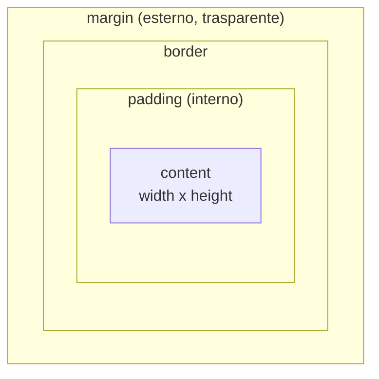

# Lezione 4.3: CSS: selettori, box model, colori

> Fonte: adattamento, tradotto e riscritto, della lezione "Terrarium Project Part 2: Introduction to CSS" del corso Microsoft "Web Development for Beginners", https://github.com/microsoft/Web-Dev-For-Beginners/blob/main/3-terrarium/2-intro-to-css/README.md . Copyright (c) Microsoft Corporation, licenza MIT: https://github.com/microsoft/Web-Dev-For-Beginners/blob/main/LICENSE . La lezione 4.4 completa l'adattamento della stessa fonte.

## 4.3.1 Regole CSS

Un foglio di stile è un elenco di **regole**. Ogni regola è formata da un **selettore**, che indica a quali elementi si applica, e da un blocco di **dichiarazioni** `proprietà: valore;`.

```css
/* selettore  { proprietà: valore; } */
h1 {
  color: #3a241d;          /* colore del testo */
  text-align: center;      /* allineamento del testo */
  font-size: 2.5rem;       /* dimensione del carattere */
}
```

- I commenti CSS si scrivono tra `/*` e `*/`.
- Una proprietà scritta male o un valore non valido vengono **ignorati senza segnalazione**: se uno stile non ha effetto, la prima verifica è negli strumenti per sviluppatori, dove la dichiarazione compare barrata o con un simbolo di avviso.

Tre modi di applicare il CSS a una pagina:

| Modo | Esempio | Uso |
|---|---|---|
| Foglio esterno | `<link rel="stylesheet" href="style.css">` nel `head` | modo standard: un file di stile per molte pagine |
| Stile interno | `<style> ... </style>` nel `head` | prove, pagine singole |
| Stile in linea | `<p style="color: red;">` | da evitare: mescola struttura e aspetto |

Il CSS è in continua evoluzione: per verificare quali browser supportano una proprietà recente si consulta la sezione "Browser compatibility" della relativa pagina MDN. Riferimento CSS: https://developer.mozilla.org/en-US/docs/Web/CSS

## 4.3.2 Selettori

| Selettore | Esempio | Seleziona |
|---|---|---|
| di tipo (elemento) | `p` | tutti i paragrafi |
| di classe | `.pianta` | gli elementi con `class="pianta"` |
| di id | `#terrario` | l'elemento con `id="terrario"` |
| discendente | `aside img` | le immagini contenute, a qualunque livello, in un `aside` |
| figlio diretto | `ul > li` | le voci figlie dirette di un `ul` |
| gruppo | `h1, h2, h3` | tutti gli elementi dei tre tipi |
| pseudo-classe | `a:hover`, `button:focus` | elementi in uno stato: puntatore sopra, focus da tastiera |
| universale | `*` | tutti gli elementi |

Negli strumenti per sviluppatori, selezionando un elemento nell'Ispettore, il pannello degli stili mostra tutte le regole che lo riguardano e da quali selettori derivano.

## 4.3.3 Cascata, specificità, ereditarietà

Più regole possono assegnare valori diversi alla stessa proprietà dello stesso elemento. La **cascata** è l'insieme di criteri con cui il browser sceglie la dichiarazione vincente:

1. **Origine e importanza**: gli stili dell'autore della pagina prevalgono su quelli predefiniti del browser. Una dichiarazione con `!important` prevale sulle altre; va evitata, perché rende il foglio di stile difficile da modificare.
2. **Specificità**: vince il selettore più specifico. Ordine dal più al meno specifico: stile in linea, selettore di id, selettore di classe (e pseudo-classe), selettore di tipo.
3. **Ordine**: a parità di specificità vince la dichiarazione scritta per ultima.

```html
<p id="avviso" class="nota">Testo</p>
```

```css
p       { color: black; }   /* tipo: specificità minima */
.nota   { color: gray; }    /* classe: prevale su p */
#avviso { color: red; }     /* id: prevale su .nota. Il testo è rosso */
```

Per confrontare selettori composti si contano, in ordine di importanza, gli id, poi le classi e le pseudo-classi, poi i tipi: `#pagina .pianta` (1 id, 1 classe) prevale su `.contenitore .pianta` (0 id, 2 classi).

**Ereditarietà**: alcune proprietà impostate su un elemento vengono ereditate dai discendenti. Si ereditano in generale le proprietà del testo (`color`, `font-family`, `font-size`, `line-height`, `text-align`); non si ereditano quelle di dimensione e impaginazione (`width`, `height`, `margin`, `padding`, `border`, `position`). Impostando `font-family` su `body`, tutta la pagina usa quel carattere.

## 4.3.4 Colori e unità di misura

Colori:

- nomi predefiniti: `white`, `black`, `green`
- esadecimali `#rrggbb`: tre coppie di cifre esadecimali (da 00 a ff) per rosso, verde, blu: `#3a241d` è un marrone scuro
- `rgb(58, 36, 29)`: stessi valori in decimale, da 0 a 255
- `rgba(0, 0, 0, 0.1)`: con un quarto valore di **opacità** da 0 (trasparente) a 1 (opaco)

Unità di misura:

| Unità | Riferimento | Uso tipico |
|---|---|---|
| `px` | pixel CSS | bordi sottili, dettagli |
| `%` | dimensione dell'elemento contenitore | larghezze in impaginazioni flessibili |
| `rem` | dimensione del carattere dell'elemento radice (di norma 16px) | caratteri, spaziature; rispetta lo zoom e le preferenze dell'utente |
| `em` | dimensione del carattere dell'elemento stesso | spaziature proporzionali al testo |
| `vh`, `vw` | 1% dell'altezza, della larghezza della finestra | sezioni a tutto schermo |

## 4.3.5 Il box model

Il browser rappresenta ogni elemento come un rettangolo formato da quattro aree concentriche (**box model**):

- **content**: il contenuto (testo, immagine), di dimensioni `width` e `height`
- **padding**: spazio interno tra contenuto e bordo; prende il colore di sfondo dell'elemento
- **border**: bordo
- **margin**: spazio esterno, che separa l'elemento dagli altri; sempre trasparente



```css
.scheda {
  width: 200px;
  padding: 1rem;                   /* 1rem su tutti e quattro i lati */
  border: 2px solid #2e7d32;       /* spessore, stile, colore */
  margin: 1rem auto;               /* 1rem sopra e sotto, auto a sinistra e destra: centra il blocco */
}
```

Per impostazione predefinita (`box-sizing: content-box`) `width` indica la larghezza del solo contenuto: la scheda sopra occupa 200 + 2·16 + 2·2 = 236 pixel. Con `box-sizing: border-box` la larghezza dichiarata comprende padding e bordo: calcoli più semplici, per questo molti progetti la impostano per tutti gli elementi.

Negli strumenti per sviluppatori (scheda Layout in Firefox, Computed in Chrome ed Edge) il box model dell'elemento selezionato è mostrato con le misure effettive. Approfondimento: MDN, "Introduction to the CSS box model", https://developer.mozilla.org/en-US/docs/Web/CSS/Guides/Box_model/Introduction

## 4.3.6 Laboratorio: prime regole per il terrario

Tempo indicativo: 30 minuti. Nella cartella `terrario` creare `style.css`, già collegato da `index.html` (lezione 4.1).

```css
/* Tutti gli elementi: le dimensioni dichiarate includono padding e bordo */
* {
  box-sizing: border-box;
}

/* Impostazioni generali, ereditate dal testo di tutta la pagina */
body {
  font-family: "Segoe UI", Tahoma, Geneva, Verdana, sans-serif;  /* elenco di alternative */
  margin: 0;                /* elimina il margine predefinito del browser */
}

h1 {
  color: #3a241d;
  text-align: center;
  font-size: 2.5rem;
  margin: 1rem 0;
}

/* Proprietà comuni ai due contenitori delle piante */
.contenitore {
  background-color: #f5f5f5;
  width: 15%;
  height: 100vh;            /* tutta l'altezza della finestra */
  padding: 1rem;
}
```

Osservazioni con gli strumenti per sviluppatori:

1. Selezionare il titolo: nel pannello degli stili compaiono le regole di `h1` e, più in basso, quelle ereditate da `body`.
2. Nel box model di un contenitore verificare che la larghezza comprenda il padding (effetto di `box-sizing: border-box`).
3. Nel pannello degli stili modificare dal vivo il colore del titolo; poi riportare nel file il valore scelto.

Le piante sono ancora una sotto l'altra e i contenitori non stanno ai lati: il posizionamento è l'argomento della lezione 4.4.

Esperimenti sulla cascata (da annullare al termine):

1. Aggiungere in fondo al file `h1 { color: green; }`: quale colore vince, e perché?
2. Aggiungere `#contenitore-sinistro { background-color: #e8f5e9; }` prima della regola `.contenitore`: vince comunque il selettore di id? Perché l'ordine in questo caso non conta?
3. Aggiungere al tag `<h1>` l'attributo `style="color: purple"` e verificare quale dichiarazione risulta barrata negli strumenti per sviluppatori.

Commit: "Terrario: primo foglio di stile".

### Esercizi

1. Calcolare la larghezza totale occupata da un elemento con `width: 300px; padding: 20px; border: 5px solid; margin: 10px;` con `content-box` e con `border-box`.
2. Ordinare per specificità: `.pianta`, `img`, `#pianta1`, `aside .pianta`, `#pagina img`.
3. Scrivere una regola che evidenzi con un bordo le immagini delle piante al passaggio del puntatore (`:hover`); verificare che non sposti gli altri elementi (suggerimento: `outline` non occupa spazio nel box model, `border` sì).
