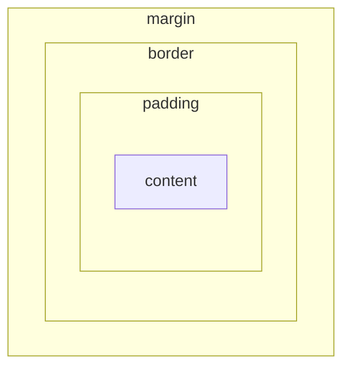

## Lezione 4.3: CSS: selettori, box model, colori

Modulo 4: HTML e CSS. Sviluppo Software e Coding Laboratoriale

Fonte: adattamento da Microsoft, "Web Development for Beginners", lezione "Introduction to CSS", licenza MIT
https://github.com/microsoft/Web-Dev-For-Beginners

---

## Regole CSS

```css
h1 {
  color: #3a241d;
  text-align: center;
  font-size: 2.5rem;
}
```

- Selettore e dichiarazioni `proprietà: valore;`
- Errori ignorati senza segnalazione: controllare nei DevTools
- Foglio esterno (`<link>`), stile interno (`<style>`), in linea (da evitare)

---

## Selettori

| Selettore | Esempio |
|---|---|
| tipo | `p` |
| classe | `.pianta` |
| id | `#terrario` |
| discendente | `aside img` |
| figlio diretto | `ul > li` |
| gruppo | `h1, h2, h3` |
| pseudo-classe | `a:hover`, `button:focus` |

---

## Cascata e specificità

1. Origine e importanza (evitare `!important`)
2. **Specificità**: in linea > id > classe > tipo
3. **Ordine**: a parità vince l'ultima

```css
p       { color: black; }
.nota   { color: gray; }
#avviso { color: red; }    /* vince */
```

**Ereditarietà**: proprietà del testo sì, dimensioni e spaziature no

---

## Colori e unità

- `#3a241d`, `rgb(58, 36, 29)`, `rgba(0, 0, 0, 0.1)`
- `px`, `%`, `rem`, `em`, `vh`, `vw`
- `rem`: rispetta zoom e preferenze dell'utente

---

## Box model



- `content-box`: `width` = solo contenuto
- `border-box`: `width` comprende padding e bordo

---

## Laboratorio 4.3

```css
* { box-sizing: border-box; }
body { font-family: "Segoe UI", Tahoma, sans-serif; margin: 0; }
.contenitore { background-color: #f5f5f5; width: 15%; height: 100vh; padding: 1rem; }
```

- Regole ereditate nei DevTools
- Box model dei contenitori
- Esperimenti sulla cascata: ordine, id, stile in linea
- Commit Git
