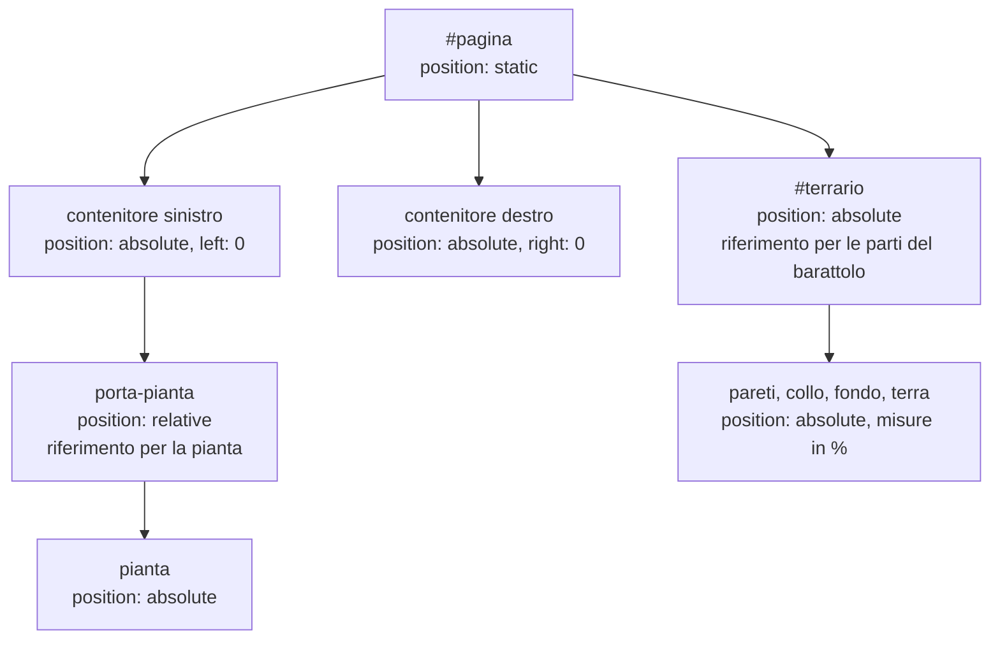
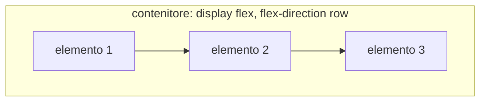
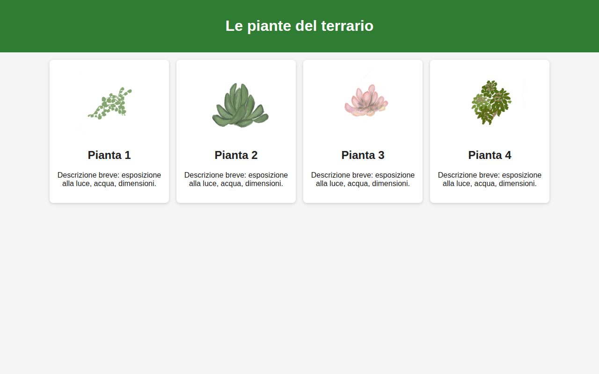
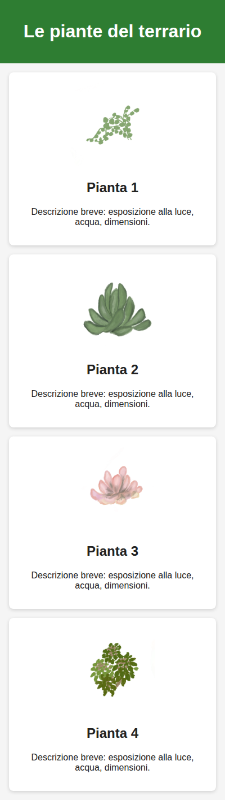

# Lezione 4.4: CSS: layout e pagine responsive

> Fonte: adattamento, tradotto e riscritto, della lezione "Terrarium Project Part 2: Introduction to CSS" del corso Microsoft "Web Development for Beginners", https://github.com/microsoft/Web-Dev-For-Beginners/blob/main/3-terrarium/2-intro-to-css/README.md . Copyright (c) Microsoft Corporation, licenza MIT: https://github.com/microsoft/Web-Dev-For-Beginners/blob/main/LICENSE . Le sezioni su Flexbox e media query sono contenuto originale.

## 4.4.1 Flusso normale e proprietà display

Senza indicazioni di posizionamento, il browser dispone gli elementi secondo il **flusso normale**:

- gli elementi di **blocco** (`div`, `p`, `h1`, `section`, ...) occupano tutta la larghezza disponibile e si dispongono uno sotto l'altro
- gli elementi **in linea** (`span`, `a`, `strong`, `img`, ...) si dispongono uno accanto all'altro come parole di un testo, e vanno a capo quando la riga è piena

La proprietà `display` modifica questo comportamento:

| Valore | Effetto |
|---|---|
| `block` | elemento di blocco |
| `inline` | elemento in linea; `width` e `height` non hanno effetto |
| `inline-block` | in linea, ma accetta dimensioni e padding come un blocco |
| `none` | l'elemento non viene mostrato e non occupa spazio |
| `flex` | l'elemento diventa un contenitore Flexbox (sezione 4.4.4) |
| `grid` | l'elemento diventa un contenitore a griglia (approfondimento facoltativo) |

## 4.4.2 Posizionamento

La proprietà `position` stabilisce come un elemento viene collocato; le proprietà `top`, `right`, `bottom`, `left` ne indicano lo spostamento.

| Valore | Comportamento |
|---|---|
| `static` | valore predefinito: flusso normale; `top`, `left`, ... non hanno effetto |
| `relative` | resta nel flusso, ma viene spostato rispetto alla propria posizione normale; diventa riferimento per i discendenti posizionati in modo assoluto |
| `absolute` | esce dal flusso (gli altri elementi si comportano come se non ci fosse); è collocato rispetto al più vicino antenato posizionato, cioè con `position` diversa da `static`, altrimenti rispetto alla pagina |
| `fixed` | collocato rispetto alla finestra: resta fermo durante lo scorrimento |
| `sticky` | si comporta come `relative` finché, scorrendo, raggiunge la soglia indicata; poi resta fermo come `fixed` |



Schema usato nel terrario:

- i contenitori delle piante sono posizionati in modo assoluto ai bordi sinistro e destro della finestra
- ogni `porta-pianta` è `relative`: resta nel flusso, uno sotto l'altro, e fa da riferimento
- ogni pianta è `absolute` dentro il proprio `porta-pianta`: nel modulo 5 JavaScript la sposterà modificando `top` e `left`
- le parti del barattolo sono `absolute` dentro `#terrario`, con misure in percentuale: il barattolo si ridimensiona insieme alla finestra

**Livelli e trasparenza**:

- `z-index`: ordine di sovrapposizione degli elementi posizionati; un valore maggiore sta sopra. Le piante (`z-index: 2`) passeranno sopra le pareti del barattolo (`z-index: 1`).
- `opacity`: opacità dell'intero elemento, da 0 (invisibile) a 1 (opaco); simula il vetro.

## 4.4.3 Laboratorio, parte 1: completare il terrario

Tempo indicativo: 20 minuti. Aggiungere a `style.css` del terrario, dopo le regole della lezione 4.3. Le nuove dichiarazioni per `.contenitore` si sommano a quelle già scritte: più regole con lo stesso selettore si combinano, e in caso di conflitto sulla stessa proprietà vale l'ultima.

```css
/* Contenitori ai due lati della finestra */
.contenitore {
  position: absolute;
  top: 0;
}
#contenitore-sinistro {
  left: 0;
}
#contenitore-destro {
  right: 0;
}

/* Spazio riservato a ciascuna pianta: riferimento per il posizionamento */
.porta-pianta {
  position: relative;
  height: 13%;
  left: -0.6rem;
}

/* Le piante: posizionate in modo assoluto, sopra il barattolo */
.pianta {
  position: absolute;
  max-width: 150%;
  max-height: 150%;
  z-index: 2;
  transition: transform 0.3s ease;   /* animazione di 0.3 secondi sulle trasformazioni */
}
.pianta:hover {
  transform: scale(1.05);            /* ingrandimento del 5% al passaggio del puntatore */
}

/* Area del barattolo: centrale, tra i due contenitori */
#terrario {
  position: absolute;
  left: 15%;
  width: 70%;
  bottom: 0;
  height: 85vh;
}

/* Parti del barattolo: misure in percentuale di #terrario */
.barattolo-pareti {
  position: absolute;
  height: 80%;
  width: 60%;
  left: 20%;
  bottom: 0.5%;
  background: #d1e1df;
  border-radius: 1rem;               /* angoli arrotondati */
  opacity: 0.5;
  z-index: 1;
  box-shadow: inset 0 0 2rem rgba(0, 0, 0, 0.1);   /* ombra interna: profondità */
}
.barattolo-collo {
  position: absolute;
  height: 5%;
  width: 50%;
  left: 25%;
  bottom: 80.5%;
  background: #d1e1df;
  opacity: 0.7;
  z-index: 1;
  border-radius: 0.5rem 0.5rem 0 0;  /* arrotondati solo gli angoli superiori */
}
.barattolo-fondo {
  position: absolute;
  height: 1%;
  width: 50%;
  left: 25%;
  bottom: 0;
  background: #d1e1df;
  opacity: 0.7;
  border-radius: 0 0 0.5rem 0.5rem;
}
.terra {
  position: absolute;
  height: 5%;
  width: 60%;
  left: 20%;
  bottom: 1%;
  background: #3a241d;
  opacity: 0.7;
  z-index: -1;                       /* dietro le pareti */
  border-radius: 0 0 1rem 1rem;
}

/* Riflessi sul vetro: posizionati dentro le pareti */
.riflesso-lungo,
.riflesso-corto {
  position: absolute;
  left: 8%;
  width: 0.6rem;
  background: #ffffff;
  border-radius: 1rem;
  opacity: 0.8;
}
.riflesso-lungo {
  bottom: 20%;
  height: 45%;
}
.riflesso-corto {
  bottom: 70%;
  height: 8%;
}
```

Proprietà nuove:

- `border-radius`: raggio di curvatura degli angoli; con quattro valori si indicano, in ordine, gli angoli in alto a sinistra, in alto a destra, in basso a destra, in basso a sinistra.
- `box-shadow`: ombra; `inset` la disegna all'interno dell'elemento, seguono spostamento orizzontale, verticale, sfocatura, colore.
- `transition` e `transform`: `transform: scale(1.05)` ingrandisce l'elemento; `transition` rende graduale il cambiamento.

Risultato atteso (finestra di 1280 x 720 pixel):


Verifiche:

1. Ridimensionare la finestra del browser: il barattolo e le piante si adattano, grazie alle misure in percentuale e in `vh`.
2. Negli strumenti per sviluppatori disattivare una alla volta (con la casella accanto) le dichiarazioni `position` di `.porta-pianta` e di `.pianta`, e osservare l'effetto.
3. Modificare `z-index` della terra portandolo a 2: che cosa cambia?
4. Commit: "Terrario: impaginazione completa".

## 4.4.4 Flexbox

Il posizionamento assoluto richiede di calcolare le coordinate di ogni elemento. Per disporre una serie di elementi in riga o in colonna si usa **Flexbox** (flexible box layout).

- Il **contenitore flex** è l'elemento con `display: flex`.
- I suoi figli diretti sono gli **elementi flex** (flex item).
- **Asse principale**: la direzione in cui vengono disposti gli elementi, definita da `flex-direction`: `row` (riga, predefinito) o `column` (colonna).
- **Asse trasversale**: perpendicolare all'asse principale.



Proprietà del contenitore:

| Proprietà | Effetto | Valori principali |
|---|---|---|
| `flex-direction` | direzione dell'asse principale | `row`, `column` |
| `justify-content` | distribuzione lungo l'asse principale | `flex-start`, `center`, `space-between`, `space-around`, `space-evenly` |
| `align-items` | allineamento lungo l'asse trasversale | `stretch` (predefinito), `flex-start`, `center`, `flex-end` |
| `flex-wrap` | permette di andare a capo su più righe | `nowrap` (predefinito), `wrap` |
| `gap` | spazio tra gli elementi | per esempio `1rem` |

Proprietà degli elementi: `flex: 1` fa crescere l'elemento occupando lo spazio libero, in parti uguali tra gli elementi che hanno lo stesso valore; `flex: 1 1 200px` indica crescita, riduzione e larghezza di base.

Centrare un elemento in orizzontale e in verticale, problema storicamente complicato in CSS, con Flexbox richiede tre dichiarazioni sul contenitore: `display: flex; justify-content: center; align-items: center;`.

Guida di riferimento: MDN, "Basic concepts of flexbox", https://developer.mozilla.org/en-US/docs/Web/CSS/Guides/Flexible_box_layout/Basic_concepts . Esercizi interattivi: Flexbox Froggy, https://flexboxfroggy.com/ , gioco gratuito, senza account, disponibile in italiano.

## 4.4.5 Pagine responsive

Una pagina **responsive** si adatta alla dimensione dello schermo, dal telefono al monitor, senza versioni separate. Strumenti:

- `<meta name="viewport" content="width=device-width, initial-scale=1">` nel `head` (lezione 4.1): senza di esso i telefoni simulano uno schermo largo e rimpiccioliscono la pagina
- **unità relative** (`%`, `rem`, `vh`, `vw`) e `max-width` al posto di larghezze fisse in pixel
- **Flexbox con `flex-wrap: wrap`**: gli elementi vanno a capo quando lo spazio non basta
- **media query**: blocchi di regole applicate solo se una condizione sullo schermo è vera

```css
/* Regole di base: schermi stretti (approccio "mobile first") */
.galleria {
  display: flex;
  flex-direction: column;
  gap: 1rem;
}

/* Dai 700 pixel di larghezza in su: disposizione in riga */
@media (min-width: 700px) {
  .galleria {
    flex-direction: row;
    flex-wrap: wrap;
  }
}
```

- `@media (min-width: 700px) { ... }` applica le regole interne solo quando la finestra è larga almeno 700 pixel.
- **Mobile first**: le regole di base descrivono la versione per schermi piccoli; le media query aggiungono le modifiche per schermi più grandi. Oggi la maggior parte del traffico web proviene da dispositivi mobili.

Prova negli strumenti per sviluppatori: **modalità dispositivo** (Chrome ed Edge: icona del dispositivo mobile nella barra degli strumenti per sviluppatori, oppure `Ctrl` + `Shift` + `M`; Firefox: Responsive Design Mode, `Ctrl` + `Shift` + `M`) per simulare schermi di diverse dimensioni.

## 4.4.6 Laboratorio, parte 2: schede delle piante

Tempo indicativo: 25 minuti. Nella cartella `terrario` creare `schede.html` e `schede.css`: una pagina con una scheda per alcune piante, che su schermo stretto si dispongono in colonna e su schermo largo in righe da più schede.

`schede.html`:

```html
<!DOCTYPE html>
<html lang="it">
  <head>
    <meta charset="UTF-8">
    <meta name="viewport" content="width=device-width, initial-scale=1">
    <title>Schede delle piante</title>
    <link rel="stylesheet" href="schede.css">
  </head>
  <body>
    <header>
      <h1>Le piante del terrario</h1>
    </header>
    <main class="galleria">
      <article class="scheda">
        
        <h2>Pianta 1</h2>
        <p>Descrizione breve: esposizione alla luce, acqua, dimensioni.</p>
      </article>
      <article class="scheda">
        
        <h2>Pianta 2</h2>
        <p>Descrizione breve: esposizione alla luce, acqua, dimensioni.</p>
      </article>
      <article class="scheda">
        
        <h2>Pianta 3</h2>
        <p>Descrizione breve: esposizione alla luce, acqua, dimensioni.</p>
      </article>
      <article class="scheda">
        
        <h2>Pianta 4</h2>
        <p>Descrizione breve: esposizione alla luce, acqua, dimensioni.</p>
      </article>
    </main>
  </body>
</html>
```

`schede.css`:

```css
* {
  box-sizing: border-box;
}

body {
  font-family: "Segoe UI", Tahoma, Geneva, Verdana, sans-serif;
  margin: 0;
  background: #f5f5f5;
  color: #222222;
}

header {
  background: #2e7d32;
  color: #ffffff;
  padding: 1rem;
  text-align: center;
}

/* Mobile first: una colonna */
.galleria {
  display: flex;
  flex-direction: column;
  gap: 1rem;
  padding: 1rem;
  max-width: 1100px;       /* su schermi molto larghi il contenuto non si allarga oltre */
  margin: 0 auto;          /* e resta centrato */
}

.scheda {
  background: #ffffff;
  border-radius: 0.5rem;
  padding: 1rem;
  box-shadow: 0 2px 6px rgba(0, 0, 0, 0.15);
  text-align: center;
}

.scheda img {
  max-width: 100%;         /* l'immagine non supera mai la larghezza della scheda */
  height: 150px;
  object-fit: contain;     /* adatta l'immagine allo spazio senza deformarla */
}

/* Schermi da 700 pixel in su: schede affiancate, a capo quando serve */
@media (min-width: 700px) {
  .galleria {
    flex-direction: row;
    flex-wrap: wrap;
  }
  .scheda {
    flex: 1 1 220px;       /* larghezza di base 220px, poi crescono in parti uguali */
  }
}
```

Risultato atteso su schermo largo e su schermo stretto:



{ width=35% }

Attività:

1. Aprire `schede.html` e restringere e allargare la finestra: individuare il punto in cui la disposizione cambia.
2. In modalità dispositivo simulare un telefono e un tablet.
3. Aggiungere una seconda media query `@media (min-width: 1000px)` che aumenti la dimensione del titolo.
4. Completare le descrizioni delle schede e i testi alternativi.
5. Commit: "Pagina delle schede responsive".

### Esercizi

1. Completare almeno i primi 12 livelli di Flexbox Froggy.
2. Con Flexbox, disporre in riga i tre elementi di un menu di navigazione (`<nav>` con tre collegamenti), distribuiti con `space-between`, e in colonna sotto i 500 pixel di larghezza.
3. Spiegare perché nel terrario si è usato il posizionamento assoluto e non Flexbox (suggerimento: che cosa dovrà fare JavaScript con le piante nel modulo 5?).

## 4.4.7 Aspetti orientativi (discussione)

- Lo sviluppo front-end (interfacce web) è uno dei settori con più offerte di lavoro per sviluppatori junior; HTML, CSS e JavaScript sono la base comune a tutti i framework usati nelle aziende (React, Angular, Vue).
- Il lavoro sull'interfaccia coinvolge figure diverse: UX designer (esperienza d'uso), UI designer (aspetto grafico), sviluppatore front-end. Collaborano partendo da prototipi e da un sistema di componenti e stili condivisi (design system).
- Domande per il dibattito: quale sito o app usato ogni giorno funziona male su telefono o su schermo grande? Che cosa si potrebbe correggere con quanto visto in questo modulo?
