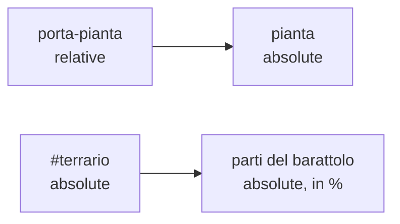
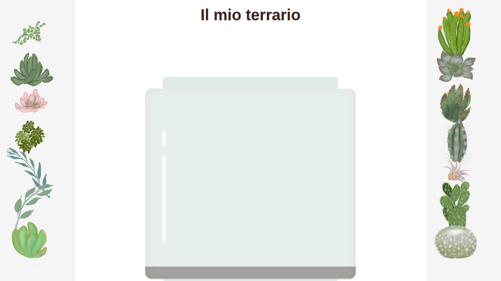

## Contenuti

- Flusso normale e display
- Posizionamento
- Il terrario
- Risultato atteso
- Flexbox
- Pagine responsive
- Laboratorio 4.4
- Aspetti orientativi

Fonte: adattamento da Microsoft, "Web Development for Beginners", lezione "Introduction to CSS", licenza MIT, https://github.com/microsoft/Web-Dev-For-Beginners

## Flusso normale e display

- Blocco: tutta la larghezza, uno sotto l'altro
- In linea: uno accanto all'altro, come parole
- `display`: `block`, `inline`, `inline-block`, `none`, `flex`, `grid`

## Posizionamento

| `position` | Riferimento |
|---|---|
| `static` | flusso normale |
| `relative` | propria posizione; riferimento per i discendenti |
| `absolute` | antenato posizionato più vicino; fuori dal flusso |
| `fixed` | finestra |
| `sticky` | relative, poi fixed durante lo scorrimento |

`z-index`: sovrapposizione; `opacity`: trasparenza

## Il terrario



- Contenitori ai lati: `absolute`, `left: 0` / `right: 0`
- Piante sopra il vetro: `z-index: 2`
- Nel modulo 5 JavaScript sposterà le piante con `top` e `left`

## Risultato atteso



## Flexbox

- Contenitore: `display: flex`; figli diretti: elementi flex
- Asse principale (`flex-direction`) e asse trasversale
- `justify-content`, `align-items`, `flex-wrap`, `gap`
- Elementi: `flex: 1`, `flex: 1 1 220px`

```css
display: flex; justify-content: center; align-items: center;
```

Esercizi: https://flexboxfroggy.com/

## Pagine responsive

```css
.galleria { display: flex; flex-direction: column; gap: 1rem; }

@media (min-width: 700px) {
  .galleria { flex-direction: row; flex-wrap: wrap; }
}
```

- `meta viewport`, unità relative, `max-width`
- **Mobile first**
- Modalità dispositivo dei DevTools: `Ctrl` + `Shift` + `M`

## Laboratorio 4.4

- Parte 1: completare il terrario (posizionamento, barattolo, riflessi)
- Parte 2: `schede.html`, schede responsive con Flexbox e media query
- Flexbox Froggy
- Commit Git

## Aspetti orientativi

- Sviluppo front-end: molte offerte per profili junior
- HTML, CSS, JavaScript: base di React, Angular, Vue
- UX designer, UI designer, sviluppatore front-end; design system
- Quale sito funziona male su telefono? Come correggerlo?
