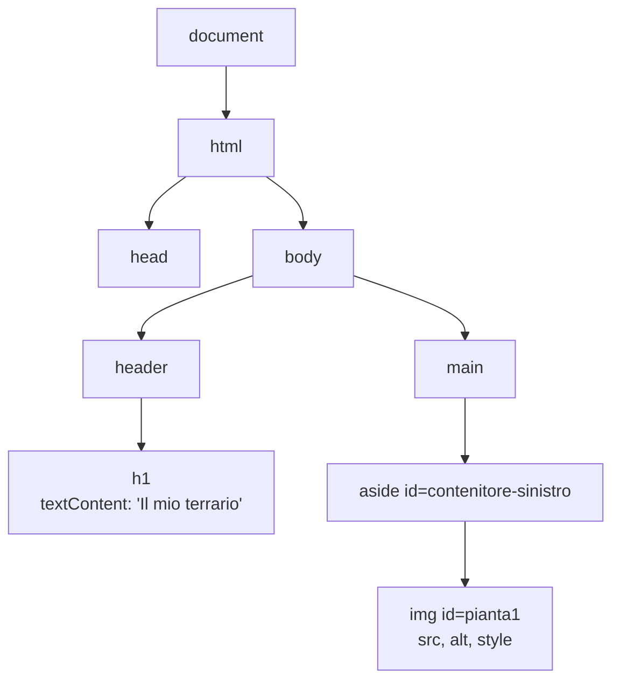
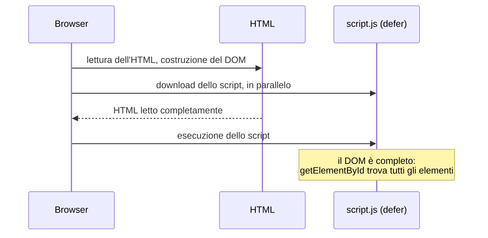

# Lezione 5.1: Il DOM

> Fonte: adattamento, tradotto e riscritto, della parte introduttiva della lezione "Terrarium Project Part 3: DOM Manipulation and JavaScript Closures" del corso Microsoft "Web Development for Beginners", https://github.com/microsoft/Web-Dev-For-Beginners/blob/main/3-terrarium/3-intro-to-DOM-and-closures/README.md . Copyright (c) Microsoft Corporation, licenza MIT: https://github.com/microsoft/Web-Dev-For-Beginners/blob/main/LICENSE . Il laboratorio è contenuto originale.

Prerequisiti: modulo 3 (JavaScript) e modulo 4 (HTML e CSS, progetto del terrario).

## 5.1.1 Che cos'è il DOM

Quando il browser carica una pagina, trasforma il codice HTML in una struttura ad albero di **oggetti** mantenuta in memoria: il **DOM** (Document Object Model). Ogni elemento HTML diventa un oggetto, con proprietà (il testo, gli attributi, lo stile) e metodi.

- Il DOM è un'**interfaccia di programmazione** (API) del browser, non fa parte del linguaggio JavaScript: JavaScript la usa per leggere e modificare la pagina mentre è visualizzata.
- La pagina mostrata corrisponde sempre allo stato attuale del DOM, non al file HTML originale: modificando il DOM la pagina cambia subito, senza ricaricarla.
- Il punto di accesso è l'oggetto globale `document`, che rappresenta l'intero documento.

Terminologia dell'albero:

- **nodo**: ogni elemento dell'albero (elementi, ma anche porzioni di testo)
- **genitore**, **figli**, **fratelli**: relazioni tra nodi, come in un albero genealogico
- **radice**: il nodo `html`



Riferimento: MDN, "Introduction to the DOM", https://developer.mozilla.org/en-US/docs/Web/API/Document_Object_Model/Introduction

## 5.1.2 Selezionare elementi

| Metodo | Restituisce |
|---|---|
| `document.getElementById("id")` | l'elemento con quell'`id`, oppure `null` |
| `document.querySelector("selettore CSS")` | il **primo** elemento che corrisponde al selettore, oppure `null` |
| `document.querySelectorAll("selettore CSS")` | **tutti** gli elementi corrispondenti, in una lista (`NodeList`) |

```javascript
const titolo = document.querySelector("h1");
const terrario = document.getElementById("terrario");
const piante = document.querySelectorAll(".pianta");   // le 14 immagini

console.log(piante.length);           // 14
piante.forEach((p) => console.log(p.id));   // una NodeList si può scorrere con forEach
```

`querySelector` e `querySelectorAll` accettano qualunque selettore CSS (lezione 4.3): `"#pagina .pianta"`, `"aside img"`, `"button:first-of-type"`. Se l'elemento cercato non esiste il risultato è `null`, e usarlo produce l'errore `TypeError: Cannot read properties of null` (lezione 3.6): la prima verifica è sul selettore.

## 5.1.3 Leggere e modificare

```javascript
const titolo = document.querySelector("h1");

// Testo
titolo.textContent = "Il terrario di 4B";

// Attributi
const pianta = document.getElementById("pianta1");
console.log(pianta.src, pianta.alt);
pianta.alt = "Pianta rampicante con foglie tonde";
pianta.setAttribute("title", "Trascinami nel barattolo");   // imposta un attributo qualunque

// Stile in linea (proprietà CSS in camelCase: background-color diventa backgroundColor)
titolo.style.color = "darkgreen";
titolo.style.backgroundColor = "#e8f5e9";

// Classi CSS
titolo.classList.add("evidenziato");       // aggiunge una classe
titolo.classList.remove("evidenziato");    // la rimuove
titolo.classList.toggle("evidenziato");    // la aggiunge se manca, la rimuove se c'è
```

Buona pratica: definire l'aspetto nel CSS con classi e, da JavaScript, aggiungere o togliere le classi; usare `style` solo per valori calcolati durante l'esecuzione, come le coordinate di un elemento trascinato (lezione 5.2).

**textContent e innerHTML**:

- `textContent` imposta o legge il testo; eventuali caratteri `<` e `>` vengono mostrati come testo.
- `innerHTML` interpreta la stringa come codice HTML. Se la stringa contiene testo inserito da un utente, un malintenzionato può inserire codice che il browser esegue: è l'attacco **XSS** (cross-site scripting), tra i più diffusi nel web. Regola: per il testo usare sempre `textContent`; per creare elementi usare i metodi della sezione 5.1.4. Riferimento: MDN, `innerHTML`, https://developer.mozilla.org/en-US/docs/Web/API/Element/innerHTML

## 5.1.4 Creare e rimuovere elementi

```javascript
// 1. Creare un elemento (non è ancora nella pagina)
const nota = document.createElement("p");

// 2. Configurarlo
nota.textContent = "Trascinare le piante nel barattolo.";
nota.classList.add("nota");

// 3. Inserirlo nel DOM come ultimo figlio di un elemento esistente
document.querySelector("header").appendChild(nota);

// Rimuovere un elemento
nota.remove();
```

`elemento.append(a, b, c)` inserisce più figli in una sola chiamata.

## 5.1.5 Quando eseguire lo script

Uno script può modificare solo gli elementi che il browser ha già letto. Uno script nel `head` eseguito subito troverebbe il `body` ancora vuoto e `getElementById` restituirebbe `null`. Due soluzioni:

- `<script src="script.js" defer></script>` nel `head`: l'attributo `defer` rinvia l'esecuzione a quando l'intero HTML è stato letto; è la soluzione preferita
- `<script src="script.js"></script>` come ultimo elemento del `body` (soluzione usata nei laboratori dei moduli 1 e 3)



## 5.1.6 Laboratorio

Tempo indicativo: 35 minuti. Cartella `terrario` del modulo 4.

### Parte 1: il DOM in console

Aprire `index.html` del terrario con Live Preview nel browser esterno e, nella console:

1. Selezionare il titolo e cambiarne il testo; ricaricare la pagina e osservare che la modifica è scomparsa.
2. Selezionare tutte le piante con `querySelectorAll` e stamparne gli `id`.
3. Nascondere tutte le piante della colonna destra: `document.querySelectorAll("#contenitore-destro .pianta").forEach((p) => p.style.display = "none")`.
4. Creare un paragrafo con il proprio nome e inserirlo nell'`header`.

### Parte 2: schede generate da un array

Obiettivo: generare con JavaScript le schede delle piante della lezione 4.4, partendo da un array di oggetti. È il modo in cui funzionano quasi tutte le applicazioni web: i dati arrivano da un database o da un server come array di oggetti, e il codice costruisce la pagina.

1. Copiare `schede.html` in `schede-dinamiche.html`; lasciare vuoto il `main` e aggiungere lo script nel `head`:

```html
<link rel="stylesheet" href="schede.css">
<script src="schede-dinamiche.js" defer></script>
```

```html
<main class="galleria"></main>
```

2. Creare `schede-dinamiche.js`:

```javascript
// Dati delle piante: in un'applicazione reale arriverebbero da un database
const datiPiante = [
  { nome: "Pianta 1", immagine: "images/plant1.png", descrizione: "Rampicante, poca acqua." },
  { nome: "Pianta 2", immagine: "images/plant2.png", descrizione: "Pianta grassa a rosetta." },
  { nome: "Pianta 3", immagine: "images/plant3.png", descrizione: "Foglie carnose rosa." },
  { nome: "Pianta 4", immagine: "images/plant4.png", descrizione: "Cespuglio compatto." },
];

const galleria = document.querySelector(".galleria");

// Una scheda per ogni oggetto dell'array
for (const dati of datiPiante) {
  const scheda = document.createElement("article");
  scheda.classList.add("scheda");

  const img = document.createElement("img");
  img.src = dati.immagine;
  img.alt = dati.nome;

  const titolo = document.createElement("h2");
  titolo.textContent = dati.nome;

  const testo = document.createElement("p");
  testo.textContent = dati.descrizione;

  scheda.append(img, titolo, testo);
  galleria.appendChild(scheda);
}

// Il titolo della pagina riporta il numero di schede
document.querySelector("h1").textContent = `Le piante del terrario (${datiPiante.length})`;
```

3. Aprire la pagina: deve apparire come `schede.html` della lezione 4.4, con il numero di piante nel titolo. Negli strumenti per sviluppatori, scheda Ispettore, gli `article` generati compaiono nell'albero; nel sorgente della pagina (`Ctrl` + `U`) invece non ci sono. È la differenza tra file HTML e DOM.
4. Aggiungere all'array altre tre piante e verificare che le schede compaiano senza modificare l'HTML.
5. Commit: "Schede generate dal DOM".

### Esercizi

1. Aggiungere a ogni oggetto una proprietà `acqua` ("poca", "media", "molta") e mostrarla nella scheda; alle schede con acqua "molta" aggiungere una classe CSS che ne colori il bordo di blu.
2. Mostrare in fondo alla pagina un paragrafo con il numero di piante che richiedono poca acqua (suggerimento: `filter`, lezione 3.5).
3. Spiegare perché `document.querySelector(".galleria")` restituirebbe `null` se lo script fosse nel `head` senza `defer`.
