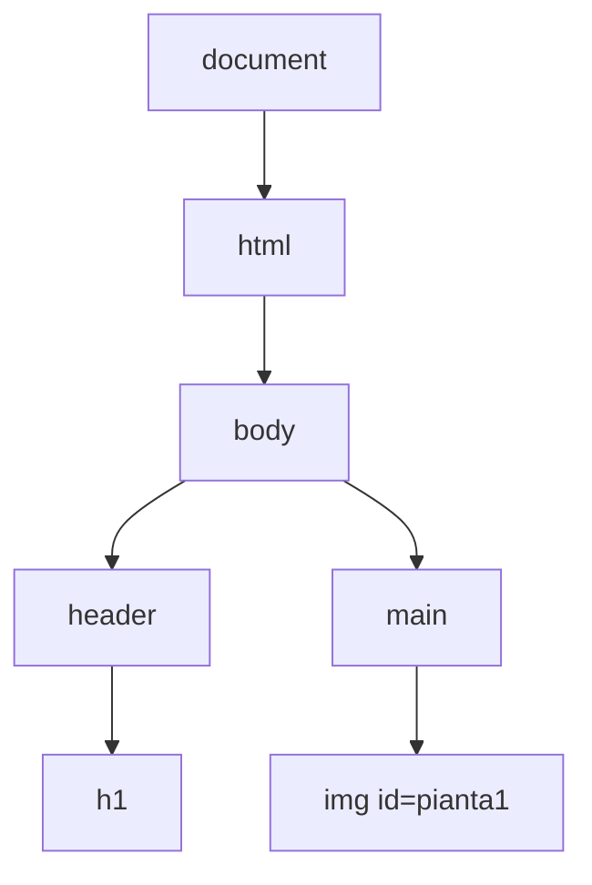

## Contenuti

- Che cos'è il DOM
- Selezionare elementi
- Leggere e modificare
- Creare e rimuovere elementi
- Laboratorio 5.1

Fonte: adattamento da Microsoft, "Web Development for Beginners", lezione "DOM Manipulation and JavaScript Closures", licenza MIT, https://github.com/microsoft/Web-Dev-For-Beginners

## Che cos'è il DOM

- Albero di **oggetti** costruito dal browser a partire dall'HTML
- API del browser, non parte del linguaggio JavaScript
- La pagina mostra lo stato attuale del DOM, non il file HTML
- Punto di accesso: `document`



## Selezionare elementi

```javascript
document.getElementById("terrario");
document.querySelector("h1");            // il primo
document.querySelectorAll(".pianta");    // tutti: NodeList
```

- Qualunque selettore CSS
- Elemento inesistente: `null`, poi `TypeError`

## Leggere e modificare

```javascript
titolo.textContent = "Il terrario di 4B";
pianta.alt = "Pianta rampicante";
titolo.style.backgroundColor = "#e8f5e9";
titolo.classList.add("evidenziato");
titolo.classList.toggle("evidenziato");
```

- Aspetto nel CSS con classi; `style` per valori calcolati
- `textContent` sì, `innerHTML` con testo degli utenti no: **XSS**

## Creare e rimuovere elementi

```javascript
const nota = document.createElement("p");
nota.textContent = "Trascinare le piante nel barattolo.";
document.querySelector("header").appendChild(nota);
nota.remove();
```

Script nel `head` con **defer**: eseguito dopo la lettura dell'HTML

## Laboratorio 5.1

- Il DOM del terrario in console
- `schede-dinamiche.js`: schede generate da un array di oggetti

```javascript
for (const dati of datiPiante) {
  const scheda = document.createElement("article");
  ...
  galleria.appendChild(scheda);
}
```

- Sorgente della pagina (`Ctrl` + `U`) e DOM a confronto
