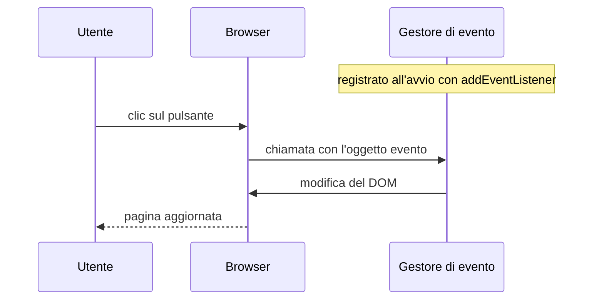
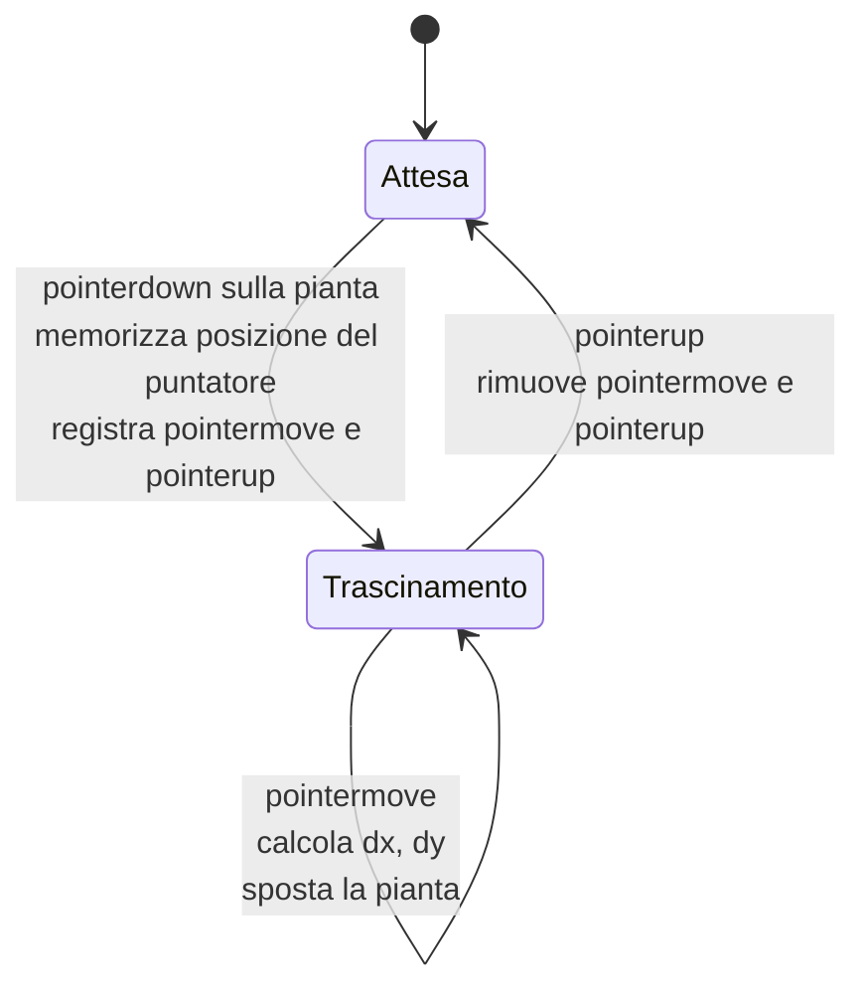

# Lezione 5.2: Eventi del mouse: il terrario

> Fonte: adattamento, tradotto e riscritto, della lezione "Terrarium Project Part 3: DOM Manipulation and JavaScript Closures" del corso Microsoft "Web Development for Beginners", https://github.com/microsoft/Web-Dev-For-Beginners/blob/main/3-terrarium/3-intro-to-DOM-and-closures/README.md . Copyright (c) Microsoft Corporation, licenza MIT: https://github.com/microsoft/Web-Dev-For-Beginners/blob/main/LICENSE . Rispetto all'originale, il codice usa `addEventListener`, nomi in italiano e un calcolo dello spostamento con il segno positivo.

## 5.2.1 Eventi e programmazione a eventi

Un **evento** è un avvenimento segnalato dal browser: un clic, la pressione di un tasto, il movimento del puntatore, il caricamento della pagina, la modifica del testo in un campo.

Nella **programmazione a eventi** il programma non segue un percorso fisso dall'inizio alla fine: registra delle funzioni, dette **gestori di evento** (event handler o listener), e il browser le chiama quando l'evento corrispondente si verifica. Tra un evento e l'altro il programma resta in attesa. È il modello di quasi tutte le interfacce grafiche: pagine web, app per telefono, programmi desktop.



## 5.2.2 addEventListener

```javascript
const pulsante = document.querySelector("button");

pulsante.addEventListener("click", saluta);   // tipo di evento, funzione da chiamare

function saluta(evento) {
  console.log("Tipo:", evento.type);           // "click"
  console.log("Elemento:", evento.target);     // l'elemento su cui è avvenuto il clic
}
```

- Il primo argomento è il **tipo di evento**, una stringa.
- Il secondo è la funzione gestore, passata **senza parentesi** (è una callback, lezione 3.2).
- Il browser chiama il gestore passandogli un **oggetto evento** con i dettagli dell'accaduto.
- `removeEventListener` con gli stessi argomenti rimuove il gestore; per questo, quando un gestore va rimosso, deve essere una funzione con nome e non una funzione anonima.

Riferimento: MDN, `addEventListener`, https://developer.mozilla.org/en-US/docs/Web/API/EventTarget/addEventListener

Eventi di uso frequente:

| Evento | Quando |
|---|---|
| `click` | clic (o `Invio` / `Spazio` su un pulsante con il focus) |
| `input` | il contenuto di un campo di testo cambia |
| `keydown` | pressione di un tasto; `evento.key` indica quale |
| `pointerdown`, `pointermove`, `pointerup` | pressione, movimento, rilascio di mouse, dito o penna |
| `submit` | invio di un modulo |

Metodo dell'oggetto evento: `evento.preventDefault()` annulla il comportamento predefinito del browser per quell'evento (per esempio il trascinamento nativo delle immagini, o l'invio di un modulo).

Gli **eventi pointer** unificano mouse, schermi touch e penne: lo stesso codice funziona su computer e tablet. Proprietà utili: `clientX` e `clientY`, coordinate del puntatore in pixel rispetto all'angolo in alto a sinistra della finestra. Riferimento: MDN, "Pointer events", https://developer.mozilla.org/en-US/docs/Web/API/Pointer_events

## 5.2.3 L'algoritmo del trascinamento

Obiettivo: quando l'utente preme il pulsante su una pianta e muove il puntatore, la pianta segue il puntatore; al rilascio resta dove si trova.

Idea: a ogni movimento si calcola di quanto si è spostato il puntatore dall'evento precedente (`dx`, `dy`) e si sposta la pianta della stessa quantità, modificandone `left` e `top`. È possibile perché ogni pianta ha `position: absolute` (lezione 4.4).



Il diagramma è un **diagramma di stato**: descrive gli stati in cui si può trovare la pianta e gli eventi che causano il passaggio da uno stato all'altro. È uno strumento comune per progettare interfacce.

Scelte di progetto:

- `pointermove` e `pointerup` si ascoltano sull'intero `document`, non sulla pianta: con un movimento veloce il puntatore può uscire dalla pianta e gli eventi andrebbero persi.
- Si ascolta `pointermove` solo durante il trascinamento: ascoltarlo sempre sarebbe uno spreco, perché il movimento del puntatore genera decine di eventi al secondo.

Proprietà usate:

- `elemento.offsetLeft`, `elemento.offsetTop`: posizione attuale dell'elemento in pixel rispetto al suo contenitore posizionato (il `porta-pianta`); in sola lettura.
- `elemento.style.left`, `elemento.style.top`: nuova posizione, come stringa con unità di misura (`"120px"`).

## 5.2.4 Laboratorio: piante trascinabili

Tempo indicativo: 35 minuti. Cartella `terrario`.

1. Collegare lo script nel `head` di `index.html`, dopo il foglio di stile:

```html
<script src="script.js" defer></script>
```

2. In `style.css`, nella regola `.pianta`, aggiungere:

```css
touch-action: none;   /* su schermi touch il trascinamento non fa scorrere la pagina */
cursor: grab;         /* puntatore a forma di mano aperta */
```

3. Creare `script.js`:

```javascript
// Rende trascinabile l'elemento ricevuto
function rendiTrascinabile(elemento) {
  let xPrec = 0;   // ultima posizione nota del puntatore, in orizzontale
  let yPrec = 0;   // ultima posizione nota del puntatore, in verticale

  elemento.addEventListener("pointerdown", iniziaTrascinamento);

  // Pulsante premuto (o dito appoggiato) sulla pianta
  function iniziaTrascinamento(e) {
    e.preventDefault();              // evita la selezione e il trascinamento nativo dell'immagine
    xPrec = e.clientX;
    yPrec = e.clientY;
    document.addEventListener("pointermove", trascina);
    document.addEventListener("pointerup", terminaTrascinamento);
  }

  // Puntatore in movimento: sposta la pianta dello stesso spostamento del puntatore
  function trascina(e) {
    const dx = e.clientX - xPrec;    // spostamento orizzontale dall'evento precedente
    const dy = e.clientY - yPrec;    // spostamento verticale
    xPrec = e.clientX;
    yPrec = e.clientY;
    elemento.style.left = (elemento.offsetLeft + dx) + "px";
    elemento.style.top = (elemento.offsetTop + dy) + "px";
  }

  // Pulsante rilasciato: si smette di ascoltare movimento e rilascio
  function terminaTrascinamento() {
    document.removeEventListener("pointermove", trascina);
    document.removeEventListener("pointerup", terminaTrascinamento);
  }
}

// Avvio: tutte le immagini con classe "pianta" diventano trascinabili
const piante = document.querySelectorAll(".pianta");
piante.forEach(rendiTrascinabile);
```

Rispetto alla versione originale del corso Microsoft, che chiama la funzione 14 volte con `getElementById("plant1")`, `getElementById("plant2")`, ..., qui `querySelectorAll` e `forEach` applicano la funzione a tutte le piante, qualunque sia il loro numero.

4. Provare il trascinamento con il mouse. Se il computer ha uno schermo touch, provare anche con il dito.
5. Tracciare il funzionamento: aggiungere in `trascina` la riga `console.log(dx, dy, elemento.style.left, elemento.style.top);`, osservare i valori durante un trascinamento lento e uno veloce, poi rimuovere la riga.
6. Commit: "Terrario: piante trascinabili".

Le piante trascinate possono finire dietro ad altre piante o fuori dal barattolo: nella lezione 5.3 si aggiungono il primo piano per la pianta afferrata, il conteggio delle piante nel barattolo e un pulsante per rimetterle a posto.

### Esercizi

1. Aggiungere un gestore di `dblclick` (doppio clic) che riporti la pianta alla posizione iniziale, assegnando `""` a `style.left` e `style.top`.
2. Sostituire `cursor: grab` con `cursor: grabbing` (mano chiusa) durante il trascinamento: aggiungere una classe CSS alla pianta in `iniziaTrascinamento` e toglierla in `terminaTrascinamento`.
3. Commentare la riga `e.preventDefault();` e provare a trascinare: che cosa cambia?
4. Registrare un gestore di `keydown` sul `document` che scriva in console il valore di `evento.key` per ogni tasto premuto.
