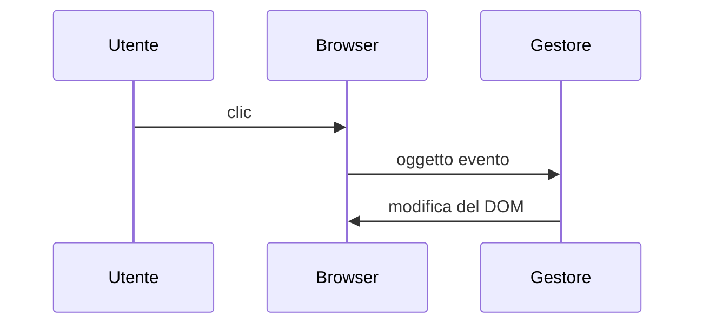
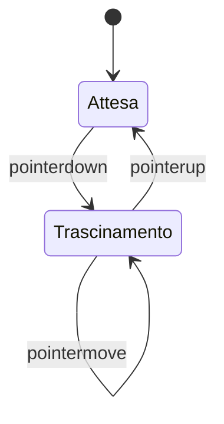

## Lezione 5.2: Eventi del mouse: il terrario

Modulo 5: DOM ed eventi. Sviluppo Software e Coding Laboratoriale

Fonte: adattamento da Microsoft, "Web Development for Beginners", lezione "DOM Manipulation and JavaScript Closures", licenza MIT
https://github.com/microsoft/Web-Dev-For-Beginners

---

## Programmazione a eventi

- **Evento**: clic, tasto, movimento del puntatore, modifica di un campo
- **Gestore**: funzione registrata, chiamata dal browser quando l'evento avviene
- Tra un evento e l'altro il programma attende



---

## addEventListener

```javascript
pulsante.addEventListener("click", saluta);   // senza parentesi
function saluta(evento) {
  console.log(evento.type, evento.target);
}
```

| Evento | Quando |
|---|---|
| `click` | clic |
| `input` | modifica di un campo |
| `keydown` | tasto premuto |
| `pointerdown` / `move` / `up` | mouse, dito, penna |

---

## Trascinamento: diagramma di stato



- `pointermove` e `pointerup` sul `document`
- Spostamento `dx`, `dy` dal movimento precedente
- `offsetLeft` + `dx` in `style.left`

---

## Il codice

```javascript
function trascina(e) {
  const dx = e.clientX - xPrec;
  const dy = e.clientY - yPrec;
  xPrec = e.clientX;
  yPrec = e.clientY;
  elemento.style.left = (elemento.offsetLeft + dx) + "px";
  elemento.style.top = (elemento.offsetTop + dy) + "px";
}

document.querySelectorAll(".pianta").forEach(rendiTrascinabile);
```

CSS: `touch-action: none; cursor: grab;`

---

## Laboratorio 5.2

- `script.js` con `defer`
- `rendiTrascinabile` per tutte le piante
- Tracciamento di `dx`, `dy` in console
- Commit Git
