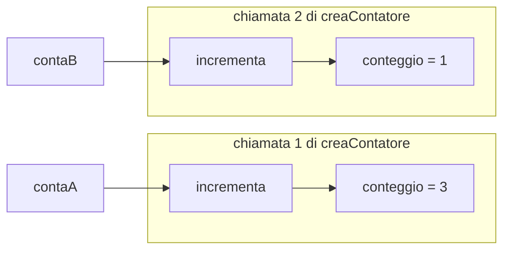
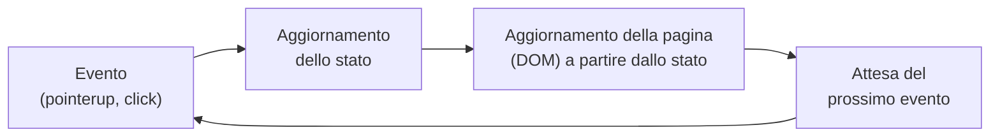

# Lezione 5.3: Closure e stato

> Fonte: la sezione sulle closure adatta, tradotta e riscritta, la lezione "Terrarium Project Part 3: DOM Manipulation and JavaScript Closures" del corso Microsoft "Web Development for Beginners", https://github.com/microsoft/Web-Dev-For-Beginners/blob/main/3-terrarium/3-intro-to-DOM-and-closures/README.md . Copyright (c) Microsoft Corporation, licenza MIT: https://github.com/microsoft/Web-Dev-For-Beginners/blob/main/LICENSE . Le estensioni del terrario sono contenuto originale.

## 5.3.1 Una domanda sul codice della lezione 5.2

Nel terrario, `rendiTrascinabile` viene chiamata 14 volte e termina subito, dopo aver registrato il gestore di `pointerdown`. Eppure, molto più tardi, quando si trascina una pianta, le funzioni `trascina` e `terminaTrascinamento` usano ancora le variabili `xPrec`, `yPrec` ed `elemento` di quella chiamata, e ogni pianta usa le **proprie** variabili, senza interferire con le altre. Il meccanismo che lo rende possibile è la **closure**.

## 5.3.2 Closure

Concetti:

- **Scope lessicale**: una funzione vede le variabili dichiarate al proprio interno e quelle delle funzioni che la contengono, in base a **dove è scritta** nel codice (lezione 3.2).
- **Closure**: una funzione, insieme alle variabili esterne a cui fa riferimento. Le variabili restano disponibili alla funzione anche dopo che la funzione esterna, in cui sono state dichiarate, è terminata.
- Ogni chiamata della funzione esterna crea un **nuovo insieme** di variabili: le funzioni interne create in chiamate diverse non condividono le variabili.

Esempio minimo: un generatore di contatori.

```javascript
function creaContatore() {
  let conteggio = 0;              // variabile locale di creaContatore

  function incrementa() {         // funzione interna: vede conteggio
    conteggio++;
    return conteggio;
  }

  return incrementa;              // restituisce la funzione, non il suo risultato
}

const contaA = creaContatore();   // prima chiamata: un conteggio
const contaB = creaContatore();   // seconda chiamata: un altro conteggio, indipendente

console.log(contaA());   // 1
console.log(contaA());   // 2
console.log(contaB());   // 1: contaB ha la propria variabile
console.log(contaA());   // 3
```

`creaContatore` è già terminata quando si chiama `contaA()`, ma `conteggio` non è stata eliminata: resta legata alla funzione `incrementa` restituita. Dall'esterno non esiste alcun modo di leggere o modificare direttamente `conteggio`: la closure realizza anche una forma di **incapsulamento**, cioè di protezione dei dati.



Nel terrario: ogni chiamata `rendiTrascinabile(pianta)` crea un insieme separato `{elemento, xPrec, yPrec}` e tre funzioni interne che lo usano. Il gestore di `pointerdown` registrato sulla pianta 1 porta con sé le variabili della pianta 1.

Approfondimento: MDN, "Closures", https://developer.mozilla.org/en-US/docs/Web/JavaScript/Guide/Closures

## 5.3.3 Lo stato di un'interfaccia

Lo **stato** di un'interfaccia è l'insieme dei dati che ne descrivono la situazione in un dato momento: nel terrario, la posizione di ogni pianta, quale pianta è in primo piano, quante piante sono nel barattolo.

Due tipi di stato:

- **stato di un singolo componente**, come le coordinate usate durante il trascinamento di una pianta: sta nella closure di quel componente
- **stato condiviso**, come il valore di `z-index` più alto assegnato finora, che serve a tutte le piante: sta in una variabile esterna, visibile a tutte le funzioni che la usano

Principio: ogni dato ha **un solo punto** in cui viene conservato e aggiornato. Il testo mostrato nella pagina (per esempio il numero di piante nel barattolo) si ricalcola dallo stato ogni volta che lo stato cambia.



Questo schema, evento, stato, aggiornamento della pagina, è alla base dei framework usati nelle aziende (React, Vue, Angular), che automatizzano l'ultimo passaggio.

## 5.3.4 Laboratorio: il terrario completo

Tempo indicativo: 40 minuti. Cartella `terrario`, a partire dal lavoro della lezione 5.2.

### Primo piano per la pianta afferrata

Problema: una pianta trascinata sopra un'altra può restare nascosta dietro di essa. Soluzione: una variabile condivisa `zMassimo`, incrementata a ogni presa e assegnata come `z-index` alla pianta afferrata.

In cima a `script.js`:

```javascript
// z-index da assegnare alla pianta afferrata più di recente: la porta in primo piano.
// Variabile globale, condivisa da tutte le piante.
let zMassimo = 10;
```

In `iniziaTrascinamento`, dopo le assegnazioni di `xPrec` e `yPrec`:

```javascript
zMassimo++;
elemento.style.zIndex = zMassimo;
```

### Conteggio delle piante nel barattolo

1. In `index.html`, nell'`header`, sotto il titolo:

```html
<div class="comandi">
  <p id="conteggio" aria-live="polite">Piante nel barattolo: 0</p>
  <button type="button" id="riordina">Rimetti a posto le piante</button>
</div>
```

L'attributo `aria-live="polite"` fa leggere ai lettori di schermo gli aggiornamenti del testo (lezione 4.2).

2. In `style.css`, dopo la regola `h1` (e ridurre il margine di `h1` a `0.5rem 0`):

```css
/* Riga con conteggio e pulsante, sotto il titolo */
.comandi {
  display: flex;
  justify-content: center;
  align-items: center;
  gap: 1rem;
}
.comandi p {
  margin: 0;
}
```

3. In `script.js`, due nuove funzioni:

```javascript
// true se il centro della pianta cade dentro le pareti del barattolo
function dentroBarattolo(pianta) {
  const p = pianta.getBoundingClientRect();   // rettangolo occupato sullo schermo
  const b = document.querySelector(".barattolo-pareti").getBoundingClientRect();
  const cx = p.left + p.width / 2;
  const cy = p.top + p.height / 2;
  return cx >= b.left && cx <= b.right && cy >= b.top && cy <= b.bottom;
}

// Conta le piante nel barattolo e aggiorna il testo nella pagina
function aggiornaConteggio() {
  let n = 0;
  for (const pianta of piante) {
    if (dentroBarattolo(pianta)) {
      n++;
    }
  }
  document.getElementById("conteggio").textContent = `Piante nel barattolo: ${n}`;
}
```

- `getBoundingClientRect()` restituisce un oggetto con posizione (`left`, `top`, `right`, `bottom`) e dimensioni (`width`, `height`) del rettangolo occupato dall'elemento sullo schermo, in pixel.
- La condizione di `dentroBarattolo` verifica che il centro della pianta sia compreso tra i bordi sinistro e destro e tra i bordi superiore e inferiore del barattolo: è un **test di appartenenza di un punto a un rettangolo**, usato anche nei videogiochi per rilevare le collisioni.

4. In `terminaTrascinamento`, dopo le due `removeEventListener`, chiamare `aggiornaConteggio();`.

### Rimettere a posto le piante

In fondo a `script.js`:

```javascript
// Riporta tutte le piante nella posizione iniziale definita dal CSS
function riordina() {
  for (const pianta of piante) {
    pianta.style.left = "";      // stringa vuota: si elimina lo stile in linea,
    pianta.style.top = "";       // torna a valere il foglio di stile
    pianta.style.zIndex = "";
  }
  aggiornaConteggio();
}

document.getElementById("riordina").addEventListener("click", riordina);
```

### Verifica

1. Trascinare due piante sovrapponendole: quella afferrata per ultima deve restare in primo piano.
2. Portare alcune piante nel barattolo e verificare il conteggio; portarne una fuori e verificare che diminuisca.
3. Premere il pulsante: tutte le piante tornano al loro posto e il conteggio torna a 0.
4. Commit: "Terrario completo: primo piano, conteggio, riordino".

Risultato atteso con due piante nel barattolo:


La soluzione completa (HTML, CSS, JavaScript e script per scaricare le immagini) è nella cartella `soluzione_terrario_interattivo` di questa lezione.

### Esercizi

1. Con `creaContatore` come modello, scrivere `creaSalvadanaio(iniziale)` che restituisce un oggetto con due funzioni, `versa(importo)` e `saldo()`; verificare che due salvadanai siano indipendenti e che il saldo non si possa modificare direttamente dall'esterno.
2. Impedire che una pianta venga trascinata fuori dalla finestra: in `trascina`, prima di assegnare `left` e `top`, verificare con `getBoundingClientRect()` che la nuova posizione resti visibile.
3. Mostrare accanto al conteggio l'elenco dei nomi (testo alternativo) delle piante presenti nel barattolo.

## 5.3.5 Aspetti orientativi (discussione)

- Trascinamento, conteggi aggiornati in tempo reale e riordino si ritrovano in molte applicazioni professionali: bacheche di attività (kanban), editor grafici, caricamento di file, configuratori di prodotti.
- La gestione dello stato è uno dei problemi centrali dello sviluppo front-end: esistono librerie e figure professionali dedicate a interfacce complesse.
- Domande per il dibattito: in un'app usata ogni giorno (chat, mappa, gioco) quali sono gli elementi dello stato? Quali eventi lo modificano?
