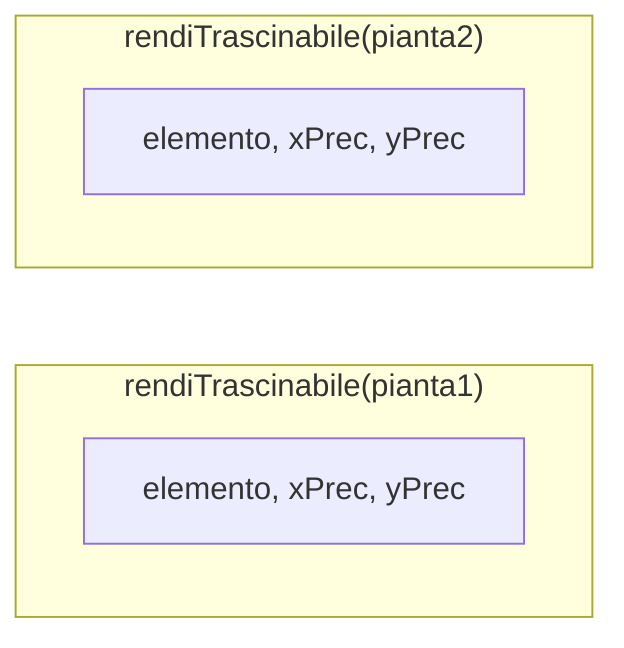
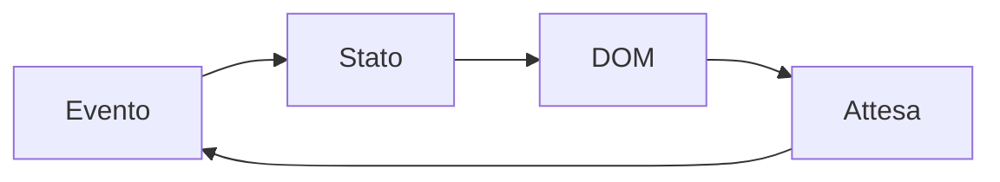
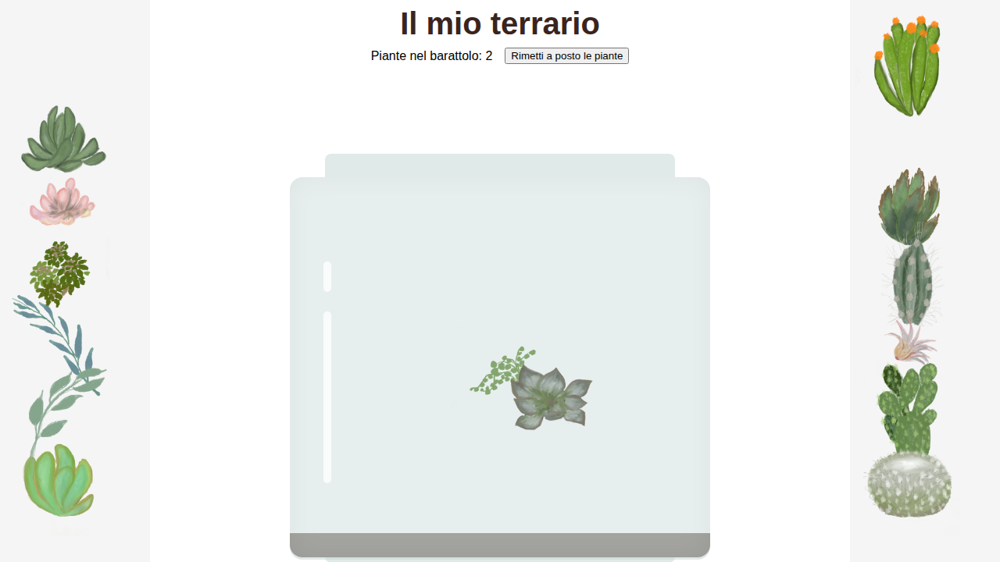

## Lezione 5.3: Closure e stato

Modulo 5: DOM ed eventi. Sviluppo Software e Coding Laboratoriale

Fonte: adattamento da Microsoft, "Web Development for Beginners", lezione "DOM Manipulation and JavaScript Closures", licenza MIT
https://github.com/microsoft/Web-Dev-For-Beginners

---

## Closure

```javascript
function creaContatore() {
  let conteggio = 0;
  function incrementa() { conteggio++; return conteggio; }
  return incrementa;
}
const contaA = creaContatore();
const contaB = creaContatore();
contaA(); contaA(); contaB();   // 1, 2, 1
```

- La funzione interna conserva le variabili esterne
- Ogni chiamata crea un insieme di variabili separato
- **Incapsulamento**: nessun accesso diretto dall'esterno

---

## Closure nel terrario



Ogni pianta usa le proprie variabili

---

## Stato di un'interfaccia

- Stato di un componente: nella closure
- Stato condiviso: variabile esterna (`zMassimo`)
- Un dato, un solo punto di aggiornamento



Schema alla base di React, Vue, Angular

---

## Il terrario completo

- Primo piano: `zMassimo++`, `style.zIndex`
- Conteggio: `getBoundingClientRect()`, punto dentro un rettangolo
- Riordino: `style.left = ""`



---

## Aspetti orientativi

- Trascinamento e stato: bacheche kanban, editor grafici, configuratori
- Gestione dello stato: problema centrale del front-end
- Quali sono lo stato e gli eventi di un'app di uso quotidiano?
