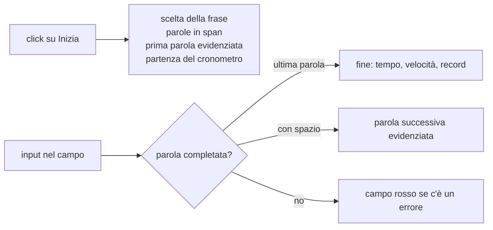

# Lezione 5.4: Programmazione a eventi: gioco di digitazione (parte 1)

> Fonte: adattamento, tradotto e riscritto, della lezione "Creating a game using events" del corso Microsoft "Web Development for Beginners", https://github.com/microsoft/Web-Dev-For-Beginners/blob/main/4-typing-game/typing-game/README.md . Copyright (c) Microsoft Corporation, licenza MIT: https://github.com/microsoft/Web-Dev-For-Beginners/blob/main/LICENSE . Rispetto all'originale: frasi in italiano, generazione delle parole con `createElement` invece di `innerHTML`, campo disattivato fuori dalla partita.

## 5.4.1 Il progetto

Un gioco per misurare la velocità di digitazione:

1. il giocatore preme **Inizia**; compare una frase scelta a caso, con la prima parola evidenziata
2. il giocatore digita la parola evidenziata e la conferma con uno spazio; l'evidenziazione passa alla parola successiva
3. se il testo digitato non corrisponde alla parola, il campo si colora di rosso
4. completata l'ultima parola, compaiono il tempo impiegato e la velocità in parole al minuto; il record viene salvato nel browser (lezione 5.5)

Lezione 5.4: struttura della pagina e avvio della partita. Lezione 5.5: controllo della digitazione, fine partita, memorizzazione dei risultati.

Il gioco è interamente guidato dagli eventi: nessuna istruzione viene eseguita finché l'utente non preme un pulsante o digita un carattere.



## 5.4.2 Struttura dei file

Cartella `gioco-digitazione`, con repository Git:

```text
gioco-digitazione/
    index.html   <- struttura: frase, messaggio, campo di input, pulsante
    style.css    <- aspetto, classi evidenziata ed errore
    script.js    <- dati, stato, gestori di evento
```

## 5.4.3 HTML e CSS

`index.html`:

```html
<!DOCTYPE html>
<html lang="it">
  <head>
    <meta charset="UTF-8">
    <meta name="viewport" content="width=device-width, initial-scale=1">
    <title>Gioco di digitazione</title>
    <link rel="stylesheet" href="style.css">
    <script src="script.js" defer></script>
  </head>
  <body>
    <main>
      <h1>Gioco di digitazione</h1>
      <p>Premere <strong>Inizia</strong>, poi digitare la frase parola per parola. Ogni parola si conferma con uno spazio; l'ultima si completa digitandola per intero.</p>

      <!-- Frase da digitare: ogni parola in uno span, generato da JavaScript -->
      <p id="frase"></p>

      <!-- Messaggi di fine partita; aria-live: i lettori di schermo leggono gli aggiornamenti -->
      <p id="messaggio" aria-live="polite"></p>

      <div class="comandi">
        <label for="digitato">Parola corrente</label>
        <input type="text" id="digitato" autocomplete="off" spellcheck="false" disabled>
        <button type="button" id="inizia">Inizia</button>
      </div>
    </main>
  </body>
</html>
```

- `<label for="digitato">`: etichetta associata al campo (lezione 4.2).
- `autocomplete="off"` e `spellcheck="false"`: disattivano suggerimenti e correttore ortografico del browser, che interferirebbero con il gioco.
- `disabled`: il campo non è utilizzabile finché la partita non inizia.

`style.css`:

```css
* {
  box-sizing: border-box;
}

body {
  font-family: "Segoe UI", Tahoma, Geneva, Verdana, sans-serif;
  margin: 0;
  background: #f5f5f5;
  color: #222222;
}

main {
  max-width: 750px;
  margin: 0 auto;
  padding: 1rem;
}

#frase {
  font-size: 1.4rem;
  line-height: 2;
  min-height: 3rem;
}

/* Parola da digitare */
.evidenziata {
  background-color: #ffe066;
  border-radius: 0.25rem;
}

/* Campo di input quando il testo digitato non corrisponde alla parola */
.errore {
  background-color: #f8b4b4;
  outline: 2px solid #c62828;
}

.comandi {
  display: flex;
  flex-wrap: wrap;
  align-items: center;
  gap: 0.5rem;
}

input,
button {
  font-size: 1.1rem;
  padding: 0.4rem 0.6rem;
}
```

La classe `errore` usa sia il colore di sfondo sia un bordo (`outline`): l'informazione non è affidata solo al colore (lezione 4.2).

## 5.4.4 Dati, stato, riferimenti

Prima parte di `script.js`:

```javascript
// ---------- Dati ----------

// Frasi proposte. La prima è l'inizio de "I promessi sposi" (A. Manzoni, 1840), testo di pubblico dominio.
const FRASI = [
  "Quel ramo del lago di Como, che volge a mezzogiorno, tra due catene non interrotte di monti.",
  "Chi va piano va sano e va lontano.",
  "Un programma fa esattamente quello che gli si chiede, non quello che si vorrebbe.",
  "Prima si scrivono i test, poi il codice che li supera.",
  "Ogni problema complesso si risolve dividendolo in problemi più semplici.",
  "Una buona documentazione vale quanto un buon programma.",
];

// ---------- Stato della partita ----------

let parole = [];        // parole della frase corrente
let indiceParola = 0;   // indice della parola da digitare
let inizio = 0;         // istante di inizio, in millisecondi

// ---------- Riferimenti agli elementi della pagina ----------

const elFrase = document.getElementById("frase");
const elMessaggio = document.getElementById("messaggio");
const elDigitato = document.getElementById("digitato");
const elInizia = document.getElementById("inizia");
```

Organizzazione del codice in tre gruppi:

- **dati**: costanti che non cambiano durante il gioco
- **stato**: variabili che descrivono la partita in corso (lezione 5.3)
- **riferimenti**: elementi della pagina, cercati una sola volta all'avvio e riusati in tutti i gestori; il prefisso `el` ne ricorda il tipo

## 5.4.5 Avvio della partita

```javascript
elInizia.addEventListener("click", () => {
  // Frase casuale, divisa in parole
  const frase = FRASI[Math.floor(Math.random() * FRASI.length)];
  parole = frase.split(" ");
  indiceParola = 0;

  // Una parola per span; textContent non interpreta il testo come HTML
  elFrase.textContent = "";
  for (const parola of parole) {
    const span = document.createElement("span");
    span.textContent = parola + " ";
    elFrase.appendChild(span);
  }
  elFrase.children[0].classList.add("evidenziata");

  // Preparazione del campo di input
  elMessaggio.textContent = "";
  elDigitato.value = "";
  elDigitato.disabled = false;
  elDigitato.classList.remove("errore");
  elDigitato.focus();

  inizio = Date.now();
});
```

Passaggi:

- `Math.floor(Math.random() * FRASI.length)`: indice casuale tra 0 e `FRASI.length - 1` (lezione 2.4).
- `frase.split(" ")`: array delle parti della frase separate da spazi; la punteggiatura resta attaccata alle parole ("Como,").
- `elFrase.textContent = ""` svuota il paragrafo prima di inserire le nuove parole, eliminando quelle della partita precedente.
- Ogni parola diventa uno `span`: è così possibile evidenziarne una sola, aggiungendo la classe `evidenziata`.
- `elFrase.children` è la lista degli elementi figli del paragrafo, cioè degli `span`, nell'ordine; `children[0]` è la prima parola.
- `elDigitato.focus()` sposta il focus sul campo: si può digitare subito, senza fare clic.
- `Date.now()`: istante attuale in millisecondi, trascorsi dal 1° gennaio 1970; la differenza tra due valori misura una durata.

## 5.4.6 Laboratorio

Tempo indicativo: 35 minuti.

1. Creare cartella, repository e i tre file delle sezioni 5.4.3-5.4.5.
2. Aprire la pagina con Live Preview e premere **Inizia** più volte: la frase cambia e la prima parola è evidenziata.

Risultato atteso dopo la pressione di Inizia:


3. Negli strumenti per sviluppatori verificare che il paragrafo `frase` contenga uno `span` per parola.
4. In console, durante una partita, esaminare lo stato: `parole`, `indiceParola`, `Date.now() - inizio` (millisecondi trascorsi dall'avvio).
5. Aggiungere all'array almeno tre frasi scritte dal gruppo.
6. Commit: "Gioco di digitazione: avvio della partita".

Digitando nel campo non accade ancora nulla: il gestore dell'evento `input` è l'argomento della lezione 5.5.

### Esercizi

1. Modificare lo script in modo che la stessa frase non venga proposta due volte di seguito.
2. Aggiungere un secondo pulsante **Frase breve** che sceglie solo tra le frasi con al massimo 8 parole (suggerimento: `filter`).
3. Spiegare che cosa accadrebbe usando `innerHTML` al posto di `textContent` se le frasi venissero digitate dagli utenti e contenessero, per esempio, il testo ``.
