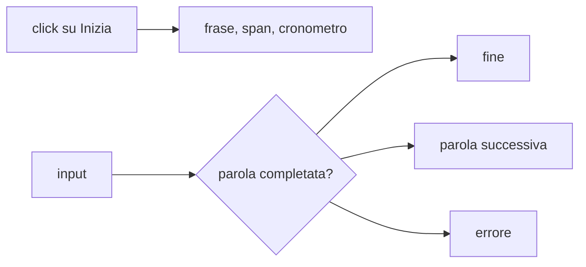
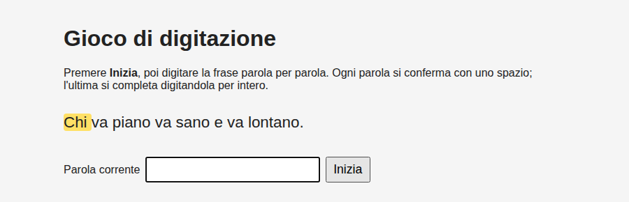

## Contenuti

- Il progetto
- HTML e CSS
- Dati, stato, riferimenti
- Avvio della partita
- Risultato atteso

Fonte: adattamento da Microsoft, "Web Development for Beginners", lezione "Creating a game using events", licenza MIT, https://github.com/microsoft/Web-Dev-For-Beginners

## Il progetto



- Parte 1: struttura e avvio della partita
- Parte 2: controllo della digitazione, risultati salvati

## HTML e CSS

```html
<p id="frase"></p>
<p id="messaggio" aria-live="polite"></p>
<label for="digitato">Parola corrente</label>
<input type="text" id="digitato" autocomplete="off" spellcheck="false" disabled>
<button type="button" id="inizia">Inizia</button>
```

- `.evidenziata`: parola da digitare
- `.errore`: colore e bordo, non solo colore

## Dati, stato, riferimenti

```javascript
const FRASI = [ "Chi va piano va sano e va lontano.", ... ];
let parole = [];
let indiceParola = 0;
let inizio = 0;
const elFrase = document.getElementById("frase");
```

## Avvio della partita

```javascript
elInizia.addEventListener("click", () => {
  const frase = FRASI[Math.floor(Math.random() * FRASI.length)];
  parole = frase.split(" ");
  elFrase.textContent = "";
  for (const parola of parole) {
    const span = document.createElement("span");
    span.textContent = parola + " ";
    elFrase.appendChild(span);
  }
  elFrase.children[0].classList.add("evidenziata");
  elDigitato.disabled = false;
  elDigitato.focus();
  inizio = Date.now();
});
```

## Risultato atteso



- Uno `span` per parola nell'Ispettore
- Stato della partita in console
- Commit Git
