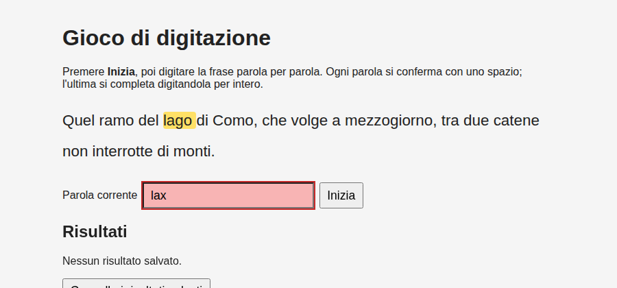

## Contenuti

- L'evento input: quattro casi
- Fine partita
- localStorage
- JSON
- Laboratorio 5.5
- Aspetti orientativi

Fonte: adattamento da Microsoft, "Web Development for Beginners", lezioni "Creating a game using events" e "Browser Extension Project Part 2", licenza MIT, https://github.com/microsoft/Web-Dev-For-Beginners

## L'evento input: quattro casi

| Caso | Condizione |
|---|---|
| 1. Fine | uguale alla parola **e** ultima parola |
| 2. Parola completata | termina con spazio **e** `trim()` uguale |
| 3. Nessun errore | la parola `startsWith` il testo |
| 4. Errore | altrimenti |

L'ordine conta: il caso 3 è vero anche a parola completa

## Fine partita

```javascript
function fine() {
  const secondi = (Date.now() - inizio) / 1000;
  const ppm = Math.round(parole.length / (secondi / 60));
  elDigitato.disabled = true;
  elMessaggio.textContent = `Completato in ${secondi.toFixed(1)} secondi: ${ppm} parole al minuto.`;
  salvaRisultato(ppm);
}
```



## localStorage

```javascript
localStorage.setItem("colore", "verde");
localStorage.getItem("colore");      // null se assente
localStorage.removeItem("colore");
```

- Solo stringhe; persistente; per sito; locale al browser
- Non per dati riservati
- Pagine aperte con Live Preview (`http://`), non come file

## JSON

```javascript
const testo = JSON.stringify([{ ppm: 42, data: "29/09/2026" }]);
const storico = JSON.parse(testo);
```

- Record: un numero come stringa
- Storico: array degli ultimi 5 risultati come JSON
- `mostraRisultati()` a ogni caricamento

## Laboratorio 5.5

- I quattro casi della digitazione
- Record e storico dopo il ricaricamento
- Scheda Application / Archiviazione dei DevTools
- Azzeramento; commit Git

## Aspetti orientativi

- DOM, eventi, stato, JSON: base di ogni applicazione web
- JSON: formato delle API dei servizi web
- Dove conservare i dati: browser, server, database; sicurezza, privacy (GDPR)
