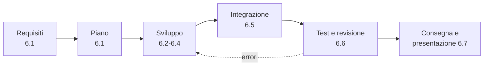
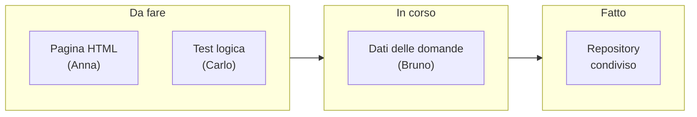

# Lezione 6.1: Dal requisito al piano

Contenuto originale. Riferimenti esterni indicati nel testo.

Il modulo 6 è un progetto di gruppo di 7 ore: una piccola applicazione web realizzata con le tecniche dei moduli 1-5, dall'analisi dei requisiti alla presentazione. Le lezioni seguono le fasi di un progetto reale e usano come esempio un **quiz di informatica**, la cui realizzazione completa è nella directory della lezione 6.3 (`esempio_quiz`).

## 6.1.1 Le fasi di un progetto software



Nei progetti professionali queste fasi non si svolgono una sola volta in sequenza: con i metodi **agili** (per esempio Scrum) si ripetono in cicli brevi, di una o due settimane, e ogni ciclo produce una versione funzionante del prodotto. In questo modulo i cicli coincidono con le lezioni: al termine di ogni lezione il progetto deve funzionare, anche se incompleto. I metodi di gestione dei progetti sono approfonditi nel corso "Informatica per l'Impresa e Soft Skills Digitale".

## 6.1.2 Gruppi e ruoli

Gruppi di 3 o 4 studenti. Tutti scrivono codice; in più ognuno ha una responsabilità, che può ruotare a metà progetto:

| Ruolo | Responsabilità |
|---|---|
| Referente del prodotto | custodisce l'elenco dei requisiti e le priorità; decide in caso di dubbi su che cosa fare |
| Referente tecnico | struttura dei file, convenzioni di codice, repository Git, integrazione |
| Referente qualità | casi di prova, test, controllo di accessibilità, raccolta degli errori |
| Referente comunicazione | diario di progetto, preparazione della presentazione |

Nei gruppi di 3 i ruoli di qualità e comunicazione si uniscono.

## 6.1.3 Progetti proposti

Ogni gruppo sceglie uno dei progetti seguenti, o ne propone uno di complessità simile al docente.

| Progetto | Descrizione minima | Tecniche principali |
|---|---|---|
| **Quiz** | domande a scelta multipla, correzione immediata, punteggio finale | array di oggetti, eventi, stato |
| **Gioco di memoria** | carte coperte da girare a coppie; le coppie uguali restano scoperte | array mescolato, stato di gioco, `setTimeout` |
| **Lista di attività** | inserimento, completamento, eliminazione di attività; dati salvati nel browser | moduli, DOM, localStorage, JSON |
| **Convertitore** | conversione tra unità di misura (lunghezze, temperature, valute con tassi fissi) | funzioni pure, input, validazione |

Il repository Microsoft usato come fonte nei moduli precedenti contiene due progetti simili, "quiz-app" e "memory-game", consultabili come spunto: https://github.com/microsoft/Web-Dev-For-Beginners

## 6.1.4 Requisiti

Un **requisito** descrive che cosa il software deve fare (requisito **funzionale**) o come deve farlo (requisito **non funzionale**: prestazioni, accessibilità, compatibilità).

Forma consigliata per i requisiti funzionali, la **user story**:

> Come *[tipo di utente]* voglio *[azione]* per *[obiettivo]*.

Ogni user story è accompagnata da **criteri di accettazione**: condizioni verificabili che stabiliscono quando la storia è realizzata. Diventeranno i casi di prova della lezione 6.6.

Esempio dal quiz:

| Id | User story | Criteri di accettazione |
|---|---|---|
| US1 | Come studente voglio rispondere a domande a scelta multipla per verificare la mia preparazione | viene mostrata una domanda alla volta con 4 opzioni; un clic su un'opzione registra la risposta |
| US2 | Come studente voglio sapere subito se la risposta è giusta per imparare dagli errori | dopo la risposta l'opzione corretta è evidenziata; se la scelta è errata è evidenziata anche quella, con un testo che lo indica; non si può cambiare risposta |
| US3 | Come studente voglio vedere il punteggio finale per valutare il risultato | dopo l'ultima domanda compaiono punteggio e giudizio (perfetto, superato con almeno il 60%, da ripassare) |
| US4 | Come studente voglio che le domande cambino ordine per non memorizzare la sequenza | l'ordine delle domande è diverso a ogni partita |
| US5 | Come studente con disabilità visiva voglio usare il quiz con la tastiera e il lettore di schermo | tutte le azioni sono possibili con `Tab` e `Invio`; esito e punteggio sono letti automaticamente |

US5 esprime un requisito di accessibilità (lezione 4.2): va previsto fin dall'inizio, non aggiunto alla fine.

## 6.1.5 Priorità e prodotto minimo

Il tempo è limitato: i requisiti vanno ordinati per priorità con il metodo **MoSCoW**:

- **Must have**: indispensabili; senza di essi il prodotto non ha senso
- **Should have**: importanti, da realizzare se possibile
- **Could have**: desiderabili, solo se avanza tempo
- **Won't have (this time)**: esclusi da questa versione, annotati per il futuro

L'insieme dei requisiti Must costituisce l'**MVP** (Minimum Viable Product, prodotto minimo funzionante): la prima versione da completare, prima di passare ai requisiti successivi. Nel quiz: US1, US2, US3 e US5 sono Must; US4 è Should; un record salvato nel browser sarebbe Could; una classifica condivisa tra studenti, che richiede un server, è Won't.

## 6.1.6 Piano di lavoro

Il lavoro si scompone in **attività** di dimensione piccola (da 15 minuti a un'ora), ciascuna assegnata a una persona. Le attività si tengono su una **bacheca kanban**, con tre colonne:



Senza servizi online, la bacheca si realizza su carta con foglietti adesivi, oppure come file `PIANO.md` nel repository del progetto, aggiornato con un commit a ogni cambiamento:

```markdown
# Piano di lavoro: Quiz di informatica

## Da fare
- [ ] Test della funzione giudizio (Carlo)
- [ ] Stile dei pulsanti di risposta (Anna)

## In corso
- [ ] Dati delle domande (Bruno)

## Fatto
- [x] Repository condiviso (Dario)
```

In Markdown `- [ ]` è una casella da spuntare e `- [x]` una casella spuntata.

## 6.1.7 Laboratorio

Tempo indicativo: 45 minuti. Prodotto finale della lezione: un file `REQUISITI.md` e un file `PIANO.md`, che nella lezione 6.2 saranno i primi file del repository.

1. Formare i gruppi, assegnare i ruoli, scegliere il progetto.
2. Scrivere almeno 5 user story con i criteri di accettazione, compresa almeno una di accessibilità.
3. Classificarle con MoSCoW e individuare l'MVP.
4. Disegnare su carta uno schizzo dell'interfaccia (**wireframe**): disposizione degli elementi, senza colori né dettagli grafici.
5. Scomporre l'MVP in attività di al massimo un'ora e assegnarle.
6. Presentare al docente in 2 minuti progetto, MVP e piano.

### Esercizi

1. Per il progetto "lista di attività", scrivere 3 user story con criteri di accettazione verificabili.
2. Trasformare questo requisito vago in criteri verificabili: "Il gioco deve essere facile da usare".
3. Indicare quali requisiti del quiz sono funzionali e quali non funzionali.

## 6.1.8 Aspetti orientativi (discussione)

- L'analisi dei requisiti è svolta da figure specifiche (analista funzionale, business analyst, product owner) che fanno da ponte tra clienti e sviluppatori.
- Una parte rilevante dei progetti software falliti o in ritardo ha all'origine requisiti poco chiari o cambiati senza controllo.
- Le user story e le bacheche kanban sono strumenti quotidiani nelle aziende; esistono servizi dedicati (Jira, Trello, GitHub Projects), che però richiedono un account e non sono usati in questo corso.
