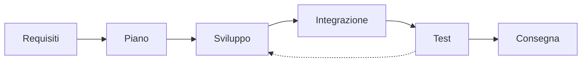
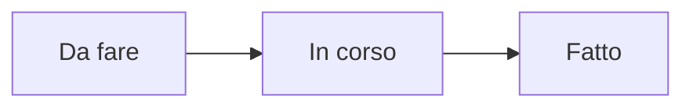

## Contenuti

- Fasi di un progetto
- Gruppi, ruoli, progetti
- Requisiti: user story
- Priorità: MoSCoW e MVP
- Piano: bacheca kanban
- Laboratorio 6.1
- Aspetti orientativi

## Fasi di un progetto

- Metodi agili: cicli brevi, una versione funzionante a ogni ciclo
- Nel modulo: a fine lezione il progetto funziona, anche se incompleto

## Gruppi, ruoli, progetti

- Ruoli: prodotto, tecnico, qualità, comunicazione; tutti scrivono codice
- Progetti: **quiz**, **gioco di memoria**, **lista di attività**, **convertitore**
- Esempio completo: `esempio_quiz` (lezione 6.3)

## Requisiti: user story

> Come *utente* voglio *azione* per *obiettivo*.

| Id | User story | Criteri di accettazione |
|---|---|---|
| US2 | Come studente voglio sapere subito se la risposta è giusta | corretta evidenziata; errata segnalata anche a testo; risposta non modificabile |
| US5 | Come studente con disabilità visiva voglio usare il quiz con tastiera e lettore di schermo | tutto con `Tab` e `Invio`; esiti letti automaticamente |

## Priorità: MoSCoW e MVP

- **Must**, **Should**, **Could**, **Won't** (this time)
- **MVP**: l'insieme dei Must, da completare per primo
- Quiz: Must US1, US2, US3, US5; Should US4; Could record; Won't classifica condivisa

## Piano: bacheca kanban

- Attività da 15 minuti a un'ora, una persona ciascuna
- Su carta o in `PIANO.md` nel repository

## Laboratorio 6.1

- Gruppi, ruoli, progetto
- 5 user story con criteri, almeno una di accessibilità
- MoSCoW e MVP
- Wireframe su carta
- Attività e assegnazioni

## Aspetti orientativi

- Analista funzionale, business analyst, product owner
- Requisiti poco chiari: causa frequente di fallimento dei progetti
- Strumenti aziendali: Jira, Trello, GitHub Projects
