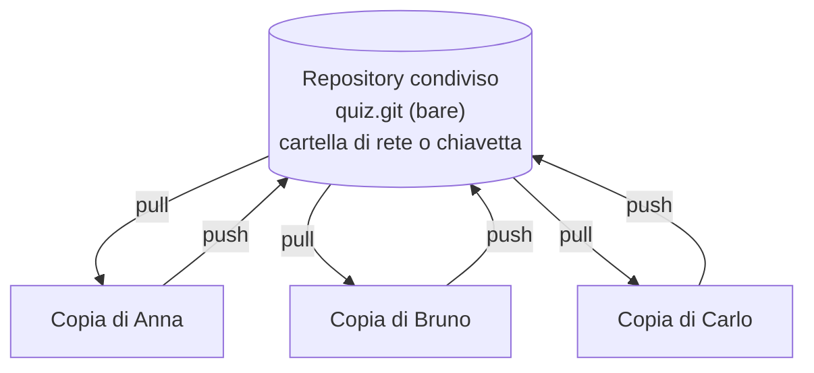
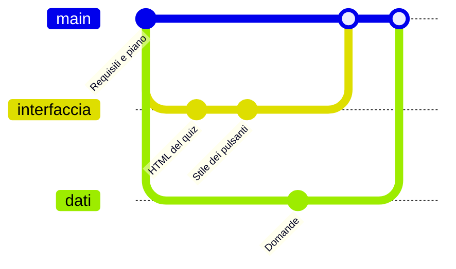

# Lezione 6.2: Sviluppo: struttura HTML e stile

Contenuto originale. Riferimenti esterni indicati nel testo.

Obiettivi della lezione: predisporre un repository Git condiviso dal gruppo, organizzare i file del progetto, realizzare l'interfaccia (HTML e CSS) a partire dal wireframe della lezione 6.1.

## 6.2.1 Un repository condiviso senza servizi online

Nel modulo 1 ogni studente aveva un repository locale. In un gruppo serve un repository **condiviso**, da cui ognuno scarica il lavoro degli altri e a cui invia il proprio. Nelle aziende è ospitato da servizi come GitHub o GitLab; per il corso, che non usa account personali, basta una cartella accessibile a tutti: una cartella di rete del laboratorio oppure una chiavetta USB.

Concetti:

- **Repository remoto**: repository usato come punto di scambio; per Git "remoto" significa "diverso da quello locale", anche se si trova sullo stesso computer o su una chiavetta.
- **Repository bare** (spoglio): repository senza directory di lavoro, che contiene solo la storia dei commit; è il formato usato per i repository condivisi, nei quali nessuno lavora direttamente.
- **clone**: copia locale di un repository remoto, collegata al remoto con il nome `origin`.
- **push**: invia al remoto i commit locali.
- **pull**: scarica dal remoto i commit degli altri e li unisce al lavoro locale.



### Creazione (referente tecnico, una sola volta)

```powershell
# Repository condiviso, per esempio sulla chiavetta E: oppure su una cartella di rete
git init --bare -b main E:\progetti\quiz.git
```

- `--bare`: crea un repository spoglio.
- `-b main`: nome del branch principale.
- Con una cartella di rete il percorso ha la forma `\\nome-server\cartella\progetti\quiz.git`.

### Collegamento (ogni membro del gruppo)

```powershell
cd C:\corso-coding
git clone E:\progetti\quiz.git quiz
cd quiz
git config user.name "Nome Cognome"
git config user.email "nome.cognome@example.com"
git config pull.rebase false
```

- `git clone PERCORSO CARTELLA` crea la cartella `quiz` con la copia del repository; al primo clone Git avvisa che il repository è vuoto, un messaggio normale.
- `git config pull.rebase false` stabilisce che `git pull` unisca il lavoro degli altri con un **merge** (sezione 6.5); senza questa impostazione le versioni recenti di Git chiedono di scegliere una strategia al primo `pull`.
- Se Git rifiuta la cartella di rete con il messaggio "detected dubious ownership", la cartella appartiene a un altro utente di Windows: il messaggio stesso indica il comando `git config --global --add safe.directory ...` da eseguire per autorizzarla.

Riferimento: Pro Git, capitolo 4, "Git on the Server", https://git-scm.com/book/it/v2/Git-on-the-Server-The-Protocols (in inglese nella traduzione italiana, ancora incompleta).

### Primo contenuto (referente tecnico)

```powershell
# copiare nella cartella REQUISITI.md e PIANO.md della lezione 6.1, poi:
git add .
git commit -m "Requisiti e piano di lavoro"
git push -u origin main
```

`-u origin main` associa il branch locale `main` a quello remoto: dal secondo invio in poi basta `git push`. Gli altri membri eseguono `git pull` e ricevono i file.

## 6.2.2 Branch di funzionalità

Per non ostacolarsi a vicenda, ognuno sviluppa la propria attività su un **branch** separato, un ramo di sviluppo parallelo, e la unisce a `main` solo quando funziona.



```powershell
git switch -c interfaccia    # crea il branch "interfaccia" e ci si sposta
# ... lavoro e commit sul branch ...
git switch main              # torna su main
git pull                     # scarica le novità degli altri
git merge interfaccia        # unisce il branch a main
git push                     # invia main aggiornato al repository condiviso
git branch -d interfaccia    # elimina il branch, ormai unito
```

- `git switch -c NOME` crea un branch e lo rende attivo; `git switch NOME` passa a un branch esistente.
- `git branch` elenca i branch locali, con un asterisco su quello attivo.
- `git merge NOME` unisce al branch attivo i commit del branch indicato.

Regole del gruppo:

- `main` deve funzionare sempre: vi si unisce solo codice provato
- un branch per attività, con un nome che la descrive (`interfaccia`, `dati-domande`, `test-logica`)
- commit piccoli e frequenti, con messaggi chiari
- `git pull` prima di iniziare a lavorare e prima di ogni `git push`

## 6.2.3 Organizzazione dei file

Struttura consigliata, che separa dati, logica e interfaccia (esempio del quiz):

```text
quiz/
    REQUISITI.md    <- user story e priorità (lezione 6.1)
    PIANO.md        <- bacheca kanban
    index.html      <- struttura della pagina
    style.css       <- aspetto
    dati.js         <- dati (domande)
    logica.js       <- funzioni pure: calcoli e regole, senza DOM (lezione 6.3)
    app.js          <- stato, disegno della pagina, gestori di evento (lezione 6.4)
    test.html       <- pagina che esegue i test
    test.js         <- test automatici della logica (lezione 6.6)
```

Vantaggi della separazione:

- più persone lavorano in parallelo su file diversi, riducendo i conflitti (lezione 6.5)
- la logica, che non dipende dalla pagina, si verifica con test automatici
- i dati si modificano senza toccare il codice

Nel `head`, gli script con `defer` vengono eseguiti nell'ordine in cui compaiono: prima i dati, poi la logica che li usa, infine l'interfaccia.

```html
<script src="dati.js" defer></script>
<script src="logica.js" defer></script>
<script src="app.js" defer></script>
```

## 6.2.4 Dal wireframe all'HTML

L'HTML del quiz d'esempio: gli elementi che cambiano durante l'uso sono vuoti e hanno un `id`, perché verranno riempiti da JavaScript; i pulsanti che compaiono solo in certi momenti hanno l'attributo `hidden`, che li nasconde finché lo script non lo toglie.

```html
<main>
  <h1>Quiz di informatica</h1>
  <p id="contatore"></p>
  <h2 id="testo-domanda"></h2>
  <div id="opzioni"></div>
  <p id="esito" aria-live="polite"></p>
  <button type="button" id="avanti" hidden>Avanti</button>
  <p id="risultato" aria-live="polite"></p>
  <button type="button" id="ricomincia" hidden>Ricomincia</button>
</main>
```

Buone pratiche già viste nei moduli 4 e 5, da applicare al progetto:

- elementi semantici e gerarchia dei titoli (lezione 4.2)
- pulsanti con `<button>`, raggiungibili da tastiera, con focus visibile (`:focus-visible` nel CSS)
- colori con contrasto sufficiente; informazioni non affidate solo al colore
- impaginazione con Flexbox e unità relative; verifica su schermo stretto (lezione 4.4)
- `aria-live="polite"` sugli elementi il cui testo cambia per comunicare un esito

Il codice completo (HTML, CSS, JavaScript) è nella cartella `esempio_quiz` della lezione 6.3.

## 6.2.5 Laboratorio

Tempo indicativo: 50 minuti.

1. Il referente tecnico crea il repository condiviso e vi inserisce `REQUISITI.md` e `PIANO.md`; gli altri membri lo clonano e configurano identità e `pull.rebase`.
2. Ciascuno crea il branch della propria attività.
3. Realizzare l'interfaccia statica: `index.html` e `style.css`, con dati di prova scritti direttamente nell'HTML se lo script non è ancora pronto.
4. Verificare la pagina con il validatore W3C (https://validator.w3.org/nu/) e con Lighthouse o con l'Accessibility Inspector (lezione 4.2).
5. Unire i branch a `main` e inviarli al repository condiviso.
6. Aggiornare `PIANO.md` e fare un commit.

### Esercizi

1. Disegnare il grafo dei commit (come nel diagramma della sezione 6.2.2) prodotto dal gruppo in questa lezione; confrontarlo con l'output di `git log --oneline --graph --all`.
2. Spiegare perché non si dovrebbe lavorare direttamente su `main` in un gruppo.
