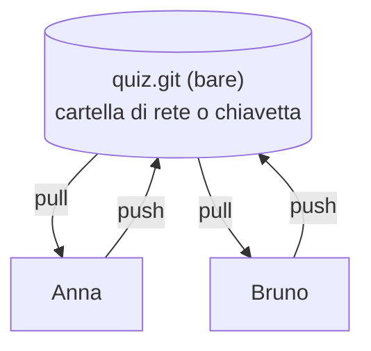
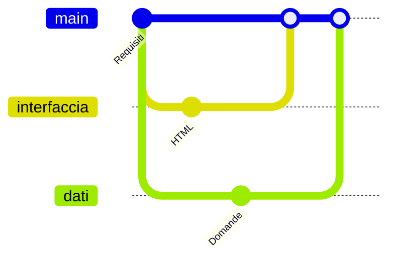

## Lezione 6.2: Sviluppo: struttura HTML e stile

Modulo 6: Progetto di gruppo. Sviluppo Software e Coding Laboratoriale

---

## Repository condiviso senza account



- **Bare**: solo la storia, nessuna directory di lavoro
- **clone**, **push**, **pull**; remoto `origin`

---

## Comandi

```powershell
git init --bare -b main E:\progetti\quiz.git       # una volta
git clone E:\progetti\quiz.git quiz                # ogni membro
git config pull.rebase false
git push -u origin main                            # primo invio
```

Cartella di rete e "dubious ownership": `git config --global --add safe.directory ...`

---

## Branch di funzionalità



`git switch -c NOME`, `git merge NOME`, `git branch -d NOME`
`main` funziona sempre

---

## Organizzazione dei file

```text
index.html  style.css
dati.js     logica.js    app.js
test.html   test.js
REQUISITI.md  PIANO.md
```

- Dati, logica, interfaccia separati
- Script con `defer`, in ordine: dati, logica, interfaccia

---

## Laboratorio 6.2

- Repository condiviso e cloni
- Un branch per attività
- `index.html` e `style.css` dal wireframe
- Validatore W3C, Lighthouse
- Merge in `main`, push, `PIANO.md`
