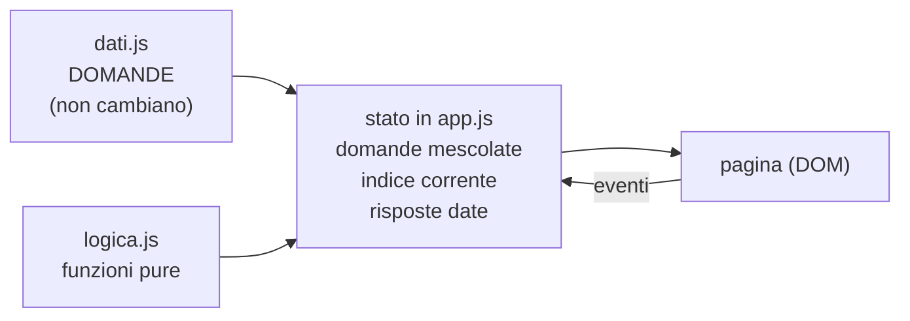

# Lezione 6.3: Sviluppo: logica e dati

Contenuto originale. Riferimenti esterni indicati nel testo.

Obiettivi della lezione: progettare la struttura dei dati dell'applicazione, scrivere le regole del programma come funzioni indipendenti dalla pagina e verificarle con test automatici.

La directory di questa lezione contiene `esempio_quiz`, il progetto d'esempio completo e verificato: dati, logica, interfaccia, test.

## 6.3.1 Modello dei dati

Il **modello dei dati** descrive quali informazioni gestisce l'applicazione e come sono organizzate. Nelle applicazioni web le strutture più comuni sono l'**array di oggetti** (un elenco di elementi dello stesso tipo) e l'**oggetto** con proprietà (un singolo elemento).

Esempio del quiz, file `dati.js`:

```javascript
const DOMANDE = [
  {
    testo: "Quale linguaggio definisce la struttura di una pagina web?",
    opzioni: ["CSS", "HTML", "JavaScript", "Git"],
    corretta: 1,     // indice dell'opzione corretta nell'array opzioni
  },
  {
    testo: "Quale struttura di controllo ripete un blocco di istruzioni?",
    opzioni: ["Sequenza", "Selezione", "Iterazione", "Assegnazione"],
    corretta: 2,
  },
  // ... altre domande
];
```

Scelte da giustificare durante la progettazione:

- la risposta corretta è memorizzata come **indice** e non come testo: se il testo di un'opzione viene corretto, il dato resta coerente
- ogni domanda ha la stessa struttura: le funzioni possono trattarle tutte allo stesso modo
- i dati sono separati dal codice: si possono aggiungere domande senza modificare la logica

Modelli di partenza per gli altri progetti:

| Progetto | Dati principali | Stato della partita o della sessione |
|---|---|---|
| Gioco di memoria | array di valori delle carte, ciascuno ripetuto due volte | carte scoperte, coppie trovate, numero di mosse |
| Lista di attività | array di oggetti `{ id, testo, completata }` | filtro attivo (tutte, da fare, completate) |
| Convertitore | oggetto con i fattori di conversione, per esempio `{ m: 1, km: 1000, cm: 0.01 }` | unità scelte, valore inserito |

Diagramma: relazione tra dati, stato e interfaccia nel quiz.



## 6.3.2 Funzioni pure

Una **funzione pura**:

- restituisce un risultato che dipende **solo** dai suoi parametri: con gli stessi argomenti produce sempre lo stesso risultato
- non ha **effetti collaterali**: non modifica variabili esterne, i propri argomenti o la pagina, non scrive in console né in localStorage

Le funzioni pure sono le più facili da capire, riusare e verificare: un test le chiama con valori noti e confronta il risultato con quello atteso, senza bisogno di una pagina web. Le regole dell'applicazione (calcoli, controlli, decisioni) vanno scritte come funzioni pure in `logica.js`; il codice che legge e modifica la pagina resta in `app.js` (lezione 6.4).

`logica.js` del quiz:

```javascript
// true se l'opzione scelta è quella corretta
function eCorretta(domanda, indiceScelto) {
  return indiceScelto === domanda.corretta;
}

// Numero di risposte corrette; risposte[i] è l'indice scelto per la domanda i (null se non data)
function calcolaPunteggio(domande, risposte) {
  let punti = 0;
  for (let i = 0; i < domande.length; i++) {
    if (risposte[i] !== null && eCorretta(domande[i], risposte[i])) {
      punti++;
    }
  }
  return punti;
}

// Giudizio in base alla percentuale di risposte corrette
function giudizio(punti, totale) {
  if (totale === 0) {
    return "nessuna domanda";
  }
  const percentuale = (punti / totale) * 100;
  if (percentuale === 100) {
    return "perfetto";
  } else if (percentuale >= 60) {
    return "superato";
  } else {
    return "da ripassare";
  }
}

// Restituisce una copia mescolata dell'array (algoritmo di Fisher-Yates); l'originale non cambia
function mescola(v) {
  const a = v.slice();
  for (let i = a.length - 1; i > 0; i--) {
    const j = Math.floor(Math.random() * (i + 1));   // indice casuale tra 0 e i
    const temp = a[i];
    a[i] = a[j];
    a[j] = temp;
  }
  return a;
}
```

Osservazioni:

- `giudizio` gestisce esplicitamente il caso limite `totale === 0`, che altrimenti produrrebbe una divisione per zero (risultato `NaN`, lezione 3.1).
- `mescola` non è pura in senso stretto, perché usa `Math.random()`, ma non ha effetti collaterali: restituisce una copia e non modifica l'array ricevuto.

**Algoritmo di Fisher-Yates**: mescola un array in modo che tutte le permutazioni siano ugualmente probabili. Si scorre l'array dall'ultima posizione alla seconda; per ogni posizione `i` si sceglie a caso una posizione `j` tra 0 e `i` e si scambiano i due elementi. Il costo è lineare (lezione 2.4). Voce enciclopedica: https://en.wikipedia.org/wiki/Fisher%E2%80%93Yates_shuffle

Un errore comune è mescolare con `v.sort(() => Math.random() - 0.5)`: è breve, ma non produce permutazioni equiprobabili e il risultato dipende dall'algoritmo di ordinamento del browser.

## 6.3.3 Test della logica

`test.html` carica dati, logica e test, senza l'interfaccia:

```html
<script src="dati.js" defer></script>
<script src="logica.js" defer></script>
<script src="test.js" defer></script>
```

`test.js` riprende la funzione `verifica` della lezione 3.5:

```javascript
let superati = 0;
let falliti = 0;

function verifica(descrizione, ottenuto, atteso) {
  const ok = JSON.stringify(ottenuto) === JSON.stringify(atteso);
  if (ok) {
    superati++;
    console.log(`OK      ${descrizione}`);
  } else {
    falliti++;
    console.error(`FALLITO ${descrizione}: atteso ${JSON.stringify(atteso)}, ottenuto ${JSON.stringify(ottenuto)}`);
  }
}

const d0 = { testo: "?", opzioni: ["a", "b", "c"], corretta: 1 };
const d1 = { testo: "?", opzioni: ["a", "b"], corretta: 0 };

verifica("risposta corretta", eCorretta(d0, 1), true);
verifica("risposta errata", eCorretta(d0, 2), false);

verifica("punteggio pieno", calcolaPunteggio([d0, d1], [1, 0]), 2);
verifica("punteggio nullo", calcolaPunteggio([d0, d1], [0, 1]), 0);
verifica("risposte mancanti", calcolaPunteggio([d0, d1], [null, 0]), 1);
verifica("nessuna domanda", calcolaPunteggio([], []), 0);

verifica("giudizio perfetto", giudizio(5, 5), "perfetto");
verifica("giudizio al limite del 60%", giudizio(3, 5), "superato");
verifica("giudizio sotto il 60%", giudizio(2, 5), "da ripassare");
verifica("giudizio senza domande", giudizio(0, 0), "nessuna domanda");

const originale = [1, 2, 3, 4, 5];
const mescolato = mescola(originale);
verifica("mescola: stessa lunghezza", mescolato.length, 5);
verifica("mescola: stessi elementi", mescolato.slice().sort(), [1, 2, 3, 4, 5]);
verifica("mescola: originale invariato", originale, [1, 2, 3, 4, 5]);

// Controllo dei dati: ogni domanda deve avere un indice corretto valido
DOMANDE.forEach((d, i) => {
  verifica(`dati: domanda ${i + 1} con indice corretto valido`, d.corretta >= 0 && d.corretta < d.opzioni.length, true);
});

console.log(`Test superati: ${superati}, falliti: ${falliti}`);
```

Tecniche da notare:

- test sui **valori al confine**: 3 su 5 è esattamente il 60%, limite tra "superato" e "da ripassare"
- per una funzione con risultato casuale (`mescola`) non si verifica un risultato preciso, ma le **proprietà** che deve sempre rispettare: lunghezza, elementi, originale invariato
- i test controllano anche i **dati**: un errore di battitura nell'indice `corretta` di una domanda verrebbe segnalato subito

Esito della verifica sul progetto d'esempio: 18 test superati su 18.

## 6.3.4 Laboratorio

Tempo indicativo: 50 minuti. Lavoro su branch (lezione 6.2), per esempio `dati` e `logica`.

1. Scrivere il modello dei dati in `dati.js` con almeno 5 elementi reali (domande, carte, attività di esempio, fattori di conversione).
2. Elencare le regole dell'applicazione e scriverle come funzioni pure in `logica.js`. Per ciascuna, prima del codice, scrivere nei commenti parametri, risultato e casi limite.
3. Scrivere `test.html` e `test.js`, con almeno 2 test per funzione, compresi i casi limite, e un controllo di validità dei dati.
4. Eseguire i test e correggere fino a quando sono tutti superati.
5. Unire i branch a `main`, inviare al repository condiviso, aggiornare `PIANO.md`.

Funzioni tipiche per gli altri progetti:

- gioco di memoria: `creaMazzo(valori)` (duplica e mescola), `sonoUguali(carta1, carta2)`, `partitaFinita(coppieTrovate, totaleCoppie)`
- lista di attività: `aggiungi(lista, testo)`, `completa(lista, id)`, `rimuovi(lista, id)`, `filtra(lista, criterio)`; ciascuna restituisce una **nuova** lista senza modificare quella ricevuta
- convertitore: `converti(valore, da, a, fattori)`, `valoreValido(testo)`

### Esercizi

1. Spiegare perché una funzione `aggiungi(lista, testo)` che restituisce una nuova lista è più facile da verificare di una che modifica la lista ricevuta.
2. Scrivere un test che verifichi che `mescola` produca, su 1000 esecuzioni con l'array `[1, 2, 3]`, tutte e 6 le permutazioni possibili.
