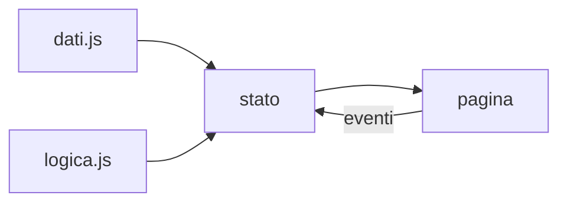

## Lezione 6.3: Sviluppo: logica e dati

Modulo 6: Progetto di gruppo. Sviluppo Software e Coding Laboratoriale

---

## Modello dei dati

```javascript
const DOMANDE = [
  { testo: "Quale linguaggio definisce la struttura di una pagina web?",
    opzioni: ["CSS", "HTML", "JavaScript", "Git"],
    corretta: 1 },
];
```

- Array di oggetti con la stessa struttura
- Risposta corretta come indice
- Dati separati dal codice

---

## Dati, stato, logica, pagina



---

## Funzioni pure

- Risultato dipendente solo dai parametri
- Nessun effetto collaterale
- Facili da verificare

```javascript
function giudizio(punti, totale) {
  if (totale === 0) return "nessuna domanda";
  const percentuale = (punti / totale) * 100;
  if (percentuale === 100) return "perfetto";
  else if (percentuale >= 60) return "superato";
  else return "da ripassare";
}
```

---

## Mescolare: Fisher-Yates

```javascript
for (let i = a.length - 1; i > 0; i--) {
  const j = Math.floor(Math.random() * (i + 1));
  // scambio di a[i] e a[j]
}
```

- Permutazioni equiprobabili, costo lineare
- Da evitare: `sort(() => Math.random() - 0.5)`

---

## Test della logica

- Valori al confine: 3 su 5 = 60%
- Risultati casuali: si verificano le proprietà
- Controllo dei dati
- Progetto d'esempio: 18 test superati su 18

---

## Laboratorio 6.3

- `dati.js` con almeno 5 elementi
- Regole come funzioni pure in `logica.js`
- `test.html`, `test.js`: almeno 2 test per funzione
- Merge, push, `PIANO.md`
