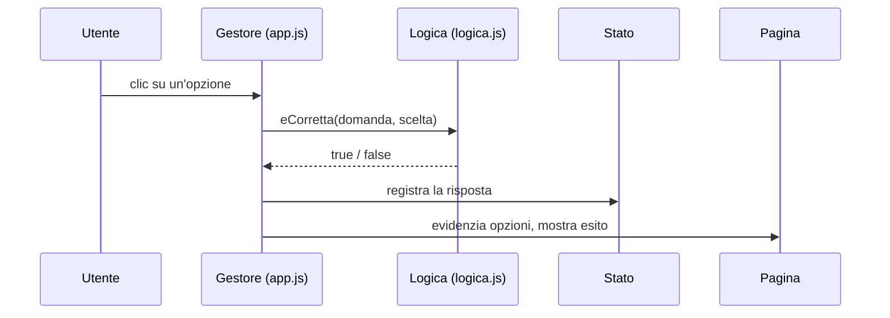

# Lezione 6.4: Sviluppo: interazione

Contenuto originale. Riferimenti esterni indicati nel testo.

Obiettivi della lezione: collegare dati e logica all'interfaccia con eventi e aggiornamenti del DOM, secondo lo schema evento, stato, pagina (lezione 5.3); gestire gli input non validi; curare l'uso da tastiera.

## 6.4.1 Struttura di app.js

`app.js` contiene tutto il codice che riguarda la pagina, organizzato in quattro parti:

1. **stato**: variabili che descrivono la sessione in corso
2. **riferimenti**: elementi della pagina, cercati una volta sola
3. **funzioni di disegno**: aggiornano la pagina a partire dallo stato
4. **gestori di evento**: modificano lo stato e richiamano il disegno



I gestori non contengono regole di calcolo: le chiedono a `logica.js`. Così le regole restano verificabili con i test (lezione 6.3) e l'interfaccia si può cambiare senza toccarle.

## 6.4.2 Il quiz d'esempio: stato e disegno

```javascript
// ---------- Stato ----------
let domande = [];      // domande della partita, in ordine mescolato
let indice = 0;        // domanda corrente
let risposte = [];     // indice dell'opzione scelta per ogni domanda (null se non ancora data)

// ---------- Riferimenti ----------
const elContatore = document.getElementById("contatore");
const elTesto = document.getElementById("testo-domanda");
const elOpzioni = document.getElementById("opzioni");
const elEsito = document.getElementById("esito");
const elAvanti = document.getElementById("avanti");
const elRisultato = document.getElementById("risultato");
const elRicomincia = document.getElementById("ricomincia");

// ---------- Avvio e disegno ----------

function nuovaPartita() {
  domande = mescola(DOMANDE);
  indice = 0;
  risposte = domande.map(() => null);   // un null per ogni domanda
  elRisultato.textContent = "";
  elRicomincia.hidden = true;
  mostraDomanda();
}

// Disegna la domanda corrente a partire dallo stato
function mostraDomanda() {
  const d = domande[indice];
  elContatore.textContent = `Domanda ${indice + 1} di ${domande.length}`;
  elTesto.textContent = d.testo;
  elEsito.textContent = "";
  elAvanti.hidden = true;

  elOpzioni.textContent = "";
  d.opzioni.forEach((testoOpzione, i) => {
    const pulsante = document.createElement("button");
    pulsante.type = "button";
    pulsante.textContent = testoOpzione;
    pulsante.addEventListener("click", () => rispondi(i));
    elOpzioni.appendChild(pulsante);
  });
}
```

- `domande.map(() => null)` crea un array della stessa lunghezza di `domande`, pieno di `null`: nessuna risposta data.
- `forEach((testoOpzione, i) => ...)`: la callback riceve valore e indice (lezione 3.4).
- `() => rispondi(i)`: ogni pulsante riceve una funzione che "ricorda" il proprio `i`; è una closure (lezione 5.3).
- `elemento.hidden = true` nasconde un elemento, `false` lo mostra: corrisponde all'attributo HTML `hidden`.

## 6.4.3 I gestori

```javascript
function rispondi(i) {
  if (risposte[indice] !== null) {
    return;                           // domanda già risposta: si ignora un secondo clic
  }
  risposte[indice] = i;
  const d = domande[indice];
  const pulsanti = elOpzioni.querySelectorAll("button");
  pulsanti.forEach((p) => (p.disabled = true));
  pulsanti[d.corretta].classList.add("giusta");
  if (eCorretta(d, i)) {
    elEsito.textContent = "Risposta corretta.";
  } else {
    pulsanti[i].classList.add("sbagliata");
    elEsito.textContent = `Risposta errata. Corretta: ${d.opzioni[d.corretta]}.`;
  }
  elAvanti.hidden = false;
  elAvanti.focus();
}

function avanti() {
  if (indice < domande.length - 1) {
    indice++;
    mostraDomanda();
  } else {
    fine();
  }
}

function fine() {
  const punti = calcolaPunteggio(domande, risposte);
  elContatore.textContent = "Quiz terminato";
  elTesto.textContent = "Risultato finale";      // un titolo non deve restare vuoto (lezione 4.2)
  elOpzioni.textContent = "";
  elEsito.textContent = "";
  elAvanti.hidden = true;
  elRisultato.textContent = `Punteggio: ${punti} su ${domande.length} (${giudizio(punti, domande.length)}).`;
  elRicomincia.hidden = false;
}

elAvanti.addEventListener("click", avanti);
elRicomincia.addEventListener("click", nuovaPartita);

nuovaPartita();
```

Scelte di progetto che rispondono ai criteri di accettazione (lezione 6.1):

- **risposta non modificabile** (US2): doppio controllo, con il `return` iniziale e con i pulsanti disattivati (`disabled`)
- **esito non affidato solo al colore** (US5): il CSS aggiunge alle classi `giusta` e `sbagliata` un testo tra parentesi, e il paragrafo `esito` lo descrive a parole
- **uso da tastiera** (US5): dopo la risposta il focus passa al pulsante Avanti (`elAvanti.focus()`), così con la tastiera si prosegue premendo `Invio`
- **lettori di schermo** (US5): `esito` e `risultato` hanno `aria-live="polite"`

Il CSS che aggiunge il testo usa lo pseudo-elemento `::after`, che inserisce contenuto dopo quello dell'elemento:

```css
.giusta {
  border-color: #2e7d32;
  background: #e8f5e9;
}
.giusta::after {
  content: "  (corretta)";
}
```

Risultato dopo una risposta errata:


## 6.4.4 Input dell'utente e validazione

I progetti con campi di testo (lista di attività, convertitore) devono controllare i dati inseriti prima di usarli. Schema con un modulo HTML:

```html
<form id="modulo-attivita">
  <label for="nuova-attivita">Nuova attività</label>
  <input type="text" id="nuova-attivita" maxlength="80">
  <button type="submit">Aggiungi</button>
  <p id="errore-attivita" aria-live="polite"></p>
</form>
```

```javascript
const modulo = document.getElementById("modulo-attivita");
const campo = document.getElementById("nuova-attivita");
const errore = document.getElementById("errore-attivita");

modulo.addEventListener("submit", (e) => {
  e.preventDefault();                  // evita l'invio del modulo e il ricaricamento della pagina
  const testo = campo.value.trim();    // spazi iniziali e finali eliminati
  if (testo === "") {
    errore.textContent = "Scrivere il testo dell'attività.";
    campo.focus();
    return;
  }
  errore.textContent = "";
  // ... aggiornamento dello stato con una funzione di logica.js, poi disegno della lista ...
  campo.value = "";
});
```

- L'evento `submit` si verifica sia con il clic sul pulsante sia premendo `Invio` nel campo: con un `<form>` la tastiera funziona senza codice aggiuntivo.
- `preventDefault()` è necessario: senza di esso il browser invierebbe il modulo ricaricando la pagina, e lo stato andrebbe perso.
- Il messaggio di errore è un testo vicino al campo, letto dai lettori di schermo grazie ad `aria-live`, e il focus torna sul campo da correggere.
- **Validazione lato client e sicurezza**: nelle applicazioni con un server, i controlli nel browser migliorano l'esperienza d'uso ma non proteggono il server, perché chiunque può modificare il codice della pagina; il server deve ripetere i controlli. È un principio base della sicurezza delle applicazioni web.

## 6.4.5 Laboratorio

Tempo indicativo: 50 minuti. Branch `interazione` o uno per funzionalità.

1. Scrivere `app.js` con le quattro parti della sezione 6.4.1.
2. Realizzare i requisiti Must dell'MVP; per ciascuno verificare a mano i criteri di accettazione.
3. Provare tutto il flusso usando solo la tastiera.
4. Per i progetti con input: provare testo vuoto, solo spazi, valori non numerici, valori molto grandi.
5. Unire a `main` solo codice funzionante; inviare al repository condiviso; aggiornare `PIANO.md`.

### Esercizi

1. Nel quiz d'esempio aggiungere una barra di avanzamento con l'elemento `<progress>` (attributi `value` e `max`), aggiornata in `mostraDomanda`.
2. Aggiungere al quiz un requisito Could: il record salvato con localStorage (lezione 5.5).
3. Individuare nel codice del quiz quali righe cambierebbero se si volessero mostrare tutte le domande insieme invece che una alla volta, e quali resterebbero invariate.
