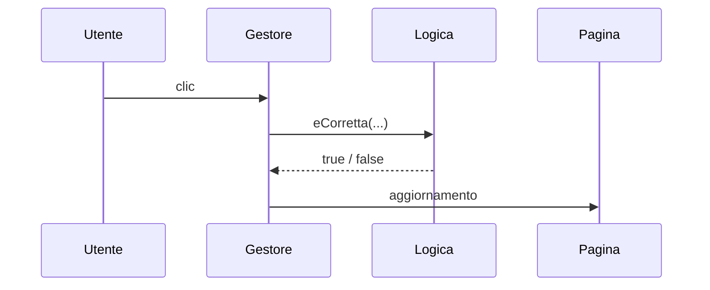
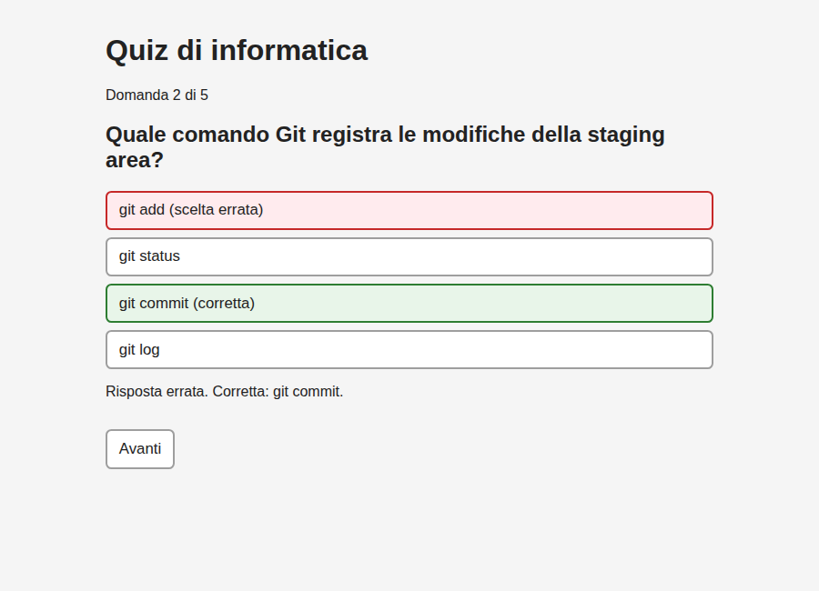

## Contenuti

- Struttura di app.js
- Disegno dallo stato
- Requisiti nel codice
- Input e validazione
- Laboratorio 6.4

## Struttura di app.js

1. Stato
2. Riferimenti
3. Funzioni di disegno
4. Gestori di evento



## Disegno dallo stato

```javascript
function mostraDomanda() {
  const d = domande[indice];
  elTesto.textContent = d.testo;
  elOpzioni.textContent = "";
  d.opzioni.forEach((testoOpzione, i) => {
    const pulsante = document.createElement("button");
    pulsante.textContent = testoOpzione;
    pulsante.addEventListener("click", () => rispondi(i));
    elOpzioni.appendChild(pulsante);
  });
}
```

## Requisiti nel codice

- Risposta non modificabile: `return` e `disabled`
- Esito anche a testo: `::after`, paragrafo `esito`
- Tastiera: `elAvanti.focus()`
- Lettori di schermo: `aria-live`



## Input e validazione

```javascript
modulo.addEventListener("submit", (e) => {
  e.preventDefault();
  const testo = campo.value.trim();
  if (testo === "") {
    errore.textContent = "Scrivere il testo dell'attività.";
    campo.focus();
    return;
  }
});
```

- `submit`: clic o `Invio`
- Controlli nel browser: esperienza d'uso, non sicurezza del server

## Laboratorio 6.4

- `app.js` in quattro parti
- Requisiti Must e criteri di accettazione
- Prova con la sola tastiera
- Input non validi
- Merge, push, `PIANO.md`
